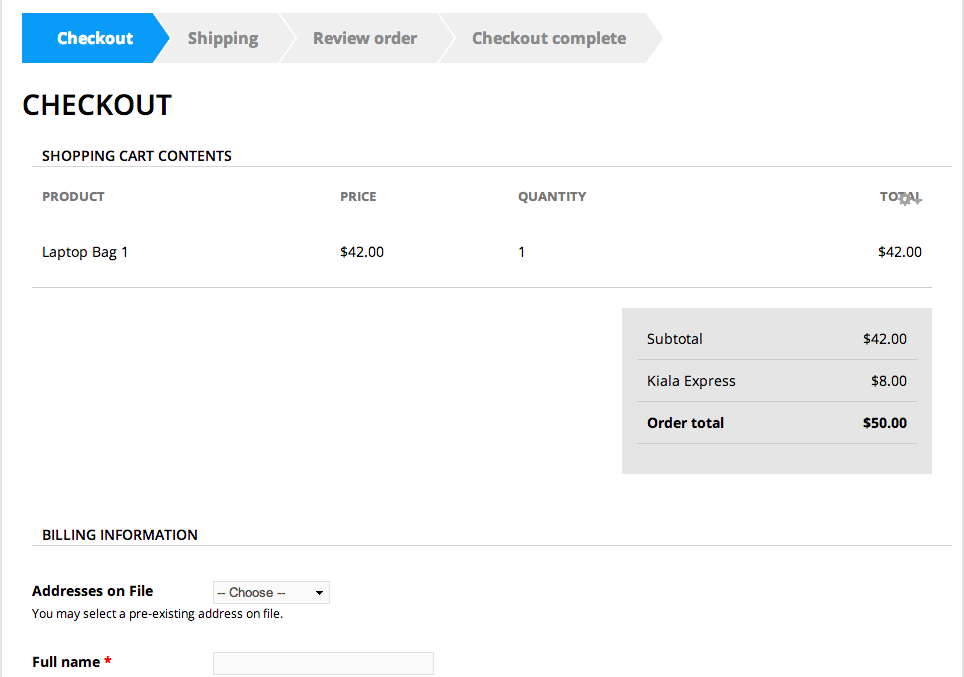

Drupal Commerce comes with a drag-and-drop checkout form builder that lets you decide what information you need to collect from or display to customers during the checkout process. It supports single and multi-page checkout depending on your requirements and can be easily extended with new components through the use of contributed or custom modules.

The parts that Kickstart brings to the table that aren't a part of our standard <a href="/user-guide/checkout-process">User Guide articles</a> include:

<ul>
<li><strong>Checkout Popup</strong> - First thing you might notice is that when you add a product to your cart, we have a pop-over that gives the user a chance to checkout or continue shopping. The intent is to increase the number of conversions you have from cart to actual checkout. This can be disabled easily as well.</li>
<li><strong><a href="http://drupal.org/project/commerce_checkout_progress">Checkout Progress</a></strong> - Probably the biggest change from the standard checkout process in Drupal Commerce is the presence of the the fantastic community contributed Commerce Checkout Progress module. This enables the user to create a fully themed and checkout aware indicator for multi-page forms. Of course, you knew you could <a href="/user-guide/checkout-form-builder">move those panes and pages around like crazy</a>, right?</li>
<li><strong><a href="http://drupal.org/project/commerce_addressbook">Addressbook</a></strong> - Before we get into the shipping options, let's go ahead and pull the address you used last time and fill it all in right here for you. The new and improved Addressbook works just like you'd expect, including giving your customers a fully editable area where they can choose a default address and many other functions.</li>
<li><strong><a href="http://drupal.org/project/commerce_shipping">Shipping Options</a></strong> - Since Kickstart 2 comes with shipping built in it makes sense that the checkout process would include a shipping step. To learn more about shipping, see our <a href="/commerce-kickstart-2/shipping">entire section of shipping documentation</a>.</li>
<li><strong><a href="http://drupal.org/project/commerce_checkout_login">Checkout Login</a></strong> - Another tweak to the checkout process is that we require your users to register. This requirement can be disabled.</li>
</ul>

