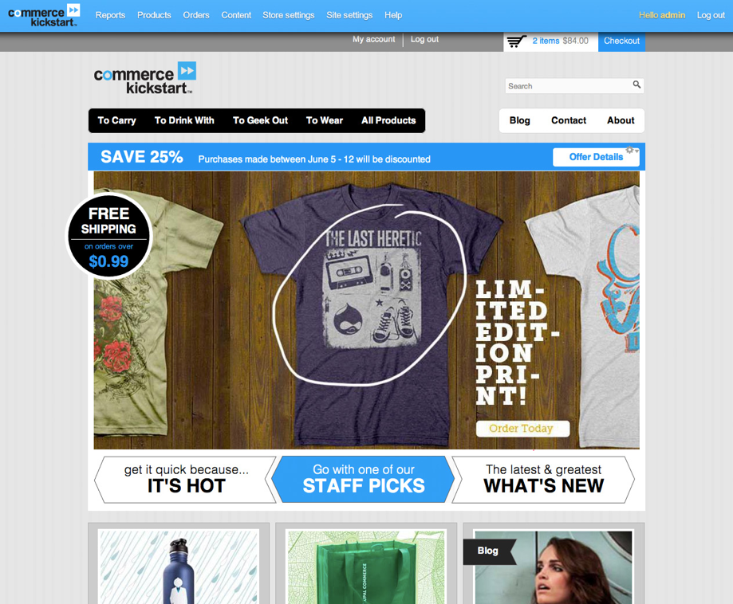
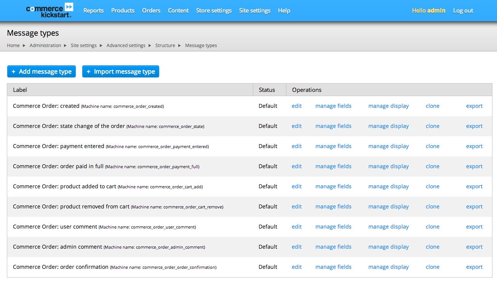
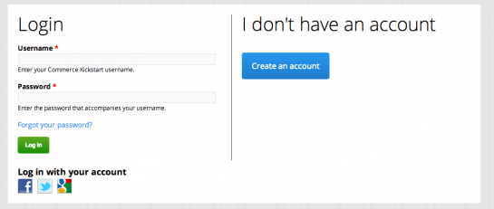

The Demo Store is an option in the installation process. This is a great way to get an idea of what is possible with Drupal Commerce and a few contributed modules. The demo store makes quite a few assumptions. For one, it assumes you are selling physical products. Thus, it has the shipping module all setup and ready to be used. Many of the store features are worth emulating or using as a basis for other sites. The following articles attempt to outline how to setup various features that can be found in the Commerce Kickstart 2 distribution.

## Rich Email Notifications

The Commerce Kickstart team decided early on that the current implementation rich HTML email notifications was a clear necessity and the existing solutions didn't match some of the biggest concerns. To handle the email notifications, Commerce Kickstart has integrated the <a href="http://drupal.org/project/message">Messages</a> module and the <a href="http://drupal.org/project/mimemail">Mime</a> mail module.

To edit the various templates that come standard with Kickstart, you simply need to go to <strong>Site Settings &gt; Advanced Settings &gt; Structure &gt; Message Types</strong>

Each Message Type is like a Content Type for Email Notifications. Commerce Kickstart then is designed to use Rules to send create a Message of a certain type.

**Trigger Rules**

The rules listed here are responsible for creating "Messages of a certain type" that will get sent. You can go here to disable a certain message type, or add an additional event or even setup a new message type.

<ul class="screenshot_breadcrumbs">
    <li class="first">Site Settings</li>
    <li>Advanced</li>
    <li>Configuration</li>
    <li class="last">Rules</li>
</ul>

<a href="http://drupal.org/project/message_notify">Message Notify</a> allows messages to be sent as emails using <a href="http://drupal.org/project/rules">Rules</a>, which Commerce Kickstart happily enables by default. Admittedly, this functionality is a bit hidden from the average user and it's in the long term goals to expose more of this functionality to the user interface in a more understandable way. Until then, please feel free to share your favorite templates and rules for sending out receipts, invoices, etc.

**Example Rule**

Here is an example rule that demonstrates a message of a certain type being created and then sent via <a href="http://drupal.org/project/message_notify">Message Notify</a>.

<ul class="screenshot_breadcrumbs">
    <li class="first">Site Settings</li>
    <li>Configuration</li>
    <li>Rules</li>
    <li>Order Notification</li>
    <li class="last">Edit</li>
</ul>

## Setup Product Catalog using Views, Taxonomy, and Menu

The Commerce Kickstart 2 comes with a great catalog setup both in the Demo store and as a part of the non-demo store setup. First, we'll explain the various parts that are at play in making the catalog function. Next, we'll create a product catalog from scratch on a non-demo store that has nearly identical functionality.

<h3>Kickstart 2 Catalog Ingredients</h3>

The Commerce Kickstart 2 Catalog uses the following major concepts:

<ul>
<li><strong>Taxonomy Organization</strong>: The menu, the view, and the nodes all use taxonomy as the underlying technology to create "catalog pages." If you think about a paper catalog, this categorization is a very common and easy to understand decision.</li>
<li><strong>Taxonomy Menu</strong>: The Menu at the top of the page for both the demo and non-demo installation is a generated menu using <a href="http://drupal.org/project/taxonomy_menu">Taxonomy Menu</a> and a custom module that comes with Kickstart, called "Commerce Kickstart Taxonomy" that modifies some of the way the menu is generated and comes with the default view.</li>
<li><strong>Search API</strong>: We use Search API to power the Views that show the catalog pages and the "All Products" view that shows you how to use the setup and working faceted search.</li>
<li><strong>Views</strong>: There are a number of views that are running the catalog system. The primary view that handles the category pages grabs the taxonomy term from the URL and uses that to narrow down the list of available products. We are using item-level grouping, not aggregation.</li>
<li><strong>Rendered Nodes, not Product Entities</strong>: For each product listed on the pages, we are rendering the product display, not the product variation. This is an architectural decision that has significant ramifications on how your site is built. Doing it this way is likely (maybe 80% of the time) the best way for your site, but there are other ways of showing products and there images / add to cart forms.</li>
</ul>
<h3>Search API</h3>

The catalog pages depend heavily on Search API. To learn a bit more about search API and what it is capable of, take a look at the following Commerce Module Tuesday video:

<iframe src="https://player.vimeo.com/video/53404289?portrait=0&amp;badge=0" width="640" height="480" frameborder="0" webkitAllowFullScreen mozallowfullscreen allowFullScreen></iframe>

## Social Logins using Connector

This documentation page was recently featured on the Commerce Kickstart Tip series. To see the blog post that featured this process, <a href="http://www.drupalcommerce.org/blog/4571/kickstart-tip-extend-your-site-social-logins">click here</a>.

<h3>Overview of Setup</h3>

The setup is pretty simple. We are taking the OAuth Connector module, a few pre-defined services for Twitter, Facebook, or Google, and connecting them to a simple and free OAuth API. Most of these API services require that you register an "App" to gain access to the API. This is how they can limit your API calls and help you keep track of traffic being generated using these services. The process is very similar to setting up a Google Maps API call.

<h3>Setting up OAuth Connector</h3>

<strong>Step 1</strong>: Go to admin/structure/oauthconnector/list and create a new provider by using one of the presets the list, or by creating your own. You will need an App Key, a secret key, and a callback URL for each provider (see list below).

URLs to apply for App Keys (as of Mar. 2012):

* Facebook: <https://developers.facebook.com/docs/facebook-login/guides/access-tokens>
* Twitter: <https://developer.twitter.com/en/docs/authentication/guides/log-in-with-twitter>
* Google: <https://code.google.com/apis/console>
* LinkedIn: <https://www.linkedin.com/secure/developer>
* Flickr: <http://www.flickr.com/services>

Signing up for App Keys is a very different process for each service. The trick usually is that you have to declare that you want to create an "app" or a service or something that needs an API access.

<strong>Step 2</strong>: Make sure you provide the correct "Callback URL"

The other trick is to make sure that you are using the right callback URL. To get the right callback URL, I'd recommend you go ahead and fill out the "App Secret" and "App ID" with a bogus number. The page on admin/structure/oauthconnector/list will then give you the callback URL that you can use to give to the service to get the API credentials.

<strong>Step 3</strong>: Make sure permissions are setup correctly.

To allow anonymous users the ability to login using a facebook account, you must give anonymous users the permission to "Connect with [Provider]." So, for example, the permission that you'll want to change for Facebook is "Connect with Facebook."

<h3>Facebook Graph API</h3>

In order to access Facebook's Graph API for access to the OAuth Consumer Key and OAuth Consumer Secret we will go to the following URL:

<strong>Step 1</strong>: https://developers.facebook.com/apps

Here, you should register and create an app that represents your website. For local sites, "localhost" worked for the App Domain, for me.

<strong>Step 2</strong>: Select "Website with Facebook Login" and provide your website's URL, plus "/oauth/authorized2/1" (see the step #2 above)

<strong>Step 3</strong>: Grab the App ID/API Key

<strong>Step 4</strong>: Grab the App Secret
