Drupal Commerce comes with a drag-and-drop checkout form builder that lets you decide what information you need to collect from or display to customers during the checkout process.  It supports single and multi-page checkout depending on your requirements and can be easily extended with new components through the use of contributed or custom modules.

Below are many of the topics related to Drupal Commerce Checkout.

<ul>
<li><a href="#checkout-form-builder">Checkout Form builder</a></li>
<li><a href="#checkout-completion-rules">Checkout Completion Rules</a></li>
<li><a href="#checkout-order-status-updates">Checkout Order Status Updates</a></li>
<li><a href="#checkout-single-vs-multiple-page">Checkout Single vs. Multiple Page</a></li>
<li><a href="#checkout-anonymous-vs-authenticated">Checkout: Anonymous vs. Authenticated</a></li>
<li><a href="#drupal-commerce-extra-panes">Drupal Commerce Extra Panes</a></li>
</ul>

## Checkout Form builder

Here's the real definition of Checkout from Ryan Szrama:
>Checkout is a multi-step order edit form that involves the creation of additional entities (via customer profile checkout panes) and usually results in the creation of a payment transaction.

What does that mean to you? It means checkout and the form builder are just a large edit form for orders that create things like customer profiles and use things like payment gateways to move the order status around.

Drupal Commerce comes with a drag-and-drop checkout form builder that lets you decide what information you need to collect from or display to customers during the checkout process. It supports [single and multi-page checkout](#Checkout-Single-vs-Multiple-Page) depending on your requirements and can be easily extended with new components through the use of contributed or custom modules.

In the checkout system, a checkout page is a distinct step in the checkout process that contains one or more checkout panes that are represented as fieldsets or divs as part of the form representing the checkout page they're on. You do not have to use every checkout pane defined on your site, and some contributed modules will define new ones that you can use if needed.

<h3 id="default-checkout-pages-panes">Default checkout pages and panes</h3>

<h4 id="checkout-settings">Checkout Settings</h4>

To see the available checkout pages and panes, go to Store -> Configuration -> Checkout settings.

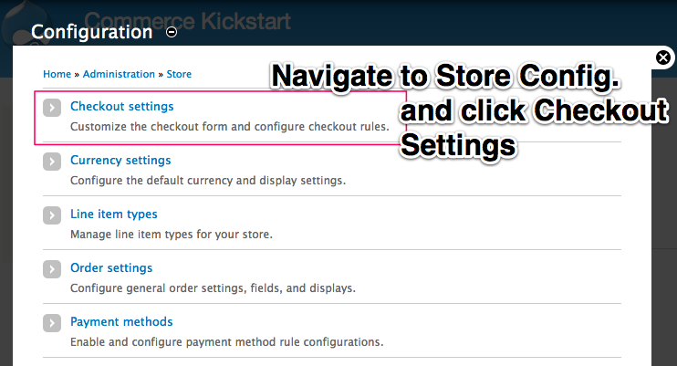

The checkout form tab is selected by default, showing the checkout form builder pictured below.

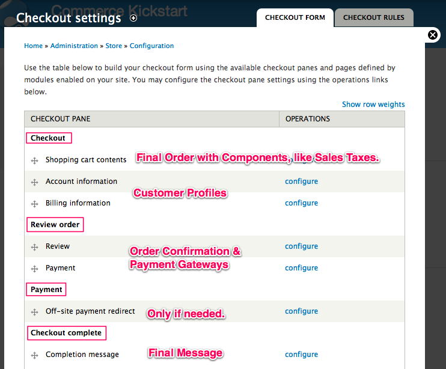

The default checkout pages are represented in the table by rows with bold titles and no drag-and-drop handle or configuration link:

* **Checkout** &mdash; the initial form used to collect basic order details.
* **Review order** &mdash; a review of all the order details with the pane for submitting payment.
* **Payment** &mdash; only used to redirect for off-site payment methods.
* **Checkout complete** &mdash; the final landing page showing the checkout completion message.

<h4 id="shopping-cart-contents">Shopping cart contents</h4>

This checkout pane displays the contents of the shopping cart or order being completed on the checkout form. It actually displays the contents through a default View that you can customize to alter the display of the cart contents here in the checkout form. In the pane's configuration form, you can even direct the pane to use a different View entirely.

<h4 id="account-information">Account information</h4>

This checkout pane is only visible for anonymous users, allowing them to specify an e-mail address to use for their order. For authenticated users, the pane is not shown, because Drupal Commerce initializes the order e-mail address field to the same e-mail address on file in their user account. Upon checkout completion, anonymous users who supplied an existing e-mail address will be notified that the order was associated with their existing account, while other anonymous users will have an account created for them. This behavior is configurable in the checkout completion rules.

!!! note "The Commerce Checkout Login module enhances this checkout pane by allowing customers who specify an existing e-mail address to supply their password and login immediately before continuing with checkout."

<h4 id="billing-information">Billing information</h4>

This checkout pane functions as an add/edit form for the billing customer profile to be associated with the order. By default, this pane will always result in the creation of a new billing customer profile, with addressbook functionality like reusing previous addresses being supplied by a contributed module.

Any fields you add to your Billing information customer profile type will appear here for the customer to supply, making it an easy way to collect details pertinent to the billing process. Additionally, changing the label of the associated customer profile reference field in the order settings will also change the title of this checkout pane on the front and back-end. Multilingual sites will need to configure field translation to ensure these labels appear in the proper language for the customer.

!!! note "A similar checkout pane will appear if you install the Commerce Shipping module, which defines a Shipping information customer profile type."

<h4 id="review-order">Review order</h4>

This checkout pane displays a full summary of the order details, including data from any other checkout pane on the form that exposes it to this pane. It will include by default the cart contents again, the user's account information, and the billing address. Other checkout panes may or may not expose data to this pane, and any that does may be directed to the relevant checkbox on the pane's configuration form.

<h4 id="payment">Payment</h4>

This checkout pane presents all payment methods available to the customer in a radio select list. If the selected payment method requires additional information from the customer, such as credit card details, the pane will be updated via Ajax to include all the fields necessary to collect and transmit the payment details to the payment service.

<h4  id="offsite-payment-redirect">Off-site payment redirect</h4>

This checkout pane will only appear if the customer selected an off-site payment method, such as PayPal WPS. It appears as a message indicating the user will be redirected to the payment service, and a JavaScript auto-redirect will go ahead and submit the redirection form if JavaScript is enabled. Otherwise the customer will have to submit the form manually.

If payment was dealt with completely on-site, the user will automatically be advanced to the next checkout page.

<h4 id="completation-message">Completion message</h4>

This checkout pane displays a simple checkout completion message that links to the order details page in the user's account. Even anonymous users will be able to view their completed orders for the duration of their current session. The checkout completion message is configurable via the pane's configuration form for single language sites, but multilingual sites will want to leave it set to the default message and translate the default string to the desired message through the translation interface.

## Checkout Completion Rules

Drupal Commerce defines several default checkout completion rules that perform the following operations when an order in checkout first reaches the checkout completion page:

<ul>
    <li>Updates the order status to the default status of the Pending state (typically the matching Pending status).</li>
    <li>Assigns an anonymous order with a known e-mail address to the appropriate user account -or-</li>
    <li>Creates a new user and sends the new account e-mail notification to the customer.</li>
    <li>Send an order notification e-mail to the customer.</li>
</ul>

You are free to customize these defaults rules, disable them entirely, and add your own rules to address your business logic pertaining to what must happen on checkout completion. Note that payment may not have been completed at this time; it may still be pending or it may have been submitted as an authorization awaiting a later capture.

!!! warning "Important Note: Beware giving away products for free"

If you have business logic that depends on payment being completed, you should add rules to the <em>When an order is first paid in full</em> event instead. It is a common Drupal Commerce configuration mistake to fulfill the order at the point of checkout completion which can lead to giving the product away for free. Malicious users may figure out how to trigger order completion without paying. Instead, assign rules that deliver the product to the event <em>When an order is first paid in full</em>.

<h3>Excercise: Fulfillment Email</h3>

To demonstrate the Checkout Rules, we've created an exercise that will send an email to our fulfillment shop once the payment is complete. This is a particularly interesting case because we will not use the event that Commerce picks for us by default. All is explained in the captions.

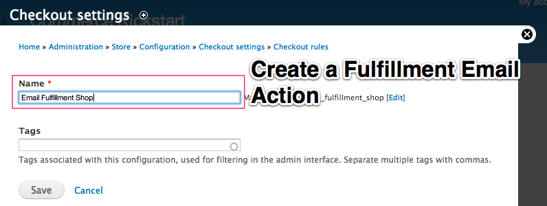

**Add Checkout Rule**

By click on "Add Checkout Rule" you have taken the first step. Though, technically this rule is not a checkout rule because of the event we will be using, it's not a bad place to start.

<ul class="screenshot_breadcrumbs">
    <li class="first">Administration</li>
    <li>Store</li>
    <li>Store Configuraiton</li>
    <li>Checkout</li>
    <li class="last">Checkout Rules: Add Rule</li>
</ul>

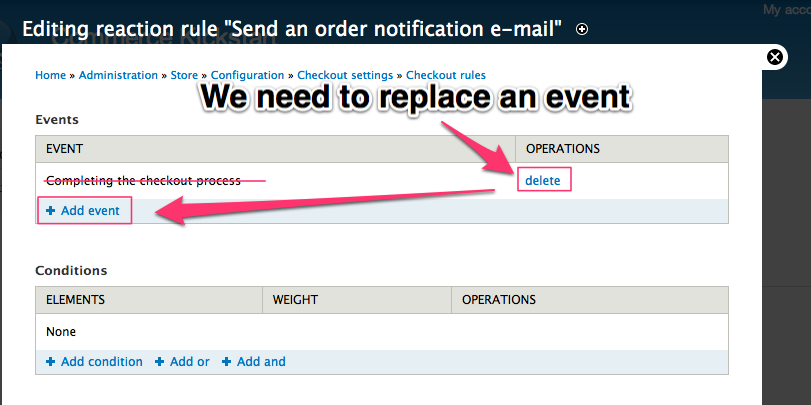

**Replace Event**

First, go ahead and delete the event that is at the top. Next, you will want to click "Add Event." This is because we don't want to send our fulfillment email until we've received payment.

<ul class="screenshot_breadcrumbs">
    <li class="first">Administration</li>
    <li>Workflow</li>
    <li>Rules</li>
    <li>Edit Rule</li>
    <li class="last">Rule Overview</li>
</ul>

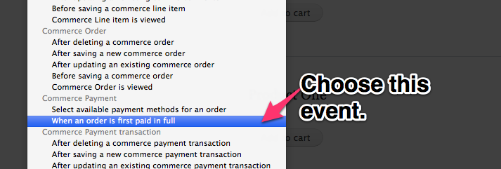

**Choose this event.**

This event will only fire after payment is paid in full. "Completing the Checkout" is not "Paid in Full" and this distinction can be a common mistake. That might allow your customer to fraudulently use a payment that doesn't complete and you find out after you have given them access or sent them the physical product.

<ul class="screenshot_breadcrumbs">
    <li class="first">Administration</li>
    <li>Workflow</li>
    <li>Rules</li>
    <li>Edit Rule</li>
    <li class="last">Add Event</li>
</ul>

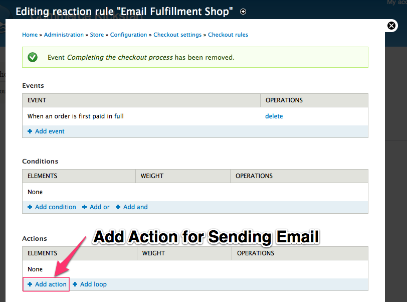

**Add Action**

Up until now, this rule could be used for anything. Perhaps you want to assign "Valued Customer" role and send them a 50% coupon code? Anything is possible with Rules. Here, we just want to add an action that will send an email. Can be found under "System &gt; Send Mail"

<ul class="screenshot_breadcrumbs">
    <li class="first">Administration</li>
    <li>Workflow</li>
    <li>Rules</li>
    <li>Edit Rule</li>
    <li class="last">Add Action</li>
</ul>

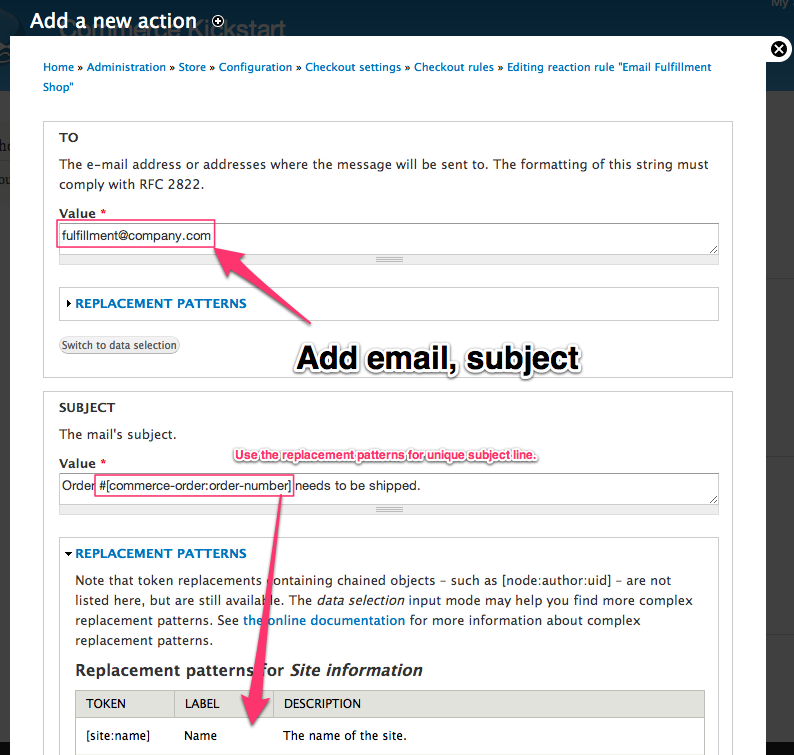

**Configure Action**

This is the straightforward email action page. This replaces the .tpl for ubercart, which means only plain text emails are possible. If you want HTML emails, we recommend <a href="http://drupal.org/project/mimemail">Mime Mail</a> for Drupal (it's designed to work within Rules very well).

<ul class="screenshot_breadcrumbs">
    <li class="first">Administration</li>
    <li>Workflow</li>
    <li>Rules</li>
    <li>Edit Rule</li>
    <li class="last">Configure Action</li>
</ul>

![Final Rule](../images/Checkout-Rules-Exercise-6.png

**Final Rule**

This is what our Fulfillment Email Rule looks like when we're done. It reads, "When an order is paid in full, Send Mail." You can't have gone through this and not absolutely fallen in love with Actions.

<ul class="screenshot_breadcrumbs">
    <li class="first">Administration</li>
    <li>Workflow</li>
    <li>Rules</li>
    <li>Edit Rule</li>
    <li class="last">Rule Overview</li>
</ul>

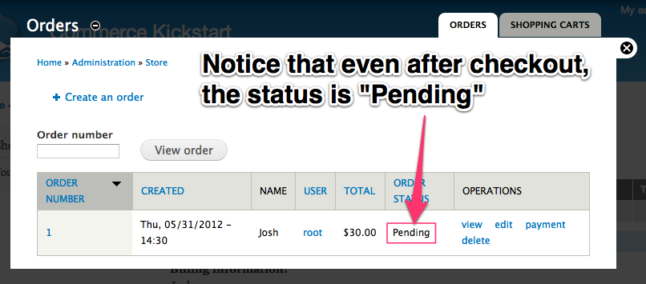

**Testing the Rule**

We added a product to our cart, checked out, and nothing seemed to happen. Notice that even after checkout, the status on the order is "Pending." This is what happens with the default testing payment method. But the event does happen, it just won't show a "display message" action.

<ul class="screenshot_breadcrumbs">
    <li class="first">Administration</li>
    <li>Store</li>
    <li>Store Configuraiton</li>
    <li>Orders</li>
    <li class="last">Edit Order</li>
</ul>

To get the event to fire in a way you can see, simply create an order and apply a payment manually.

## Checkout Order Status Updates

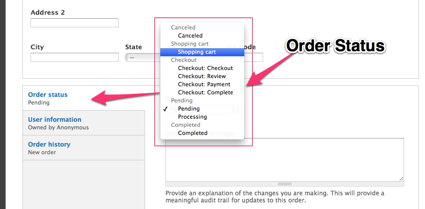

<ul class="screenshot_breadcrumbs">
    <li class="first">Administration</li>
    <li>Store</li>
    <li>Configuration</li>
    <li>Orders</li>
    <li class="last">Add Order</li>
</ul>

As customers progress through checkout, their cart orders are continually being updated. This makes the checkout form act as a multi-step order edit form with the end result being a fully formed order that is ready for fulfillment or completion.

In addition to customer data being saved to the order, the order status is also updated to reflect its current place in the checkout process. The checkout router uses the order status to determine a customer's access to visit a requested checkout page for a particular order.

Upon checkout completion, the <em>Completing the checkout process</em> event/hook is invoked, allowing you to affect what happens to orders and what sort of communication needs to occur on checkout completion.

<ul class="screenshot_breadcrumbs">
    <li class="first">Administration</li>
    <li>Configuration</li>
    <li>Workflow: Rules</li>
    <li>Add New Rule</li>
    <li class="last">Add Event</li>
</ul>

!!! note "There is a more reliable event called <em>When an order is first paid in full</em> that should be used to update or process an order based on payment. Checkout can complete with payment still pending, so it is best not to mark orders completed on the basis of checkout completion alone."

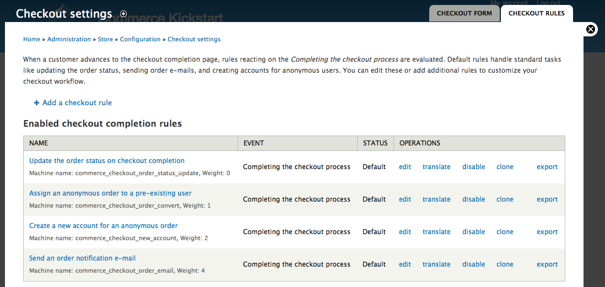

<ul class="screenshot_breadcrumbs">
    <li class="first">Administration</li>
    <li>Store</li>
    <li>Configuration</li>
    <li>Checkout settings</li>
    <li class="last">Checkout Rules</li>
</ul>

By default Drupal Commerce executes the following checkout completion rules:

<ol>
    <li>Update the order status on checkout completion.</li>
    <li>Assign an anonymous order to a pre-existing user. Or...</li>
    <li>Create a new account for an anonymous order.</li>
    <li>Send an order notification e-mail.</li>
</ol>

The Pending order status simply means that the order is now out of the customer's hands and in yours. You don't need to use this status at all if you don't need it, but the basic idea is that orders first appear to you and the customer as Pending until you acknowledge them and begin Processing them. Once fulfillment occurs or payment is complete for orders that require no additional fulfillment, orders can then be considered Completed.

## Checkout Single vs. Multiple Page

The checkout form represents any of a number of checkout pages that are comprised of fieldsets (or container divs) called checkout panes. The normal progression through the checkout form goes from one non-empty checkout page to the next until the Completion page is reached.

The checkout form can safely be altered to suit your needs via the drag and drop checkout form builder. Existing checkout pages can be ignored by removing any checkout panes from them, and additional checkout pages can also be defined using hook_commerce_checkout_page_info().

The Payment page is solely used for the off-site payment redirect checkout pane. It is purely a point of departure and return for off-site payment methods and should not be used to hold any other checkout panes. This page contains no continue or back buttons, as such movement is meant to occur in conjunction with requests from the payment service.

Additionally, orders on this page of the checkout form will no longer be considered shopping carts so the total of the order does not change while the customer is submitting payment.

<h3>Overview of screenshots</h3>

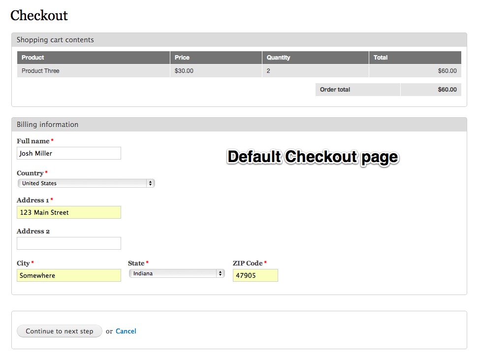

## Checkout: Anonymous vs. Authenticated

Customers to your store are not required to be logged in (authenticated) or anonymous. To setup your site to always be anonymous, you would only have to delete the two rules mentioned here:

**Account Creation Rules**

Disabling these rules would mean the users can't login to see their Orders, but would have absolutely no side affect to being able to purchase items, etc.

What is the difference between an authenticated and anonymous checkout?

There is not much. Both authenticated and anonymous users will still have to fill out any information required by customer profiles. Customer profiles are not user profiles (multiple data fields per user), they are uniquely assigned to each order (multiple data fields per order). This allows the same customer to have multiple addresses for each order and other types of situations. But this does cause a bit of confusion as the user expects their address to appear if they are logged in.

If you are curious as to what happens with anonymous users, you can checkout the following screens and read through each rule.

**Anonymous Rules**

The rules you see here can be found by going to the Store Configuration screen and selecting "Checkout Settings" and then selecting "Checkout Rules." This kind of functionality is usually handled by an obscure bit of code and an interface that can be very limiting. Instead, here we use Rules to not only make the store work as expected, but also give the site builder the tools to modify this process as needed.

**Merge Account Rule**

The first rule we are looking at has a simple job: If the new user already exists, assign the order to the user that already exists. Imagine business logic that requires this user supply a password to merge these two accounts. Lots of possibilities with this rule exposed.

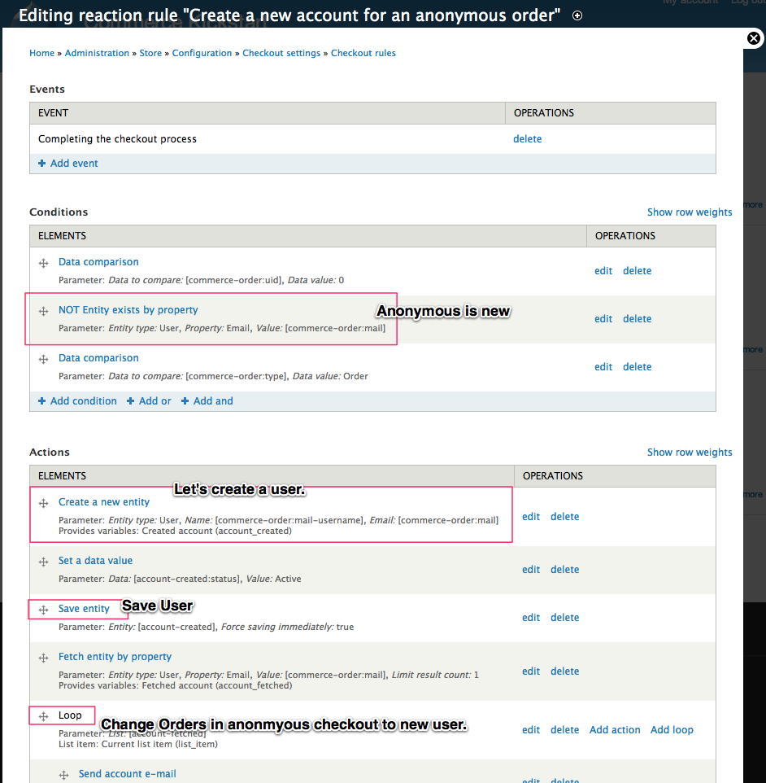

**New Account Rule**

The final anonymous checkout rule deals with creating a new user for anonymous accounts. In here you could add an email notification with a link to reset their password and verify their new account.

<h3>How does checking out work with address information?</h3>

Customer information collected for orders on separate entities called customer profiles that are associated with the order through customer profile reference fields. By default the Billing information customer profile type just includes an address field, but it can be edited through the field interface to include any additional fields you require. These fields will automatically be visible on the related checkout pane for the customer profile.

Some modules define additional customer profile types, such as the Shipping information customer profile type defined in the <a href="http://drupal.org/project/commerce_shipping">Commerce Shipping</a> module.

During a default checkout process, customers cannot reuse previously created customer profiles. A new customer profile will be saved each time, though modules like <a href="http://drupal.org/project/commerce_addressbook">Commerce Addressbook</a> bring simple and elegant solutions to help save your customers time.

## Drupal Commerce Extra Panes

The module for extra panes can be found here:

<ul><li><a href="http://drupal.org/project/commerce_extra_panes">http://drupal.org/project/commerce_extra_panes</a></li></ul>

Then you can configure an extra pane for the checkout process at:
admin/commerce/config/checkout/extra

For instance, if you need the legal aspects (terms of service) information you can proceed as follows:
Create a new node with your information called "Terms of Service" (or something else...)
under: admin/commerce/config/checkout/extra you can now add this node to a pane.
A new pane is added to your checkout procedure: admin/commerce/config/checkout

Now you can configure the pane "Terms of Service" like this:

* Under: "Extra panes Terms of Service"
* Check "Enable this pane as Terms of Service." &
* Check "Make the terms of service required."
* Please be aware that this pane should be shown during the checkout procedure, not under review or something else.

For my purposes, the Terms of Service did not need to be shown again on the review page, therefore I unchecked "Include this pane on the Review checkout pane"

Hope this helps a little bit since I was struggling with it for a couple of hours.