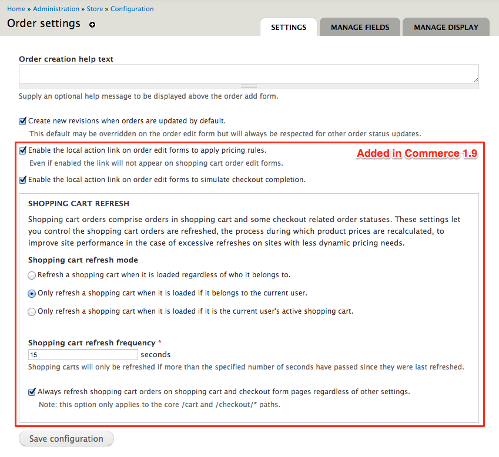
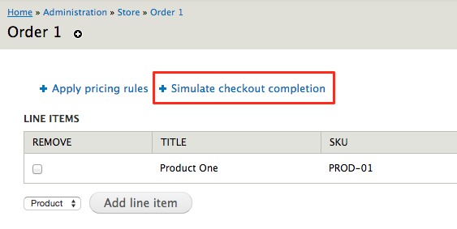
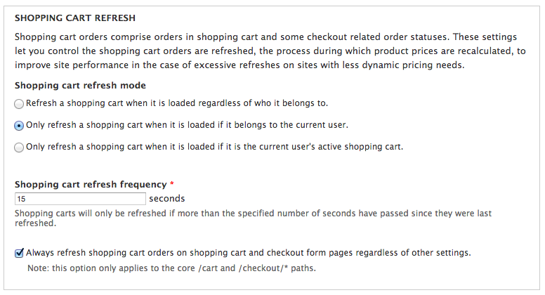

<ul>
  <li><a href="#order-settings">Order Settings</a></li>
  <li><a href="#implementing-an-automated-order-workflow">Implementing an automated order workflow</a></li>
  <li><a href="#displaying-all-orders">Displaying All Orders</a></li>
</ul>

## Order Settings

In March 2014, Commerce 1.9 was released that included a number of feature enhancements involving order workflow on the administrative side. Below is a rundown of the various settings and how they affect the new features.

* [Apply pricing rules](#apply-pricing-rules) - A new local action for orders that, when clicked, will run the pricing rules for that particular order.
* [Simulate checkout completion](#simulate-checkout-completion) - A new local action for orders that, when clicked, will invoke the checkout completion events in rules.
* [Shopping cart refresh](#shopping-cart-refresh) - These settings let you control how often the shopping cart orders are refreshed, a task that can impact speed at the cost of flexibility.

<ul class="screenshot_breadcrumbs">
    <li class="first">Administration</li>
    <li>Store</li>
    <li>Configuration</li>
    <li class="last">Order settings</li>
</ul>

<h3 id="apply-pricing-rules">Apply pricing rules</h3>

A new local action for orders that, when clicked, will run the pricing rules for that particular order. 

When you click the "Apply pricing rules" button, a few things will happen:

<ul>
  <li>All product prices will be reset and recalculated using the product pricing rules defined on this site.</li>
  <li>Non-product line items may or may not be updated depending on the type.</li>
  <li>Custom prices entered on the edit form will be lost.</li>
</ul>

<h3 id="simulate-checkout-completion">Simulate checkout completion</h3>

A new local action for orders that, when clicked, will invoke the checkout completion events in rules.

When you click the "Simulate checkout" button, a few things will happen:

<ul>
  <li>The normal checkout completion process will be invoked on this order.</li>
  <li>This may involve order status updates and e-mail notifications.</li>
</ul>

<h3 id="shopping-cart-refresh">Shopping cart refresh</h3>

Shopping cart orders comprise orders in shopping cart and some checkout related order statuses. These settings let you control how the shopping cart orders are refreshed, the process during which product prices are recalculated, to improve site performance in the case of excessive refreshes on sites with less dynamic pricing needs.

<h4>Refresh mode</h4>

<ul>
  <li><strong>Refresh a shopping cart regardless of who it belongs to.</strong> This was the default setting pre Commerce 1.9. This has a performance impact but enables extremely dynamic pricing (assuming the pricing changes between each page request).  </li>
  <li><strong>Only refresh a shopping cart if it belongs to the current user.</strong> This is the new default and allows for dynamic pricing but prohibits the performance impact when the user viewing the information (presumably an administrator) views the cart, which enhances the speed for the administrator and limits the number of possible problems with dynamic pricing that relies on "current user" instead of "order owner."  </li>
  <li><strong>Only refresh a shopping cart if it is the current user's active shopping cart.</strong>  This setting further preserves pricing on older carts that are not currently the active cart.</li>
</ul>

<h4>Refresh frequency</h4>

To further enhance the performance impact, we set a reasonable lifespan for calculated prices. If your pricing depends on up-to-the-second changes, then this setting can be set to zero so that it will always be calculated. Its likely the majority of use cases could have a large number of seconds here. Shopping carts will only be refreshed if more than the specified number of seconds have passed since they were last refreshed.

Note that, by default, we always recalculate on /cart and /checkout but you can turn off that setting here as well.

## Displaying All Orders

Views is the easy way to display all orders, including orders that are cart orders, etc. You can just edit the existing administrative view of orders and expose the filter, etc.

There is even a default view to change your Admin Orders view into a Views Bulk Operations view with all this functionality in [Commerce VBO Views](http://drupal.org/project/commerce_vbo_views)

## Implementing an automated order workflow

The Drupal Commerce shopping cart and checkout systems handle advancing an order from the <em>Shopping cart</em> status through the various <em>Checkout: ####</em> statuses and finally to the <em>Pending</em> order status. While the Order module defines additional order statuses for <em>Canceled</em>, <em>Processing</em>, and <em>Completed</em> orders, it does not implement any rules specifically to place orders into these statuses. The only way orders will get to these statuses out of the box is if an administrator were to move the order to that status from its edit form.

When you build your store, it is up to you to implement your automated order workflow beyond what the shopping cart and checkout systems provide. You can do this via direct module integration or Rules configurations that interact with various events, such as moving an order that has been paid in full to the <em>Processing</em> status for fulfillment or directly to <em>Completed</em> if fulfillment is automated (e.g. in the case of a digital commerce site).

The primary thing to keep in mind is that an order may complete the checkout process without having been paid in full. This means any automated workflow steps that result in the fulfillment of the order should use the <em>When an order is first paid in full</em> event or <code>hook_commerce_payment_order_paid_in_full()</code> instead of the checkout completion event / hook. This is primarily the case when a site integrates a payment gateway that supports delayed payment (e.g. PayPal eCheck payments) or performs authorization only transactions during checkout that are meant to be captured later.

You do not have to use all the order statuses provided by default, and you can create your own either through code or a contributed module like <a href="http://www.drupalcommerce.org/extensions/module/project/commerce-custom-order-status">Commerce Customer Order Statues</a>.

For more information, refer to the <a href="http://www.drupalcommerce.org/user-guide/checkout-order-status-updates">related checkout documentation</a>.