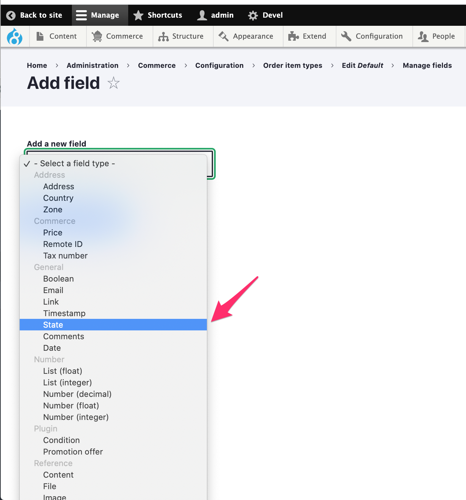
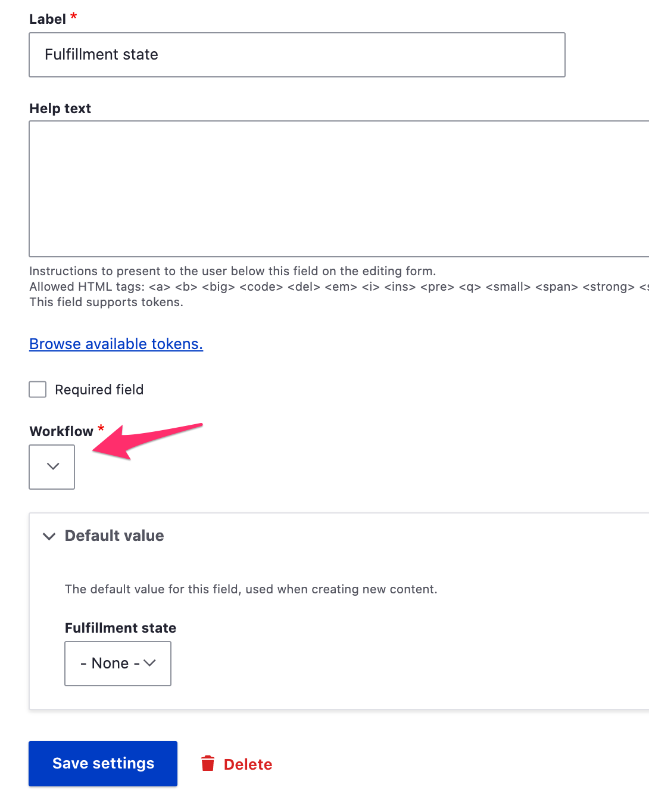
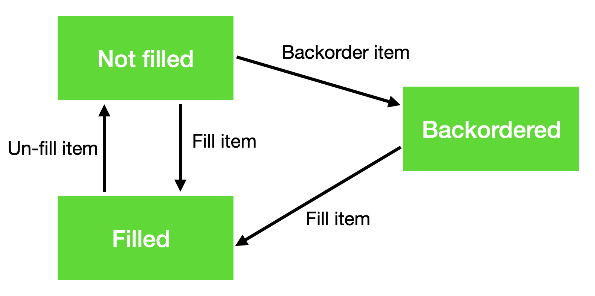
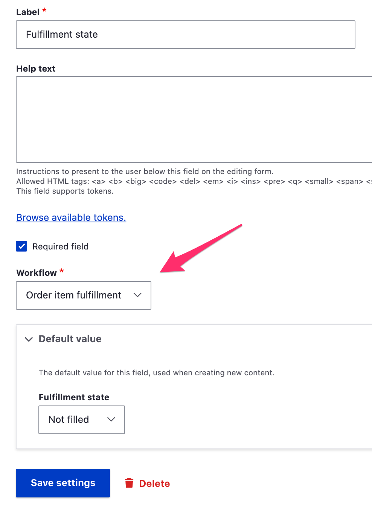
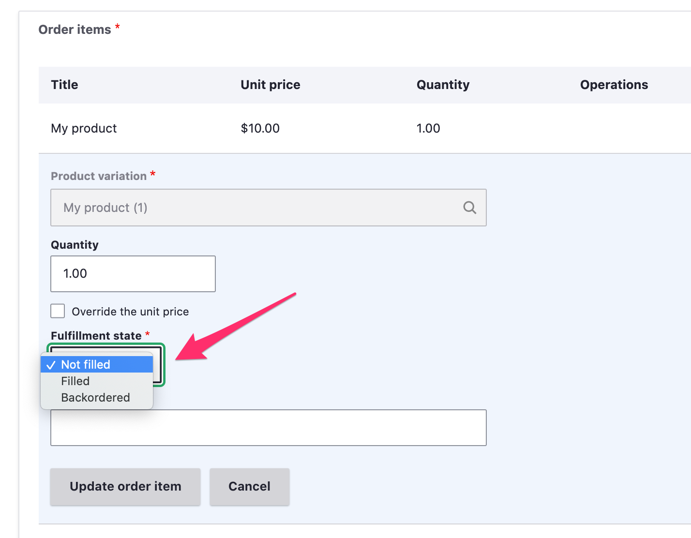
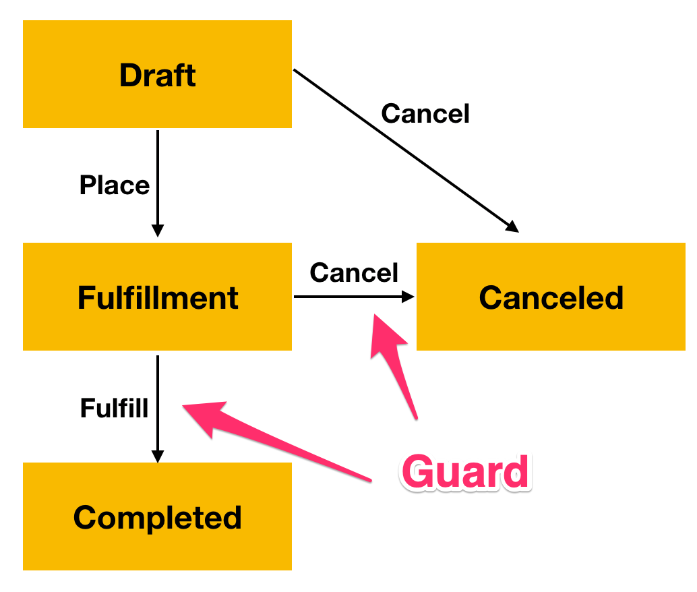

Drupal Commerce is built from many different components. Understanding
these building blocks and their functionality will aid you in building
your Drupal Commerce store.

**[Libraries and dependencies](#php-libraries)**


**[Conditions](01.conditions)**

- Learn how the Core Conditions component allows us to create configuration entities with conditions.
- Learn how to build your own Condition plugin or alter an existing one.
- Learn how to filter the list of Conditions provided for specific configuration entities.

**[Sending HTML emails](02.html-emails)**

- Learn how to use the Swift Mailer module to send HTML emails.
- More TBD

**[Understanding resolvers](03.understanding-resolvers)**

- Learn about the concept of Resolvers.
- Learn about types of Resolvers and how they're used in Drupal Commerce.
- Learn about the structure of Resolvers and Chain resolvers.

**[Relationship diagrams](05.relationships)**

- Learn about the major Drupal Commerce entities and their relationships.


## PHP libraries


The following PHP libraries are used:

**[commerceguys/intl]**: An internationalization library powered by CLDR data. Handles currencies, currency formatting, and more.

**[commerceguys/addressing]**: An addressing library, powered by Google’s dataset. Stores and manipulates postal addresses.

## Dependancies

### Profile

The Profile module provides the profile entity type used to collect customer information.
In Commerce 1.x, we called these entities “Customer Profiles” and for
Commerce 2.x we have moved to where the community has extended user
profiles to include fieldable entity bundles.

The fieldable Profile entity allows administrators to define different sets of fields for user profiles,
which are then displayed in the My Account section. This permits users
of a site to share more information about themselves and can help
community-based sites organize users around specific information.

See Also: [Profile module on Drupal.org]

Additional documentation on [Profiles](../../../customers/profiles) and how they are used within Drupal Commerce is provided within the [Customers](../../../customers) section of this guide.

### Inline Entity Form

See Also: [module on drupal.org]

Provides a widget for inline management (creation, modification,
removal) of referenced entities. Commerce uses it extensively for
product variations, line items, and (soon) tax rate amounts.

### State Machine

See Also: [State machine module on drupal.org]

The State Machine module provides code-driven workflow functionality.

A workflow is a set of states and transitions that an entity goes through during
its lifecycle. A transition represents a one-way link between two states and has its
own label. The current state of a workflow is stored in a state field, which
provides an API for getting and applying transitions. An entity can have multiple
workflows, each in its own state field. An order might have checkout and payment
workflows. A node might have legal and marketing workflows. Workflow groups are
used to group workflows used for the same purpose (e.g. payment workflows).

**[Architecture](#architecture)**

- Provides a technical overview of the State Machine module's architecture.

**[Working with State fields](#working-with-state-fields)**

- Learn how State fields are used within Drupal Commerce.
- Learn how to create custom State fields, workflows, and workflow groups.
- Includes example for a custom Order item fulfillment State field.

**[State transition Guards](#state-transition-guards)**

 - Guards can be used to add business logic constraints to State transitions.
 - Includes example code for an Order fulfillment workflow Guard.

**[State transition event subscribers](#state-transition-event-subscribers)**

 - Learn about the different types of Events provided by the State machine module.
 - Includes example code for reacting to the transitions of a custom Order item fulfillment field.

**[Code recipes](#code-recipes)**

- Alter existing workflows.
- Get State field values.
- Apply State transitions programatically.

#### Architecture


[Workflow] and [WorkflowGroup] are plugins defined in YAML, similar to
menu links.

Example: `commerce_order.workflow_groups.yml`:

```yaml
order:
  label: Order
  entity_type: commerce_order
```

Groups can also override the default workflow class, for more advanced
use cases.

Example: `commerce_order.workflows.yml`:

```yaml
order_default_validation:
  id: order_default_validation
  group: commerce_order
  label: 'Default, with validation'
  states:
    draft:
      label: Draft
    validation:
      label: Validation
    completed:
      label: Completed
    canceled:
      label: Canceled
  transitions:
    place:
      label: 'Place order'
      from: [draft]
      to:   validation
    validate:
      label: 'Validate order'
      from: [validation]
      to: completed
    cancel:
      label: 'Cancel order'
      from: [draft, validation]
      to:   canceled
```

Transitions can be further restricted by [guards], which are implemented as tagged services:

```yaml
mymodule.fulfillment_guard:
        class: Drupal\mymodule\Guard\FulfillmentGuard
        tags:
          - { name: state_machine.guard, group: commerce_order }
```

The group argument allows the guard factory to only instantiate the guards relevant
to a specific workflow group.

The current state is stored in a [StateItem] field. A field setting specifies the used workflow, or a value callback that allows the workflow to be resolved at runtime (checkout workflow based on the used plugin, etc.). A validator is provided that ensures that the specified state is valid (exists in the workflow and is in the allowed transitions).

If a transition has been applied, the StateItem field will dispatch several [events] on entity save.
The pre_transition events are dispatched before the save (and allow the entity to be modified), while
the post_transition events are dispatched after the save.


#### Working with state fields

Drupal Commerce uses State fields for two of its entities: Orders and Payments. You can learn more about [Order workflows](../../../../orders/workflows) in the Orders documentation section. The [Payments information structure](../../../../payments/payments-information-structure) documentation describes the states of *Default* and *Manual* Payment workflows. There are also examples of altering Payment workflows in the [Payments code recipes](../../../../payments/code-recipes) and the [State machine code recipes](../code-recipes).

In this documentation section, we will go through an example of creating a custom State field, workflow, and workflow group and continue to build out the example in the next two sections on Guards and Transition event subscribers.

Our custom state field will be added to Order item entities, and we'll use it to track order fulfillment on a per-item basis. We are assuming that order items will be "filled" from inventory manually by administrative users. We'll also add in an option to "backorder" an item, if inventory is not currently available for that item. An order will not be complete until each of its items has either been filled or backordered.

A custom "State" field can be created through the admin UI like any other custom field. Navigate to the "Manage fields" page for the "Default" order type at `admin/commerce/config/order-item-types/default/edit/fields` and click the "Add field" button to add a new "State" field. We'll name our new field "Fulfillment state" with machine ID: `field_fulfillment_state`. The number of allowed values for a State field should always be set to 1.



All that is fairly straightforward, but we have a problem. We cannot set a "Workflow" for the field since none are available for this entity type. If we were adding the custom field to a Payment type or Order type, we could use the workflows defined for those entities. But since we are creating a State field on an Order item type, we need to create a new custom workflow.



It is not possible to create a workflow through the admin UI, so we need to add its definition using a custom module. See the Drupal.org [Creating custom modules] documentation if you need help getting started. In this example, we'll assume we've created and installed a custom module named `mymodule`.

We need to create both a custom workflow and a workflow group for our order item State field. [Workflow] and [WorkflowGroup] are plugins defined in YAML, similar to [menu links].

Our workflow group is defined in `mymodule.workflow_groups.yml`, a YAML file which should exist in the root folder of our custom module. We provide an ID for the workflow group on the first line and then define its Label and the entity type.

```yaml
mymodule_order_item:
  label: 'Order item'
  entity_type: commerce_order_item
```

Now that we have a workflow group for Order item entities, we can create one or more workflows in `mymodule.workflows.yml`. Here is the definition for our order item fulfillment workflow. Notice that we reference the ID of the workflow group we just defined as the `group`. The `label` is what administrative users will see when selecting a workflow for a State field.

```yaml
mymodule_order_item_fulfillment:
  id: mymodule_order_item_fulfillment
  group: mymodule_order_item
  label: 'Order item fulfillment'
  states:
    unfilled:
      label: 'Not filled'
    filled:
      label: Filled
    backordered:
      label: Backordered
  transitions:
    fill:
      label: 'Fill item'
      from: [unfilled, backordered]
      to: filled
    unfill:
      label: 'Un-fill item'
      from: [filled]
      to:   unfilled
    backorder:
      label: 'Backorder item'
      from: [unfilled]
      to: backordered
```

Following `id`, `group`, and `label`, we have two sections which define our workflow: `states` and `transitions`. 

For each state, we simply define a label for each of the state IDs. The state IDs (`unfilled`, `filled`, `backordered`) will be used whenever we want to work with the workflow programatically. The state labels ("Not filled", "Filled", "Backordered") will be used when displaying state values through the admin UI.

Defining the transitions can be trickier, if your workflow has any complex logic. Sketching out the states and transitions on paper with boxes and arrows can be helpful. For example, here is a diagram for our order item fulfillment workflow:



Notice that there are two separate arrows for the "Un-fill" and "Fill" transtions between the "Not filled" and "Filled" states. State transitions are always one-way, so we need a separate transition for each direction. Also, for any transition, there can only be exactly one "to" state. Since any transition can have multiple "from" states, those state IDs are defined with square brackets.

After creating the workflow group and workflow YAML files, we just need to clear caches so that the configuration can be discovered. Now we can set the workgroup value for our custom Order item state field through the admin UI:



To see the new State field in action, create a new order and then edit it through the admin UI. We now have a Fulfillment state field on the order item with State options matching the ones defined for its workflow. If you update its state to "Filled" and then save, you will see that the options change the next time you edit the order item. Only "Un-fill" will be available as an option.




#### State transition Guards

The workflow set for a State field defines all the states and transitions that are available for that field. For example, the Commerce Order "Fulfillment" workflow has states: "Draft", "Fulfillment", "Completed", and "Canceled", with transitions: "Place", "Fulfill", and "Cancel". This diagram illustrates the states and transitions of the Order fulfillment workflow:


When an order is placed, either at checkout or through the admin UI, its State changes from "Draft" to "Fulfillment". After that, administrative users can manually transition the order's state to "Completed" or "Canceled". 


But what if we wanted to add constraints to prevent administrative users from moving an Order from the Fulfillment state to Completed or Canceled under certain conditions? In the [Custom state fields documentation](../custom-state-fields), we created a custom State field for Order items, to track fulfillment on a per-item basis. We might want to prevent users from cancelling an order if any of its order items have already been "filled". And we might want to prevent users from transitioning an order to Completed if any of its items are still "un-filled". The State Machine module's state transition "Guards" provide the ability to incorporate this sort of business logic. State transition Guards limit the transitions available for a State field based on contextual information. Transitions can be restricted based on the current user's permissions, a parent entity field, etc.



Using Guards requires writing custom code. Specifically, you will need to write a tagged service that implements `Drupal\state_machine\Guard\GuardInterface`. This interface defines a single method that returns a boolean TRUE/FALSE value:

```php
public function allowed(WorkflowTransition $transition, WorkflowInterface $workflow, EntityInterface $entity);
```

If the given transition is allowed for the workflow, return `TRUE`; otherwise return `FALSE`.

Here is an example Guard implementation that implements the business logic described above:

```php
<?php

namespace Drupal\mymodule\Guard;

use Drupal\Core\Entity\EntityInterface;
use Drupal\state_machine\Guard\GuardInterface;
use Drupal\state_machine\Plugin\Workflow\WorkflowInterface;
use Drupal\state_machine\Plugin\Workflow\WorkflowTransition;

class FulfillmentOrderGuard implements GuardInterface {

  public function allowed(WorkflowTransition $transition, WorkflowInterface $workflow, EntityInterface $entity) {
    if ($transition->getId() == 'cancel') {
      // Do not cancel orders with filled items.
      foreach ($entity->getItems() as $order_item) {
        if ($order_item->get('field_fulfillment_state')->first()->getId() == 'filled') {
          return FALSE;
        }
      }
      return TRUE;
    }
    if ($transition->getId() == 'fulfill') {
      // All items must be filled or backordered. At least one must be filled.
      $has_filled_item = FALSE;
      foreach ($entity->getItems() as $order_item) {
        $inventory_state = $order_item->get('field_fulfillment_state')->first()->getId();
        if ($inventory_state != 'filled' && $inventory_state != 'backordered') {
          return FALSE;
        }
        $has_filled_item = $inventory_state == 'filled' ? TRUE : $has_filled_item;
      }
      return $has_filled_item;     
    }

    // All other transitions.
    return TRUE;
  }

}
```

By itself, this `FulfillmentOrderGuard` class won't do anything. We need to add it to our custom module's `services.yml` file so that it can be discovered. The `group` argument allows the guard factory to only instantiate the guards relevant to a specific workflow group. In this case, we want the `commerce_order` group since our Guard is intended for the Commerce order `State` field:

```yaml
services:
  mymodule.fulfillment_order_guard:
    class: Drupal\mymodule\Guard\FulfillmentOrderGuard
    tags:
      - { name: state_machine.guard, group: commerce_order }
```

If we wanted to implement a Guard for the custom Order item "Fulfillment state" field we implemented in the [Custom state fields documentation](../custom-state-fields), the `group` value would change to match that custom workflow group:

```yaml
  mymodule.fulfillment_order_item_guard:
    class: Drupal\mymodule\Guard\FulfillmentOrderItemGuard
    tags:
      - { name: state_machine.guard, group: mymodule_order_item }
```

#### State transition event subscribers

In the previous two sections, we created a custom Order item State field, Workflow and state transition Guard that could be used as parts of a custom Order fulfillment management system. Here we'll continue with that example and look at how event subscribers that react to State transition events can be used to provide custom business logic for your Drupal Commerce application.

If you're unfamiliar with the concept of event subscribers, you may want to start with documentation provided by Drupal.org:
- [Subscribe to and dispatch events]
- [EventSubscriber example]

The [State machine module] dispatches several events whenever a transition is applied to a State field. The two types of events are `pre_transition` phase and `post_transition` phase.

- **Pre-transition** phase events are dispatched right before the State field's entity is saved and allow the entity to be modified.
- **Post-transition** phase events are dispatched right after the State field's entity is saved.

Both types of events provide methods that can be used by your event subscriber:

```php
/** @var \Drupal\state_machine\Plugin\Workflow\WorkflowTransition $transition */
$transition = $event->getTransition();

/** @var \Drupal\state_machine\Plugin\Workflow\WorkflowInterface $workflow */
$workflow = $event->getWorkflow();

/** @var \Drupal\Core\Entity\ContentEntityInterface $entity */
$entity = $event->getEntity();

/** @var string $state_field_name */
$state_field_name = $event->getFieldName();

/** @var \Drupal\state_machine\Plugin\Field\FieldType\StateItemInterface $state_field */
$state_field = $event->getField();
```

When subscribing to a State transition event, you will specify pre- or post- transition as well as the type(s) of transitions you are targeting.

##### Generic state transition events
The `state_machine.pre_transition` and `state_machine.post_transition` events are fired for *any* transition on *any* State field. They are useful for logging, notifications, and other use cases that require reacting to every transition regardless of the workflow group. For an example of generic (and other) state transition event subscribers, see the [WorkflowTransitionEventSubscriber] test code provided by the State machine module.

##### Workflow group-specific state transition events
The pattern for workflow group-specific events is "{$workflow_group_id}.{$phase}", where {$workflow_group} is something like, `commerce_order` or `mymodule_order_item` and {$phase} is either `pre_transition` or `post_transition`.

These events are useful for performing an action based on the "to" state, regardless of which transition made the change. You can get the "to" state and its ID from the event transition, like this:

```php
/** @var \Drupal\state_machine\Plugin\Workflow\WorkflowTransition $transition */
$transition = $event->getTransition();

/** @var \Drupal\state_machine\Plugin\Workflow\WorkflowState $to_state */
$to_state = $transition->getToState();

$to_state_id = $to_state->getId();
```

!!! example "Example: subscriber to log all Order item fulfillment events"
    In [Working with state fields](../state-fields), we created the `mymodule_order_item` custom workflow group for an Order item fulfillment state field. We can implement an event subscriber to log all transitions (for any workflow assigned to the group) by subscribing to the `mymodule_order_item.post_transition`, like this:

    ```php
    namespace Drupal\mymodule\EventSubscriber;

    use Drupal\state_machine\Event\WorkflowTransitionEvent;
    use Symfony\Component\EventDispatcher\EventSubscriberInterface;

    class OrderItemFulfillmentSubscriber implements EventSubscriberInterface {

    public static function getSubscribedEvents() {
        $events = [
        'mymodule_order_item.post_transition' => 'onLogOrderItemTransition',
        ];
        return $events;
    }

    public function onLogOrderItemTransition(WorkflowTransitionEvent $event) {
        /** @var \Drupal\commerce_order\Entity\OrderItemInterface $order_item */
        $order_item = $event->getEntity();

        $transition_id = $event->getTransition()->getId();
        // Log order item transition here.
    }

    }
    ```

Example code for logging an order item transition can be found in the [Code recipes](../../../../activity-logs/code-recipes) section of the [Activity logs documentation](../../../../activity-logs).

##### Transition-specific state transition events
The pattern for workflow group-specific events is "{$workflow_group_id}.{$transition_id}.{$phase}". These transition-specific state transition events can be extremely useful for powering business logic in Drupal Commerce applications. 

For example, the event subscriber that sets order numbers when an order is *placed* subscribes to the `commerce_order.place.pre_transition` event:

- `commerce_order` is the workflow group.
- `place` is the transition.
- `pre_transition` is the phase.

Additionally, other event subscribers for the `commerce_order.place.pre_transition` event perform cart finalization operations and register coupon/promotion usage, and an event subscriber for the `commerce_order.place.post_transition` event does some address book management.

!!! example "Example: event subscriber to manage Order item fulfillment"
    In [Working with state fields](../state-fields), we created a custom workflow for an Order item state field with `fill` and `unfill` transitions. In a custom inventory management system, we could implement event subscribers for the `mymodule_order_item.fill.pre_transition` and `mymodule_order_item.unfill.pre_transition` events to make the actual updates to inventory data, like this:

    ```php
    <?php

    namespace Drupal\mymodule\EventSubscriber;

    use Drupal\Core\Entity\EntityTypeManagerInterface;
    use Drupal\mymodule\InventoryManagerInterface;
    use Drupal\state_machine\Event\WorkflowTransitionEvent;
    use Symfony\Component\EventDispatcher\EventSubscriberInterface;

    class OrderItemFulfillmentSubscriber implements EventSubscriberInterface {

    /**
     * The custom inventory manager.
     *
     * @var \Drupal\mymodule\InventoryManagerInterface
     */
    protected $inventoryManager;

    /**
     * The log storage.
     *
     * @var \Drupal\commerce_log\LogStorageInterface
     */
    protected $logStorage;

    /**
     * Constructs a new OrderItemFulfillmentSubscriber object.
     *
     * @param \Drupal\mymodule\InventoryManagerInterface $inventory_manager
     *   The inventory manager.
     * @param \Drupal\Core\Entity\EntityTypeManagerInterface $entity_type_manager
     *   The entity type manager.
     */
    public function __construct(InventoryManagerInterface $inventory_manager, EntityTypeManagerInterface $entity_type_manager) {
        $this->inventoryManager = $inventory_manager;  	
        $this->logStorage = $entity_type_manager->getStorage('commerce_log');
    }

    /**
     * {@inheritdoc}
     */
    public static function getSubscribedEvents() {
        $events = [
        'mymodule_order_item.fill.pre_transition' => 'onOrderItemFill',
        'mymodule_order_item.unfill.pre_transition' => 'onOrderItemUnFill',
        'mymodule_order_item.post_transition' => 'onLogOrderItemTransition',
        ];
        return $events;
    }


    /**
     * Executes the actual inventory transaction for the order item fill.
     *
     * @param \Drupal\state_machine\Event\WorkflowTransitionEvent $event
     *   The event.
     */
    public function onOrderItemFill(WorkflowTransitionEvent $event) {
        /** @var \Drupal\commerce_order\Entity\OrderItemInterface $order_item */
        $order_item = $event->getEntity();

        $this->inventoryManager->fillOrderItem($order_item);
    }

    /**
     * Executes the inventory transaction for un-filling the order item.
     *
     * @param \Drupal\state_machine\Event\WorkflowTransitionEvent $event
     *   The event.
     */
    public function onOrderItemUnFill(WorkflowTransitionEvent $event) {
        /** @var \Drupal\commerce_order\Entity\OrderItemInterface $order_item */
        $order_item = $event->getEntity();

        $this->inventoryManager->unfillOrderItem($order_item);
    }

    /**
     * Log all order item fulfillment transitions to the parent order.
     *
     * @param \Drupal\state_machine\Event\WorkflowTransitionEvent $event
     *   The transition event.
     */
    public function onLogOrderItemTransition(WorkflowTransitionEvent $event) {
        /** @var \Drupal\commerce_order\Entity\OrderItemInterface $order_item */
        $order_item = $event->getEntity();

        $transition_id = $event->getTransition()->getId();
        $this->logStorage->generate($order_item->getOrder(), 'order_item_' . $transition_id, [
        'order_item_id' => $order_item->id(),
        ])->save();
    }

    }

    ```

    In the above example, the "inventory manager" is not an actual Drupal Commerce service. You would need to implement your own custom service to manage updates to inventory with `fillOrderItem()` and  `unfillOrderItem()` or similar methods.

#### Code recipes

##### Alter existing workflows
If your State field can be configured through the admin UI, then you can usually just create your own custom workflow for use with the State field. See the examples in the [State fields](../state-fields) documentation.

The workflows for Payment states are not as easily altered, since they are managed entirely by code. Payment gateways define their Payment types in the gateway plugin annotation, and Payment types define the workflow for the Payment State field in their annotations. So there is no admin UI that allows you to change the workflow for Payments. Instead, you can use a hook provided by the State machine module.

Here is an example for changing the label for a Payment State, using `hook_workflows_alter(array &$workflows)`.
!!! Example
    ```php
    /**
     * Change the label for the "Completed" state to "Captured", for the `payment_default` workflow.
     *
     * @param array $workflows
     *   Workflow definitions, keyed by plugin ID.
     */
    function mymodule_workflows_alter(array &$workflows) {
      $workflows['payment_default']['states']['completed']['label'] = 'Captured';
    }
    ```

In addition to `hook_workflows_alter(array &$workflows)`, the State machine module also provides `hook_workflow_groups_alter(array &$workflow_groups)` for altering the definitions of workflow groups.

##### Get values for a State field
See `Drupal\state_machine\Plugin\Field\FieldType\StateItemInterface` for the full definitions of all methods available for State fields. Here are a few examples for the most commonly used operations:

!!! Example "Current state ID for an Order entity"
    The state ID is a string; for example: `draft`.
    ```php
    /** @var \Drupal\commerce_order\Entity\OrderInterface $order */
    $state = $order->getState()->getId();
    ```

!!! example "Label for an entity with a custom State field"
    In this example, we've added a "Fulfillment state" field to an Order item type, with machine ID: `field_fulfillment_state`.
    ```php
    /** @var \Drupal\commerce_order\Entity\OrderItemInterface $order_item */
    $label = $order_item->get('field_fulfillment_state')->first()->getLabel();
    ```

!!! example "Allowed transitions for the current state of a Payment entity"
    ```php
    /** @var \Drupal\commerce_payment\Entity\PaymentInterface $payment */
    /** @var \Drupal\state_machine\Plugin\Workflow\WorkflowTransition[] $transitions */
    $transitions = $payment->getState()->getTransitions();
    ```

##### Change the current state for a State field
The current state should always be changed by applying a transition. Do not attempt to "set" the value of the State field directly. You can use the `applyTransition(WorkflowTransition $transition)` method to change the current state using a transition or apply a transition by ID, like this:

!!! Example "Place an order"
    ```php
    /** @var \Drupal\commerce_order\Entity\OrderInterface $order */
    $order->getState()->applyTransitionById('place');
    $order->save();
    ```

!!! example "Apply the "complete" transition to a custom State field"
    ```php
    /** @var \Drupal\state_machine\Plugin\Field\FieldType\StateItemInterface $state_item */
    $state_item = $entity->get('field_state')->first();
    $state_item->applyTransitionById('complete');
    $entity->save();
    ```

[Subscribe to and dispatch events]: https://www.drupal.org/docs/creating-custom-modules/subscribe-to-and-dispatch-events
[EventSubscriber example]: https://www.drupal.org/docs/8/modules/simple-fb-connect-8x/eventsubscriber-example
[State machine module]: https://www.drupal.org/project/state_machine
[WorkflowTransitionEventSubscriber]: https://git.drupalcode.org/project/state_machine/-/blob/8.x-1.x/tests/modules/state_machine_test/src/EventSubscriber/WorkflowTransitionEventSubscriber.php
[Creating custom modules]: https://www.drupal.org/docs/creating-custom-modules
[Workflow]: https://git.drupalcode.org/project/state_machine/blob/8.x-1.x/src/Plugin/Workflow/WorkflowInterface.php
[WorkflowGroup]: https://git.drupalcode.org/project/state_machine/blob/8.x-1.x/src/Plugin/WorkflowGroup/WorkflowGroupInterface.php
[menu links]: https://www.drupal.org/docs/drupal-apis/menu-api/providing-module-defined-menu-links
[Workflow]: https://git.drupalcode.org/project/state_machine/blob/8.x-1.x/src/Plugin/Workflow/WorkflowInterface.php
[WorkflowGroup]: https://git.drupalcode.org/project/state_machine/blob/8.x-1.x/src/Plugin/WorkflowGroup/WorkflowGroupInterface.php
[guards]: https://git.drupalcode.org/project/state_machine/blob/8.x-1.x/src/Guard/GuardInterface.php
[StateItem]: https://git.drupalcode.org/project/state_machine/blob/8.x-1.x/src/Plugin/Field/FieldType/StateItem.php
[events]: https://git.drupalcode.org/project/state_machine/-/blob/8.x-1.x/src/Event/WorkflowTransitionEvent.php
[State machine module on drupal.org]: https://www.drupal.org/project/state_machine
[Profile module on Drupal.org]: https://www.drupal.org/project/profile
[commerceguys/intl]: https://github.com/commerceguys/intl
[commerceguys/addressing]: https://github.com/commerceguys/addressing
[State machine module on drupal.org]: https://www.drupal.org/project/state_machine
[Profile module on Drupal.org]: https://www.drupal.org/project/profile
[commerceguys/intl]: https://github.com/commerceguys/intl
[commerceguys/addressing]: https://github.com/commerceguys/addressing
[module on drupal.org]: https://www.drupal.org/project/inline_entity_form
