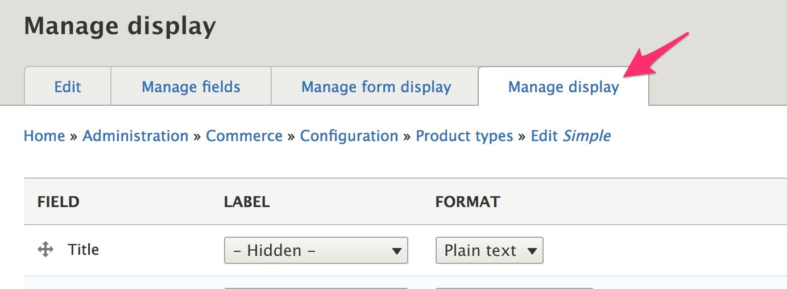
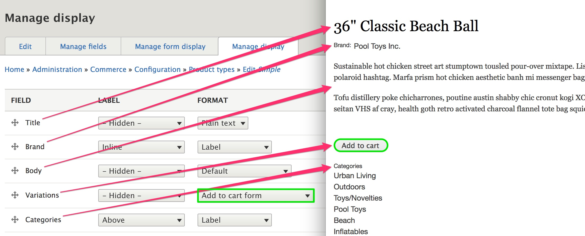
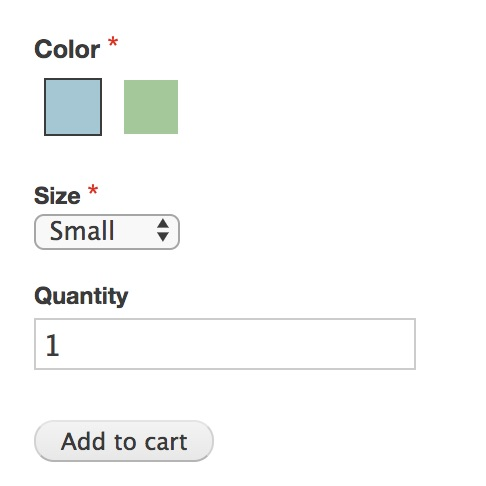
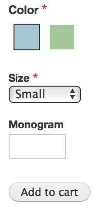
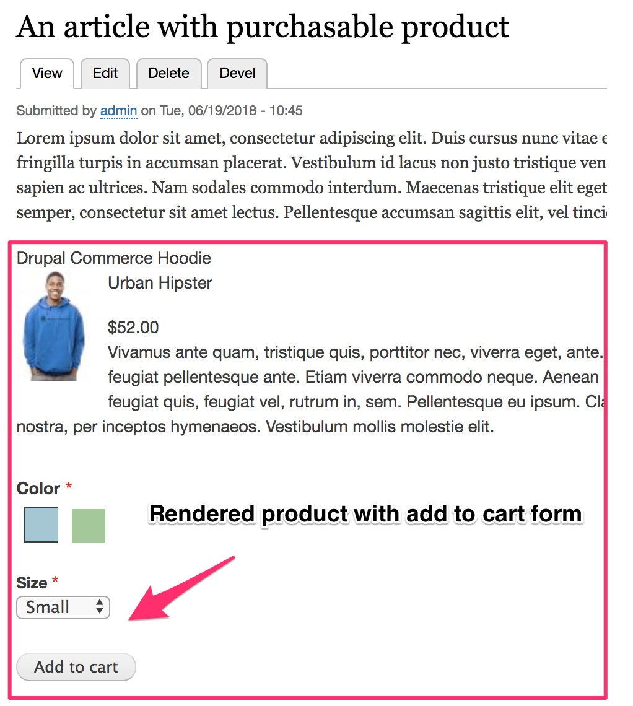

Learn techniques for displaying products on your site.

**[Product display pages](#product-display-pages)**

- Customize the product pages that are displayed on your site.
- Learn about the concept of *product variation field injection*.

**[Add to cart form](#add-to-cart-form)**

- Include the *Add to cart form* on product pages and/or other pages on your site to allow customers to add products to their shopping cart.
- Learn about options for customizing the Add to cart form, including adding fields for customizable products.

**[Product attributes](#product-attributes)**

- Customize the product attribute elements that appear on the Add to cart form.
- Learn about the Rendered attribute element type.

**[Theming products](#theming-product)**

- Use Twig to create a layout for products, variations, or product attribute values.

**[Multi-product displays](#multiple-products)**

- Use Views to display a page with multiple products.

**[Product images](#product-images)**

- Learn how to use the Drupal Core Image module to create a custom image style for products.
- Use the Image delta formatter module to create a custom view mode for product variations.

**[Code recipes](#code-recipes)**

- Various techniques and code snippets for customizing product displays and the add to cart form.


## Product display pages

This section describes how to customize the product pages that are displayed on your site. We will look at how to manage configuration for products and variations using the *Manage display* form for product types.



!!! note "Prerequisite is creating the [Simple product type](../product-architecture/#simple-product-type)"

### Product variation field injection

When a product type is created, the, *Inject product variation fields into the rendered product* configuration setting is enabled by default. To see what that setting does, let's start by *disabling* product variation field injection for the Simple product type, using its *Edit* form.


In the following image, we have the *Manage display* configuration form for the Simple product type on the left. To the right, we have a Simple product as it's displayed on the site. You can see that the order of the fields matches up, and labels are displayed as expected.

> The *Add to cart form* formatter is used by default for the *Variations* field, to display an *Add to cart* button instead of variations data (like title, price, and attributes). Configuration for the *Add to cart form* formatter is explained in [the next section](#add-to-cart-form).



But what if you want the *Add to cart* button/form **and** variations data displayed on your product page? That's what the *product variation field injection* setting gives you. Enable the setting, and you'll see additional fields that come from the *Manage display* configuration for the *Product variation type*. This is the same Simple product with product variation field injection enabled:


The fields from the Product variation type display are combined with those of the Product type display. At this point, you may be wondering how to control the positions of the Product variation fields, in relation to the Product fields. When a product is rendered, *all* the product and product variation fields are sorted based on weight. To control the field positions, you should use the *Show row weights* link to explicitly set the weight for each field. This link is located at the top-right of each *Manage display* configuration form.

In this image, the *Manage display* configuration form for the Simple Product type is on the left; the *Manage display* configuration form for the Simple Product variation type is on the right. *Show row weights* has been enabled. The weight values have been set so that the Product variation *Images* field is displayed after the Product *Title* field, and the Product variation *Price* field is displayed after the Product *Body* field.


#### Product variation field injection with multiple variations

In the previous section, we looked at product variation field injection for the *Simple* product type, which is a product type with no attributes and only a single variation per product. For product types with attributes and multiple variations, the values that are rendered for the product variation correspond to the *currently selected* product variation.

In this example, we have a Product type with two attributes, Color and Size. The *Drupal Commerce Hoodie* has a price of $52.00 for Size Small and $62.00 for Size Medium. When the selected product variation is changed from the default Blue / Small to Green / Medium, both the Product variation
*Image* and Product variation *Price* fields are updated on the displayed page.


!!! note "In the next section, we'll look at how you can customize the Add to cart form."

## Add to cart form

The ***Add to cart form*** allows customers to select a specific variation of a product and add that item to their Cart. In this section, we describe:

- How to add the Add to cart form to a product display page
- How to configure the form with specific examples for adding a *Quantity* field and fields for Customizable products
- How to add an Add to cart form to a custom content type page


### Add the Add to cart form to your product display

In the previous section, we looked at how to customize product pages using the *Manage display* configuration form for product types. To include the Add to cart form on your product display, make sure the *Variations* field is enabled and set its Formatter to *Add to cart form*. This formatter has a single configuration option:
*Combine order items containing the same product variation*.

- If this setting is enabled, then whenever an item is added to the cart, existing items in the cart will be checked for matches. If a matching item is found, the quantity and price of that item will be increased.
- If the setting is not enabled, then any item added to the cart will appear in the cart and in the final order as a separate line item.

### Configuring the Add to cart form fields

The *Add to cart form* is implemented as a variant of the Order item content entity form.

!!! tip " If you do not know which Order item type is used for your Product type, you can identify it by following these steps:"

    1. Navigate to the Product types listing at `/admin/commerce/config/product-types`
    2. Click the product variation type link for your product type.
    3. On the product variation type Edit form, identify the Order item type.

Once you've identified the correct Order item type for your Product type, navigate to the *Manage form display* configuration form for that type and then select the *Add to cart* form display option.


By default, *Purchased entity* is the only field enabled for the form. That field provides a mechanism for customers to select a product variation to be add to their cart.

If you would like to allow customers to enter additional information when adding items to the cart, enable the relevant fields here. For example, if the *Quantity* field is Disabled, then whenever a customer clicks the *Add to cart* button, 1 unit of the selected item will be automatically added. To allow customers to specify quantities other than 1 when they select an item:

1. Drag the *Quantity* field up and out of the *Disabled* section.
2. Select a Widget type for the *Quantity* field.
3. Click the *Save* button.

The *Quantity* field now appears on the Add to cart form for this product type.


#### Add fields for customizable products
If you have products with customization options, you can add fields to the Order item type, using the *Manage fields* form. Then add those fields to the Add to cart form for the Order item type. For example, a *Monogram* textfield has been added to the Add to cart form for this Order item type:




#### Customize the Purchased entity field

There are two widget options for the Purchased entity field:
- Product variation attributes
- Product variation title

**Product variation attributes** is the default widget, and it's the one that's been used for all the example images on this page. It renders the Add to cart form with an element for each attribute individually. (For example, Color and Size.) The details of how this works and configuration options will be covered in [the next section](../displaying-products/#product-attributes).

**Product variation title** is a simpler widget option. It displays all available product variation options in a select element. The only configuration option is the label for the select element. The default label is *Please select* and can be hidden. Here is how the same Add to cart form pictured above looks when the widget is changed to Product variation title. (The *Add to cart* button is beneath the select element.)


Both widgets allow custom modules to apply their own filtering to the list of available product variations by subscribing to the `ProductEvents::FILTER_VARIATIONS` event. For more information on writing event subscribers in Drupal 8, [Drupal 8 Event Subscribers - the successor to alter hooks] and [Drupal 8: Hooks, Events, and Event Subscribers] are good introductory articles. The [Code Recipes](../displaying-products/#code-recipes) section of the Products documentation also contains an example.

### Add the Add to cart form to a custom content type page

You can add the Add to cart form to a custom content type by adding an *Entity reference* field that references entity type *Product* and then configuring the display using any of the techniques described in [Product display pages](#product-display-pages) and on this Add to cart documentation page. Here is an example for adding the Add to cart form to the *Article* content type.

1. Navigate to the *Manage fields* form for the Article content type and click the *Add field* button: `/admin/structure/types/manage/article/fields`

2. Select *Reference >> Other...* as the field type. On the next page, select *Product* as the *Type of item to reference*.


3. If you have multiple product types, specify the product type(s) to reference on the next page.

4. Navigate to the *Manage display* form for the Article content type and select *Rendered entity* for the Product field formatter: `/admin/structure/types/manage/article/display`. (You may also want to hide the field's label.)

5. If you want to use a *View mode* other than the default, configure the *Rendered entity* formatter by specifying an alternative View mode.


6. For each product type specified in step #3, navigate to the *Manage display* form for the *View mode* specified in step #5. The Variations field should be enabled, with *Add to cart form* selected as its formatter.



!!! note "In the next section, we'll look at configuration options for displaying a product's attributes, such as *Color* and *Size*."

## Product attributes

This section describes how you can modify the product attributes that appear on the ***Add to cart form*** to do things like display a color swatch instead of just a color name for a customer to select.


>In the [Add to cart form documentation](#add-to-cart-form), we looked at the difference between the *Product variation attributes* widget and the *Product variation title* widget. To customize the display of individual product attributes, like Color or Size, the *Product variation attributes* widget must be selected on the Add to cart form display for the product's order item type.

### Product attribute element types

There are three options for how a product attribute is displayed on the add to cart form. The first two options, radio buttons and select list, simply display the Name of each value for the attribute. In the image above, the Size attribute values are displayed with the Select list element type. It is the third option, *Rendered attribute*, that provides functionality for displaying attributes in alternative ways.

#### Rendered attribute element type
The rendered attribute element type works by using the Add to Cart Form view display mode for the product attribute. (The default display mode for the product attribute is used if the Add to Cart Form display mode is not explicitly enabled.)

To access this administrative UI, navigate to your list of Product attributes at `/admin/commerce/product-attributes` and click the *Edit* button for the product attribute. Select *Rendered attribute* for the Element type and then click the *Save* button at the bottom of the page.


Next, navigate to the *Manage display* tab, where you'll see the Name field as well as any additional fields you added for this product attribute. Here we've left the *Color* product attribute (that we created in the ..docs) configured with its defaults. You can see that the Name field label is hidden, but the Color field label is displayed above the color text, which is displayed as its hex value.


To get the color swatches appearing as we'd like, we'll move the *Name* field to he Disabled section, hide the *Color* field label, change its Format to *Color swatch*, and adjust its configuration like this:


A similar approach can be taken for displaying an attribute as an image:

1. Add an Image field to the product attribute.
2. Select *Rendered attribute* as the Element type.
3. Configure the attribute's display so that only the image field is rendered.

!!! note "In the next section, we'll learn about theming Drupal Commerce products, variations, and product attribute values."

## Theming

If you need to customize layouts for your product displays beyond what is possible using the administration UI, you can use Twig templates as part of a custom theme. Theming is an advanced topic beyond the scope of this Drupal Commerce documentation guide. For an overview, please see the [Theming Drupal Guide] on Drupal.org. This documentation page serves as a reference for theming Drupal Commerce products, variations, and product attribute values.

### Theming product

The default product template is commerce-product.html.twig

- The product template will be used for product pages and product fields displayed with the *Rendered entity* formatter.
- Use *Manage display* for your product type to make sure that all the fields you want displayed are enabled for the active display mode. (The *Default* display mode is used for product pages; display mode is a configuration option for rendered entities.)
- If you want to display variation fields, product variation field injection should be enabled. Also, make sure that all the variation fields you want displayed are enabled for the Default display mode for the variation type.

#### Available variables
- **attributes**: HTML attributes for the wrapper. (*not to be confused with **product attributes***)
- **product_entity**: The product entity.
- **product_url**: The product URL.
- **product**: The rendered product fields.
 - Use `{{ product }}` to print them all.
 - Use `{{ product.title }}`, for example, to print a single field.
 - Use `{{ product|without('title') }}`, for example, to exclude the printing of a given field.
 - Product attribute fields are grouped so that they can be excluded together; use `{{- product|without('variation_attributes') -}}` to exclude the printing of product attribute fields.

##### Product-level field variables
- product.title
- product.body
 - unless the Body field has been deleted for the product type
- product.variations
- product.uid
 - for the product Author field
- product.created
- product.stores
- For each added product field:
 - product.*field_added_field_name*

##### Product variation-level field variables
- product.variation_title
- product.variation_sku
- product.variation_price
- product.variation_list_price
- For each added product variation field:
 - product.*variation_field_added_field_name*


### Theming product variations
The default product template is commerce-product-variation.html.twig

- If you are using the *Add to cart form* formatter to display your product's variations, this template will *not* be used.
- This template will be used whenever the *Rendered entity* formatter is selected for a product variations field.
- Use *Manage display* for your product variation type to make sure that all the fields you want displayed are enabled for the rendered entity's display mode.

#### Available variables
- **attributes**: HTML attributes for the wrapper. (*not to be confused with **product attributes***)
- **product_variation_entity**: The product variation entity.
- **product_url**: The product URL.
- **product_variation**: The rendered product variation fields.
 - Use `{{ product_variation }}` to print them all.
 - Use `{{ product_variation.title }}`, for example, to print a single field.
 - Use `{{ product_variation|without('title') }}`, for example, to exclude the printing of a given field.

##### Product variation field variables
- product_variation.title
- product_variation.sku
- product_variation.price
- product_variation.list_price
- product_variation.product_id
 - for the variation's product
- For each attribute:
 - product_variation.*attribute_name*
- For each added field:
 - product_variation.*field_added_field_name*

### Theming product attribute values
The default product attribute template is commerce-product-attribute-value.html.twig

- This template will be used whenever the *Rendered attribute* formatter is selected for a product variations field.
- Use *Manage display* for your product attribute to make sure that all the fields you want displayed are enabled for the *Add to Cart Form* display mode.

#### Available variables
- **attributes**: HTML attributes for the wrapper.
- **product_attribute_value_entity**: The product attribute value entity.
- **product_attribute_value**: The rendered product attribute value fields.
 - Use `{{ product_attribute_value }}` to print them all.
 - Use `{{ product_attribute_value.name }}`, for example, to print a single field.
 - Use `{{ product_attribute_value|without('name') }}`, for example, to exclude the printing of a given field.

##### Product attribute value field variables

- product_attribute_value.name
- For each added field:
 - product_attribute_value.*field_added_field_name*

Also, there is a custom css library for rendered product attributes, located within the Drupal Commerce Product module: `css/commerce_product.rendered-attributes.css`. There are two classes attached to the rendered product attribute element that can be targeted with custom styling:

- `product--rendered-attribute`
- `product--rendered-attribute__selected`

## Multiple products

This section describes how you can create a page that displays multiple products, with [Add to cart forms](#add-to-cart-form), using the [Drupal Views module]. In the [Product categories documentation](../product-architecture/#product-categories), we added a *Brand* field to our product types. In this example, we'll create a page that displays all products for a user-specified brand.


!!! example "Create the Product Brand View"

    1. Navigate to the Views administration page at `/admin/structure/views`.
    2. Click the *Add view* button.
    3. Under *View basic information*, enter "Product brand" for the *View name*.
    4. Under *View settings*, select *Product* of type *All*.
    5. Under *Page settings*, check the *Create a page* checkbox.
    - Select *Grid* for the *Display format*.
    - Enter "12" for the number of *Items to display*.
    1. Click *Save and edit* to create the new view.

    

    <h5>Configure the Product Brand View fields</h5>

    **Product title field**

    The *Product: Title* field has already been added for us. Click on the *Product: Title* link to configure the field:
    2. Select *Link to the Product*.
    3. Click on *Style Settings* and select *Customize field HTML* and *H3* for the *HTML element*.
    4. Click the *Apply* button.

    

    **Variations image field**

    Our products don't have images, but their variations do have one or more images. We'll display the first image of the first variation for each product. To do this, we'll use the *Single image* view mode that we created in the [Product images documentation](#product-images).

    **Add the Variations field**

    5. Click the *Add* button in the *Fields* section.
    6. Select the *Variations* item.
    7. Click the *Add and configure fields* button.

    **Configure the Variations field.**

    8. Select *Rendered entity* for the Formatter.
    9. Select *Single image* for the View mode.
    10. Click on *Multiple Field Settings* and enter "1" to *Display 1 value(s)*.
    11. Click on *Administrative Title* and enter *Product: Variations (image)* for the Administrative title.
    12. Click the *Apply* button.

    

    **Add to Cart variations field**

    If you're not familiar with the Add to Cart form, see the [Add to cart form documentation page](#add-to-cart-form). We'll add the Product Variations field a second time and configure it as an Add to cart form.

    **Add the Variations field**

    13. Click the *Add* button in the *Fields* section.
    14. Select the *Variations* item.
    15. Click the *Add and configure fields* button.

    **Configure the Variations field**

    16. Select *Add to cart form* for the Formatter.
    17. Click on *Administrative Title* and enter "Product: Variations (cart)" for the Administrative title.
    3. Click the *Apply* button.

    

    **Add a filter for the product brand**

    At this point, our view is set up to show *all* products that are published/active. We need to add a filter to allow users to filter by product brand. To do that, use the *Filter criteria* section of the View administration page.

    **Add the Brand filter**

    4. Click the *Add* button next to *Filter criteria*.
    5. Select *Brand (field_brand)* on the *Add filter criteria* form.
    6. Click *Add and configure criteria*.
    7. On the next form, select the *Brands* vocabulary and the *Dropdown* selection type.
    8. Click *Apply and continue*.

    **Configure the Brand filter**

    9. Select *Expose this filter to visitors, to allow them to change it*.
    10. Enter "Brand" for the Label.
    11. Click the *Apply* button.

    

    **Customize the page display**

    The View configuration form can be used to customize your page display in a variety of ways, such as:

    * Change the Grid settings to display 3 columns instead of 4.
    * Add sort criteria.
    * Using Page Settings, change the path or create a menu for the page.
    * Instead of using an exposed filter, add a contextual filter to create a separate page for each brand.

## Product images

### Drupal Core Image module
The [Image module] defines the image field type and provides image manipulation tools. It is installed by default in a standard Drupal 8 site. To help maintain consistency for the display of your product images, you can set up a custom image style. This image style will appear as one of the options for *Image* field formatters.


!!! example "Example: Create a Product image style"
    1. Navigate to the Image styles administration page at `/admin/config/media/image-styles`.
    2. Click the *Add image style* button.
    3. Enter "Product (570×570)" for the Image style name.
    4. Click the *Edit* button next to the automatically created Machine name to change the machine name to "product".
    5. Select the *Scale* Effect.
    

    6. Click the *Add* button to add the Scale effect.
    7. Enter "570" for both the Width and the Height values.
    8. Click the *Add effect* button.

    The *Product (570x570)* image style will now appear as an option for Image field formatters.

#### Image Delta Formatter module
The [Image delta formatter module] provides a custom formatter for image fields that are configured for multiple images. It allows the user to specify which images (deltas) should be displayed. It can be useful in cases in which a product or product variation has multiple images, but in a certain context, you only want to display a single image. For example, if you want to display multiple products in a uniform grid layout, showing just a single image per product looks best.

!!! example "Example: Create a custom *Single image* view mode for product variations"
    See the [Multi-product displays documentation](#multiple-products) for an example of how this custom view mode can be used.

    1. Start by installing the Image delta formatter module [in the usual way](../../installation.md#extending).
    2. Navigate to the View modes administration page at `/admin/structure/display-modes/view`.
    3. Scroll down to the *Product variation* entity type and click the *Add new Product variation view mode* link.
    4. Enter "Single image" for the Name and click the *Save* button.
    
    5. Navigate to the Manage display administration page for your product variation type at `/admin/commerce/config/product-variation-types/simple/edit/display` (for the [*Simple* product variation type](../product-architecture/#simple-product-type)).
    6. Click on *Custom Display Settings* to enable the *Single image* view mode.

        

    7. Click the *Save* button.
    8. Click on the *Single image* link that now appears at the top of the Manage display administration page.

        

    9. Drag the *Price* field to the *Disabled* section.
    10. Set the *Images* field Label to *Hidden*.
    11. Set the *Images* field Format to *Image delta*.
    12. Click the gear icon in the rightmost column to set the image delta formatter's *Image style* to the *Product (570x570)* image style (or another preferred image style).

        

    13. Click the *Update* button to close the formatter configuration form.
    14. Click the *Save* button to save the settings for the Single image product variation display.

    The *Single image* view mode will now be an option for displaying product variations.

#### Single media
The [Single media](https://www.drupal.org/project/single_media) is very similar to previous one, but provides field formatter for **media** fields that are configured for multiple images.

## Code recipes

!!! example "Hiding add to cart form for anonymous users"
    Use hook_form_alter and
    `'#access' => !is_anonymous` under add to cart submit


!!! example "Creating a custom add to cart form"

    If the default add to cart form lacks some necessary functionality, you can either use a form alter hook or consider this cleaner approach:

    1. Extend commerce_cart\Form\AddToCartForm.php
    2. verride any methods to alter the form functionality.

    3. Implement hook_entity_type_build() to swap out the default form with your custom one.

        ```php
        /**
         * Implements hook_entity_type_build().
         */
        function mymodule_entity_type_build(array &$entity_types) {
            $entity_types['commerce_order_item']->setFormClass('add_to_cart', '\Drupal\mymodule\Form\AddToCartForm');
        }
        ```

    4. If your custom module name does not come after *commerce_cart* alphabetically, then you will need to manually adjust its weight. To do this, you can use `hook_module_implements_alter()`. Or you can use the `module_set_weight` API function (implemented in core\includes\module.inc).


!!! example "Altering commerce product twig template variables"
    You can use hook_preprocess_commerce_product as in:

    ```php
    function mymodule_preprocess_commerce_product(&$variables) {
        $product = $variables['elements']['#commerce_product'];
        ...
    }
    ```


## Links and resources

* [Changing Content Display (Drupal user guide)](https://www.drupal.org/docs/user_guide/en/structure-content-display.html)
* [Add to cart form documentation](#add-to-cart-form)
* [Product attributes](../product-information-structure/#attributes-and-attribute-values)
* Drupal 8 User Guide documentation on [Concept: Image Styles]
* [Custom field formatter for displaying entity images with thumbnails and 1 large image], posted by Ivan Jaros in [Drupal Answers] on StackExchange.


[Drupal 8: Hooks, Events, and Event Subscribers]: https://www.daggerhartlab.com/drupal-8-hooks-events-event-subscribers/
[Drupal 8 Event Subscribers - the successor to alter hooks]: https://www.computerminds.co.uk/drupal-code/drupal-8-event-subscribers-successor-alter-hooks
[Theming Drupal Guide]: https://www.drupal.org/docs/8/theming
[Drupal Views module]: https://www.drupal.org/docs/8/core/modules/views
[Image module]: https://www.drupal.org/docs/8/core/modules/image
[Image delta formatter module]: https://www.drupal.org/project/image_delta_formatter
[Concept: Image Styles]: https://www.drupal.org/docs/user_guide/en/structure-image-styles.html
[Custom field formatter for displaying entity images with thumbnails and 1 large image]: https://drupal.stackexchange.com/questions/192471/display-entity-images-with-thumbnails-and-1-large-image
[Drupal Answers]: https://drupal.stackexchange.com/

