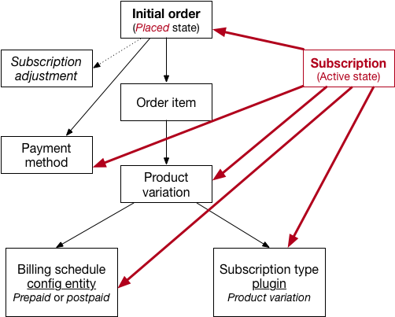
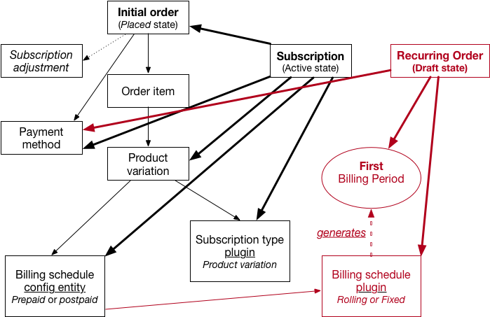
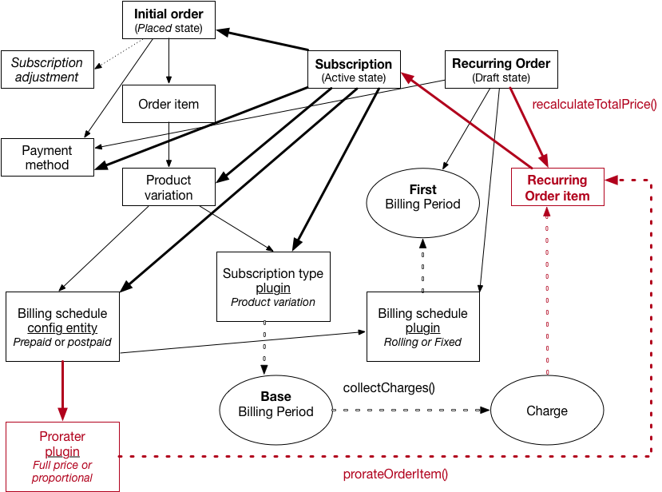
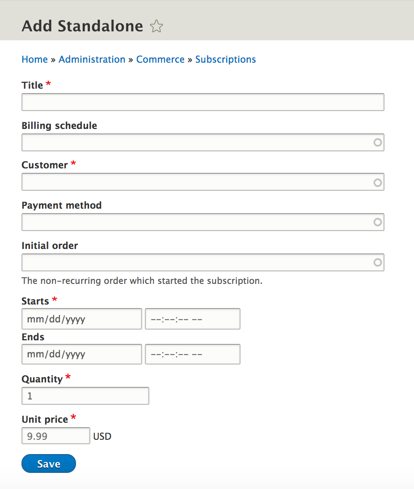

## Create subscriptions

<h3>Ordering a subscription/recurring product</h3>

This section describes the sequence of events that occurs when a customer completes checkout for an order that includes a subscription/recurring product variation. At the end of the [Getting started section](./getting-started/#setting-up-subscriptions-first-steps), we had an initial order with a payment method and at least one order item for a product variation that allows subscriptions. A "subscription" adjustment may have been added to the order (depending on the variation's billing schedule and timing of the order).

<h4>The Initial order vs. Recurring orders</h4>

When a new subscription order is placed, it may be tempting to think, "oh, I've just created a new order with a subscription item. This must be a 'recurring' order with a 'recurring' order item." But that's not the case. A subscription's "Initial order" is never a recurring-type order. It does, however, have at least one order item for a product variation that allows subscriptions. And this product variation is set as the Subscription's "Purchased entity".

"Recurring" orders, on the other hand, are created for each billing period of a subscription. And the recurring order's items represent the charges applied to the subscription during that billing period. You will never directly create or edit either a recurring order or recurring order items through the UI. These entities are managed internally, as part of the overall subscription system. (Note: as of 3/13/2018, there is [an open issue (#2925817)](https://www.drupal.org/project/commerce_recurring/issues/2925817) for disallowing the creation/editing of recurring orders.)

<h3>OrderSubscriber onPlace() method</h3>

The Commerce Recurring module includes an `OrderSubscriber` service that subscribes to the `commerce_order.place.pre_transition` event. When a customer completes checkout, the order is placed, and the order subscriber's `onPlace()` method is triggered. In this method, we first confirm that the order type is *not* recurring and that the payment method has been set. If the order is valid, we iterate through the order's items. If an order item's purchasable entity has both a "subscription type" and "billing schedule", then a new subscription is created for the item.

<h3>SubscriptionStorage createFromOrderItem() method</h3>

The subscription entity is created by the `SubscriptionStorage` class, in its `createFromOrderItem` method. The subscription's `state` is set to 'active'. The subscription type and billing schedule are set based on the purchased entity's values. The subscription's purchased_entity, title, quantity, and price field values are set based on the corresponding order item values. (The price value is the *resolved* order item unit price but not adjusted/prorated.) The subscription's payment method, store_id, uid, and initial_order fields are set based on the data for the order that was placed. 

This method also triggers the onSubscriptionCreate() method for the `SubscriptionType` plugin. In the default "Product variation" subscription type, this method does nothing, but you could add your own custom logic here by overriding the method in a custom SubscriptionType plugin (and creating a product variation type that uses your custom plugin.)

<h3>Return to OrderSubscriber::onPlace()</h3>

`SubscriptionStorage` returns the newly created Subscription entity to the `onPlace()` method in the OrderSubscriber class, which saves the entity: 

There's one last step in the `onPlace()` method, but it's a *BIG* one: a call to the `ensureOrder` method provided by the `RecurringOrderManager` service. The RecurringOrderManager holds almost all of the module logic, so we'll see it used throughout the Commerce Recurring module. For now, we'll limit ourselves to just the `ensureOrder()` method (and the methods it calls.)

<h3>RecurringOrderManager ensureOrder() method</h3>

The Subscription entity is passed to the `ensureOrder` method as its only argument. First, the subscription's billing schedule plugin is used to generate the first billing period. (For more information on how this happens, review [Subscriptions overview](./getting-started/#billing-schedule-plugin) as well as the `Fixed` and `Rolling` billing schedule plugin code.) 

Next, RecurringOrderManager's `createOrder()` method is used to create a new recurring-type order entity. Its store, customer, billing profile, payment method, payment gateway, and billing schedule fields are set to values provided by the subscription entity and its payment method. The order's billing period is set to the first billing period.

After the billing period and recurring order are created, the RecurringOrderManager's `applyCharges()` method is called. There's a lot of logic in this method, but to keep things simple here, we'll just look at what happens for our *newly created* recurring order.

<h3>RecurringOrderManager applyCharges() method</h3>

Our newly created *recurring* order does not yet have any order items. The `applyCharges()` method is where recurring-type order items are created and added to our recurring-type order. First, the subscription type plugin's `collectCharges()` method is used to create `Charge` objects. Assuming our subscription is using the product variation subscription type plugin, the `collectCharges()` method is implemented in the `SubscriptionTypeBase` class. The Charge object (or objects) returned by `collectCharges()` has the following structure:

* purchasedEntity (`PurchasableEntityInterface` or null)
* title (string)
* quantity (string)
* unitPrice (`Price`)
* billingPeriod (`BillingPeriod`)

<h3>SubscriptionTypeBase::collectCharges()</h3>

Here is a short synopsis of what the method does; for full details, take a look at the full source code for `SubscriptionTypeBase::collectCharges()`.

`collectCharges()` uses the subscription's start date (the date the initial order was placed) and the first billing period that was calculated for the recurring order. It determines a "base billing period" using the billing schedule plugin's `generateNextBillingPeriod()` method, if needed. Depending on whether the billing schedule is Prepaid or Postpaid as well as the whether the billing schedule's plugin is fixed or rolling, the base billing period could be the same as the first billing period or some other combination of start and end dates.

In the case of a Prepaid billing schedule, the base billing period will be the *next* billing period after the first billing period. Its start date will be either the subscription start date plus a single interval or, if the billing schedule is fixed, the adjusted subscription start date plus a single interval; its end date will be the start date plus an interval.

Otherwise, the billing schedule is POSTPAID, and we're charging for the current/initial billing period. The base billing period's start date will be either the subscription start date or the adjusted subscription start date. The base billing period's end date will be one of:
* the start date plus a single interval
* the adjusted start date plus a single interval
* the subscription end date (if it ends before the end of the interval)

Once the base billing period is determined, a new `Charge` is created using that billing period and subscription entity field values.

<h3>Return to RecurringOrderManager::applyCharges()</h3>

The subscription type plugin returned an array containing just a single `Charge` object that is used for the purchased entity, title, quantity, billing period, and unit price fields values of the recurring-type order item. Also, the `subscription` field of the recurring order item is set to the `id` of the subscription entity.

At this point, we have a problem with our recurring order item: the unit price might not be valid for the base billing period that was calculated. So here's where the prorater plugin gets called into action. Recall that the billing schedule configuration entity has a [prorater plugin](./getting-started/#prorater). In the prorater plugin's `prorateOrderItem` method, a prorated unit price is returned, and the recurring order item's unit price is updated. Note that the unit price is set here as 'overridden' so that it will not be subsequently changed by any price resolvers.

Finally, the `applyCharges()` method finishes by adding the recurring order item to the recurring order. The recurring order's total is automatically recalcuated so that it matches the unit price of the recurring order item.

<h3>Return to RecurringOrderManager::ensureOrder()</h3>

After the `applyCharges()` method finishes, `ensureOrder()` triggers the `onSubscriptionActivate()` method for the `SubscriptionType` plugin. In the default "Product variation" subscription type, this method does nothing, but you could add your own custom logic here by overriding the method in a custom SubscriptionType plugin (and creating a product variation type that uses your custom plugin.)

Next, `ensureOrder()` finishes up by saving the recurring order item and the recurring order. Then the recurring order is added to the `Subscription` entity, and the Subscription is saved. The recurring order is returned to the OrderSubscriber's `onPlace()` method and we're done!

<h3>Summary</h3>

Here's an overview of "who did what" when the OrderSubscriber's `onPlace()` method was triggered by the `commerce_order.place.pre_transition` event:
1. SubscriptionStorage:
    * create subscription
    * trigger `onSubscriptionCreate()` (SubscriptionType plugin method)

2. OrderSubscriber: save subscription

3. BillingSchedule plugin: generate first billing period

4. RecurringOrderManager: create recurring order

5. SubscriptionType plugin: generate base billing period for the recurring order item (with an assist by the BillingSchedule plugin)

6. RecurringOrderManager:
    * create recurring order item
    * prorate the recurring order item price (with an assist by the Prorater plugin)
    * trigger `onSubscriptionActivate()` (SubscriptionType plugin method)
    * save recurring order item
    * save recurring order
    * add recurring order to the subscription
    * save the subscription

(Note that these steps would be repeated if the initial order has multiple subscription items.)

At the end of this process, we have an 'active' subscription with a single recurring order (in the draft state). The billing period for the recurring order is the "first" billing period for the subscription. The billing period for the recurring order item is the base billing period. The order total is the *next* amount due, calculated using the base billing period and taking the amount already charged in the initial (non-recurring) order into consideration.

## Create standalone subscriptions

If a new Subscription is created through the Admin UI, "Standalone" is available as a subscription type option. This section describes what happens when a standalone type subscription is created.

Once all the required field values have been entered and the form has been saved, the new Subscription is in the `Pending` state and does not yet have any recurring orders. In [the next section](#close-and-renew-subscriptions), we can see how the `Cron` service created [AdvancedQueue](https://www.drupal.org/project/advancedqueue) `Jobs` for closing and renewing a recurring order. The `Cron` service also checks whether there are any pending subscriptions that have already started (i.e., subscription start date < current date/time). If any are found, a new AdvancedQueue `Job` (for 'activating' the subscription) is created and enqueued for each subscription.

The `SubscriptionActivate` JobType plugin is used to activate a subscription. If the subscription is not found or is not active, the plugin's `process()` method returns with a "failure" result. Otherwise, the `activate` transition is applied to the subscription and the RecurringOrderManager's `ensureOrder()` method is called to create the recurring order for the subscription. This is the same method that was used to [create a recurring order for a product variation type subscription](#create-subscriptions). At the end, we will have an "active" subscription with a single recurring order (in the "draft" state.) 

The only difference between a subscription created from an order item and a standalone subscription is that neither the standalone subscription nor its recurring order item will have a purchased entity. [The recurring order close-and-renewal process](#close-and-renew-subscriptions) reamins the same. One possible use-case for a standalone subscription is a recurring donation system. The admin UI currently provides only basic functionality and would probably require improvements before it could be used in production. For example, the standalone subscription still requires a stored payment method; the Payment method field should be required and validated.

## Close and renew subscriptions

This section describes what happens when a recurring order's billing period comes to an end. At that point, we need to close the current recurring order  (by successfully creating a payment for it) and renew the subscription by creating a new recurring order for the next billing period. In [the previous section](#create-subscriptions), we looked at how the `OrderSubscriber` kicks off a chain of events when a new order is placed. And at the end, a Subscription entity with at least one recurring order, which was left in the draft state, was created. In this part, it's Cron that will kick things off. The Commerce Recurring module implements `hook_cron` with a call to the `run()` method of the `Cron` service class.

<h3>Cron service class</h3>

The Cron service class does a couple different things in its `run()` method, but we'll just look at one of them here, the one that's relevant to closing and renewing a recurring order. The `run()` method starts by checking whether there are any recurring orders in the draft state with an ended billing period (i.e., billing period end date < current date/time). If any are found, the 'commerce_recurring' queue is loaded. (The [AdvancedQueue module](https://www.drupal.org/project/advancedqueue) is used for queue management in the Commerce Recurring module). Then, for each draft/ended recurring order, two Advanced Queue Jobs (for 'close' and 'renew') are created and enqueued for the order.

<h3>AdvancedQueue Jobs and JobType plugins</h3>

Without getting too much into the details, an AdvancedQueue `Job` is an object that has a state (queued, processing, success, failure), belongs to a AdvancedQueue `Queue` (a configuration entity), and has a payload (an array of values passed to the `Job`). An AdvancedQueue `JobType` plugin contains the logic for processing a given job, in its `process()` method. Commerce recurring defines two `JobType` plugins for closing and renewing orders: `RecurringOrderClose` and `RecurringOrderRenew`.

### Closing a recurring order

Given the recurring order id (via the `Job` payload), the `RecurringOrderClose` plugin attempts to load the order and then calls the **RecurringOrderManager's** `closeOrder()` method. First, if the recurring order's state is 'draft', the state is changed to 'placed' by applying the 'place' workflow transition. This ensures that the recurring order won't be queued again by the `Cron` service the next time Cron runs. Next, we need to get the payment method and payment gateway. If the recurring order has only one order item and only one subscription, we can use that subscription's payment method. If the recurring order has multiple subscriptions and multiple payment methods, then the most recent payment method is used.

Once we have a payment method, we get its payment gateway and the payment gateway plugin. Next, a new `Payment` entity is created for the recurring order in the amount of the total price of the order. The payment gateway's `createPayment()` method is called and, if successful, the recurring's order state is changed to 'completed' by applying the 'mark_paid' transition.

What happens if the `createPayment()` method fails? The `DeclineException` is caught by the `RecurringOrderClose` plugin and handled by the plugin's `handleDecline` method.

<h4>RecurringOrderClose handleDecline() method</h4>

The recurring's order BillingSchedule (a config entity) is used to get the Retry Schedule. (This is set in the "Dunning" section of the billing schedule's data entry form.) If the maximum number of retries has not yet been reached, then a "Failure" result will be returned with a retry delay based on the Dunning settings and the number of retries so far increased by one. The queue will attempt to run the Job again after the retry delay.

If the maximum number of retries has been reached, the recurring order's state is changed to 'Failed' by applying the 'mark_failed' workflow transition. The Billing Schedule's Dunning settings control whether the recurring order's subscription(s) should remain active or should be canceled. If the subscription(s) should be canceled, this is also handled by the `RecurringOrderClose` plugin. The state of each subscription will be set to 'Canceled', and the subscriptions will be saved. The Job will not be run again.

If the customer wishes to reactivate the subscription, he will have to go through the checkout process again to begin a new subscription. (A process to reactivate a subscription by adding a new payment method does not yet exist.)

The `handleDecline()` method also dispatches a `PaymentDeclinedEvent` (that could be used to send a dunning email) and saves the recurring order.

### Renewing a recurring order

Given the recurring order id (via the `Job` payload), the `RecurringOrderRenew` plugin attempts to load the order and then calls the **RecurringOrderManager's** `renewOrder()` method. If the order's subscription state is not active, the subscription has ended, so nothing is done. Otherwise, we create a new `BillingPeriod` object for the current billing period, using the recurring order's `billing_period` field value. Next, the billing schedule's plugin (`Fixed`, `Rolling`, etc.) is used to generate the next billing period.

A new recurring order is then created for the subscription and the next billing period, and subscription charges are applied.  This is the same process that was used for [creating the initial recurring order](#create-subscriptions) for the subscription. 

At this point, `renewOrder()` triggers the `onSubscriptionRenew()` method for the `SubscriptionType` plugin. In the default "Product variation" subscription type, this method does nothing, but you could add your own custom logic here by overriding the method in a custom SubscriptionType plugin (and creating a product variation type that uses your custom plugin.)

Next, the new recurring order and its items are saved, the order is added to the subscription, the renewed time is set for the subscription (to the current time), and the subscription is saved. The order renewal process is complete.

## Cancel subscriptions

In the [Create subscriptions section](#create-subscriptions), we looked at how the `OrderSubscriber` class uses its `onPlace()` method to handle the "place" transition that's triggered when checkout completes. In this part, we look at what happens when an order with a subscription is canceled. 

The `OrderSubscriber` class handles the order cancel event with its `onCancel()` method. Just as in `onPlace()`, this method only operates on *non-recurring* order types. Unlike the `onPlace()` method, `onCancel()` is fairly simple and straighforward.

In `onCancel()`, we iterate through the order's items. If an order item's purchasable entity has both a "subscription type" and "billing schedule", then we find any subscriptions for which this order is the subscription's "initial order" *and* the subscription state is "active". For each subscription, the state is set to Canceled and the subscription is saved.
