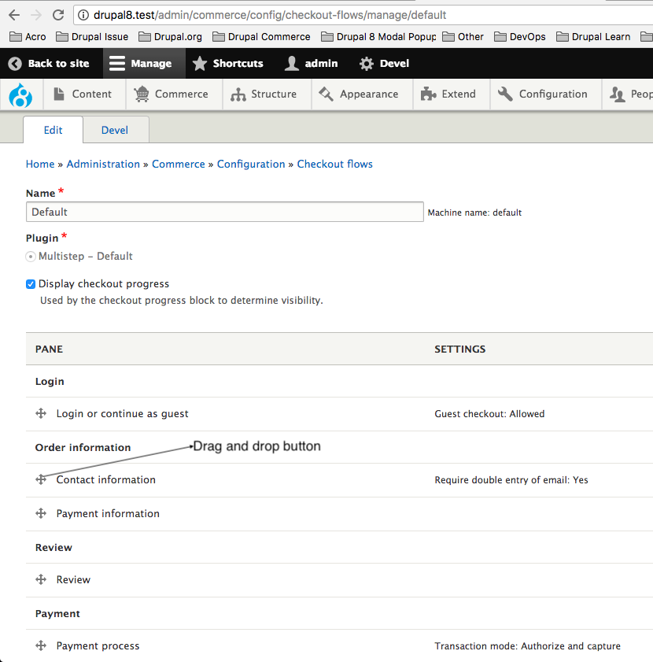
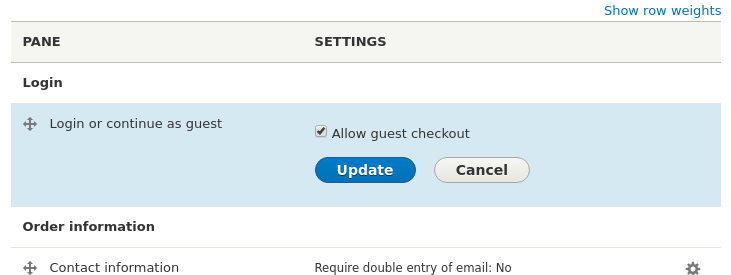
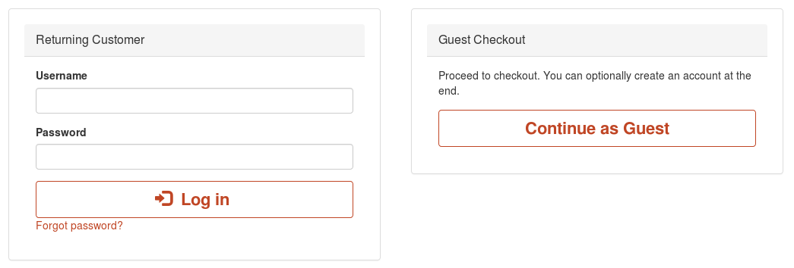
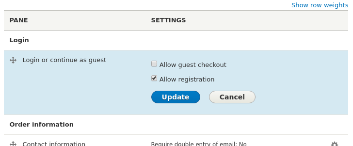
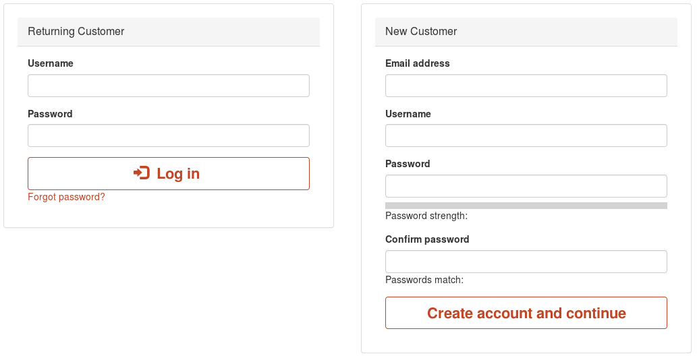
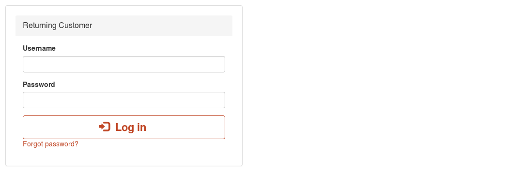

! We need help filling out this section! Feel free to follow the *edit this page* link and contribute.

## Configure checkout

### Checkout Flows

Checkout flow page is under Home >> Administration >> Commerce >> Configuration >> Orders >> Checkout flows

Drupal Commerce comes with a drag-and-drop checkout form builder that lets you decide what information you need to collect from or display to customers during the checkout process. It supports single and multi-page checkout depending on your requirements and can be easily extended with new components through the use of contributed or custom modules.

Content of panes is split in this 7 parts, but it can be modular, so you can drag and drop them as you wish or even disable them:

* Login - offers option for users to login or continue as guest, enables guest checkout
* Order information - the initial form used to collect basic order details
* Review - a review of all the order details with the pane for submitting paymen
* Payment -  used to select Transaction Mode - Authorize and capture or Authorize only
* Complete -  the final landing page showing the checkout completion message.
* Sidebar - order summary and coupon redemptions
* Disabled - Panes that you want to disable

### Order information

Contains from **Contact information** and **Payment information**.

**Contact information** is only visible for anonymous users, allowing them to specify an e-mail address to use for their order. 
For authenticated users, the pane is not shown, because Drupal Commerce initializes the order e-mail address field to the same e-mail address on file in their user account.

**Payment information** checkout pane functions as an add / edit form for the billing customer profile to be associated with the order. By default, this pane will always result in the creation of a new billing customer profile, with addressbook functionality like reusing previous addresses being supplied by a contributed module.

### Review

This checkout pane displays a full summary of the order details, including data from any other checkout pane on the form that exposes it to this pane. It will include by default the cart contents again, the user's account information, and the billing address. Other checkout panes may or may not expose data to this pane, and any that does may be directed to the relevant checkbox on the pane's configuration form.

### Payment

This checkout pane presents all payment methods available to the customer in a radio select list.

### Completion message

This checkout pane displays a simple checkout completion message that links to the order details page in the user's account. Even anonymous users will be able to view their completed orders for the duration of their current session. The checkout completion message is configurable via the pane's configuration form for single language sites, but multilingual sites will want to leave it set to the default message and translate the default string to the desired message through the translation interface.

## Controling guest checkout

By default your site will allow guest checkouts.
You can change this and only allow registered users to checkout and/or allow users to register before they checkout.
You can change this setting on a per Checkout Flow basis, so you can allow guest checkouts for some flows and not others as you need.

### How to enable / disable Guest Checkout

Visit the Commerce configuration page and go to the **Checkout Flows** section.

Click **Edit** on the Checkout Flow you want to configure.

To **Enable** Guest Registration

* Click the cog icon in the **Login or continue as guest**
* Check the **Allow guest checkout** box, click **update** and then **Save** at the bottom of the page.

To **Disable** Guest Registration

* Click the cog icon in the **Login or continue as guest**
* Uncheck the **Allow guest checkout** box, click **update** and then **Save** at the bottom of the page.

Your first checkout page will then have the below sections, its exact appearance will vary as the below image uses the Bootstrap theme.

## Allow registration during checkout

You can restrict checkout to just users with accounts. You can then either completely deny checkout access to users without accounts or require them to create an account before they can checkout.

You can change this setting on a per Checkout Flow basis, so you can deny guest checkouts for some flows and not others as you need.

### Enable / Disable Account Registration at Checkout

Visit the Commerce configuration page and go to the **Checkout Flows** section.

Click **Edit** on the Checkout Flow you want to configure.

To **Allow Registration at Checkout**

* Click the cog icon in the **Login or continue as guest**
* Uncheck the **Allow guest checkout** box
* Check the **Allow registration** box
* Click **Update** and then **Save** at the bottom of the page.

With a Boostrap theme your page will look something like the below:

To **Deny Registraion at Checkout**

* Click the cog icon in the **Login or continue as guest**
* Uncheck the **Allow guest checkout** box
* Uncheck the **Allow registration** box
* Click **Update** and then **Save** at the bottom of the page.

With a Boostrap theme your page will look something like the below.

### Allow guests to create an account during the checkout process

To give your customers the ease of creating an account at the end of their checkout you need to enable the "Guest Registration after checkout" pane in your checkout flow.

! At the time of writing your site will not have this feature by default. You need to apply the latest good [patch from this issue]. The below instructions will then apply to your site.

#### Enable / Disable Account Registration at Checkout
You need to enable / disable registration for each Checkout Flow you are using.

Visit the Commerce configuration page and go to the **Checkout Flows** section.

Click **Edit** on the Checkout Flow you want to configure.

To **Enable** Guest Registration

* Locate the "Disabled" section and drag the **Guest registration after checkout** into the "Complete" section and click **Save**.

To **Disable** Guest Registration

* Locate the "Complete" section and drag the **Guest registration after checkout** into the "Disabled" section and click **Save**.

[patch from this issue]: https://www.drupal.org/node/2857157
