The competitive nature of the current retail market has driven store owners to search for methods and strategies to stand out from the competition and to drive sales. Creating promotions has been the strategy that has proven most effective for achieving those two goals.

Drupal Commerce Core provides powerful pricing options that store administrators can leverage to turn their innovative promotion ideas into reality. Promotions and coupons give us the ability to configure pricing rules to meet the store's needs. Before we delve into the process of creating promotions and coupons, let's first get some basic understanding of these terms.

* **Promotion** - a pricing strategy to increase/boost customer sales. It can include product-based discounts or discounts on the entire order. An unlimited number of promotions can be added. They are applied based on the weight that you give each promotion. Promotions with a lower weight are applied first.
* **Offer** - the actual discount that customers will receive. For example, a "10%" discount.
* **Condition** - the requirements that need to be met for the promotion to apply. For example, the offer will only apply if the order total is greater than "$100".
* **Compatibility** - whether the promotion can be combined with other promotions.
* **Coupon** - a promotion that applies only if the customer adds a matching voucher code during checkout.

Imagine that your store is planning to run a special New Year campaign where you'd like to give customers a 10% discount on orders worth $50 or more. You'd like to set up the promotion ahead of time and limit it to a specific date range. With the default offers and conditions provided by the promotion system, it is quite simple.

## Adding a New Promotion

* You can create a new promotion by going to ``/admin/commerce/promotions`` and clicking the "Add promotion" button.

* Give your promotion a descriptive name, for example, "10% off on $50 or more orders".

* If you would like to use a different name for what customers will see on their order/cart, enter a "Display name", for example, "10% Off Storewide Sale". If the display name is set, only administrative users will see the "Name" of the promotion.

* Optionally, you can also enter a description for the promotion. This description can only be viewed by administrative users, not customers.

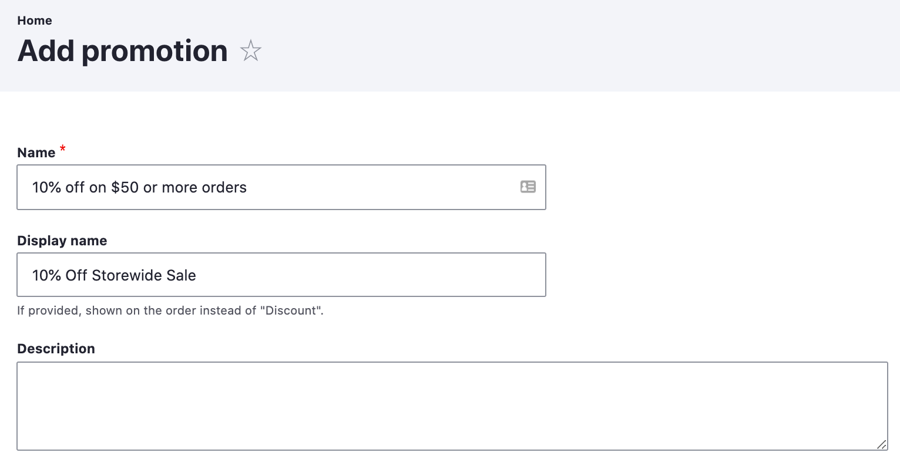

### Setting the Offer

* Let's now decide on the type of offer you'd like to give users. As our goal is to give customers a 10% discount on orders worth $50 or more, let's select the "Percentage off the order subtotal" option under ``Offer type``. Notice that whenever you change the offer type, the form changes below the list of options to provide additional inputs.
* Now enter the percentage you'd like to give the customer as the "Percentage off". For this example, we enter "10".

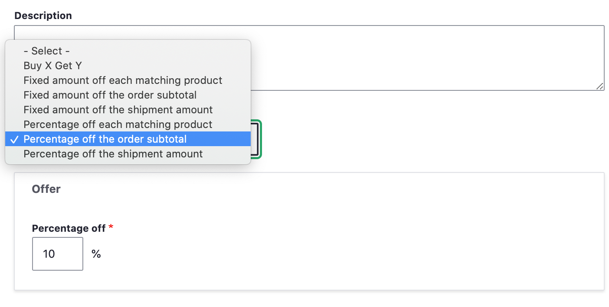

!!! note
    See the [Edit a promotion](#edit-a-promotion) documentation page for a description of all Offer types provided by Drupal Commerce core. Note that additional offer types can be created in custom code by a developer. See the [Create an offer type](../developer-guide/promotions/offers) page in the Developer guide for documentation and example code.

### Adding Conditions

The conditions section allows you to further manage the promotions so that you can tell the system to apply the promotion only if the order meets certain criteria. There are three categories of Conditions: Customer, Order, and Products. Click on each to see condition options in that category. You can specify multiple conditions. For this example, we want to add a condition so that our promotion will only apply to orders worth $50 or more. This is the "Current order total" condition, an "Order" condtion. Similar to the "Offer type" options, whenever we select a Condition type, a new form will appear under that condition. We'll select the "Greater than or equal to" Operator and enter "50" as the Amount:

At the end of the Conditions section of the page, you can specify whether "all conditions must pass" or "only one condition must pass". Since our example promotion has only one Condition, it doesn't matter which option we select. We'll leave it set to the default, "all conditions must pass":

!!! note
    See the [Edit a promotion](#edit-a-promotion) documentation page for a description of all Condition types provided by Drupal Commerce core. Note that additional condition types can be created in custom code by a developer. See the [Create a condition](../developer-guide/promotions/offers) page in the Developer guide for documentation and example code.

### Additional Configuration

On the right-hand side of the page, you'll see options for setting additional limitations on the promotion. For this example, we stated that we wanted to limit our promotion to a specific date range. So we'll enter a Start date of "12/31/2021" at "10:00 PM" and an End date of "1/7/2020" at "11:59 PM", right before midnight. To do so, we need to enable the "Provide an end date" option by clicking the checkbox.

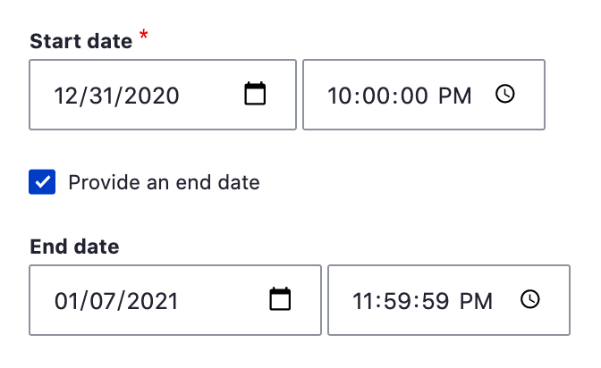

Note that the date and time constraints are applied based on the Timezone of the *Store*, not that of the customer.

### Testing the Promotion

Now, that you've entered the necessary conditions let's "Save" the promotion. You can test this out by adding a product or a number of products to the cart. Once the order total reaches $50 or more, note, a discount is automatically applied to the order total.

!!! tip
     If you want to test a promotion before it goes live, use the "Customer role" Condition to temporarily require an administrative role. Then you can safely enable and test a promotion without exposing it to customers. In this example, you would also need to adjust the starting date to allow orders during the testing period. Just remember to restore the correct starting date and remove the Customer role condition after testing and before it needs to go live!

## Edit a promotion

After creating a promotion, you can make updates by editing its various configuration options. The [Create a promotion](#adding-a-new-promotion) documentation page provides an introduction to those options; this page provides a more comprehensive summary.

### Updating Names and Description

The "Name", "Display name", and "Description" fields can be updated after a promotion is created, even if the promotion is already active. However, if the promotion has already been applied to existing orders, the name that customers see on their order/cart may or may not be updated, depending on the state of the order.

* If the order has already been placed, the promotion name will not be updated.
* If the order is still an in-progress shopping cart, the promotion name will be updated.

### Offer types

Commerce Core includes five different offer types. The Commerce Shipping module, if installed, provides two additional offer types. When the Offer type is changed, the "Offer" form below the list of options will be updated with configuration options specific to the offer type.

#### Fixed amount or Percentage off the order subtotal

The two simplest offer types are, "Fixed amount off the order subtotal" and "Percentage off the subtotal". For the "Fixed amount" offer, enter the exact amount that should be deducted from the order subtotal. If your site has multiple currencies installed, you will need to specify the currency in addition to the amount.

For the "Percentage" offer, enter the percentage that should be applied to the order subtotal to calculate the discount amount. Decimal amounts can be entered. For example, enter, "1.5" for a 1.5% discount amount. If the subtotal amount is $1,000.00, the discount will be $15.00.

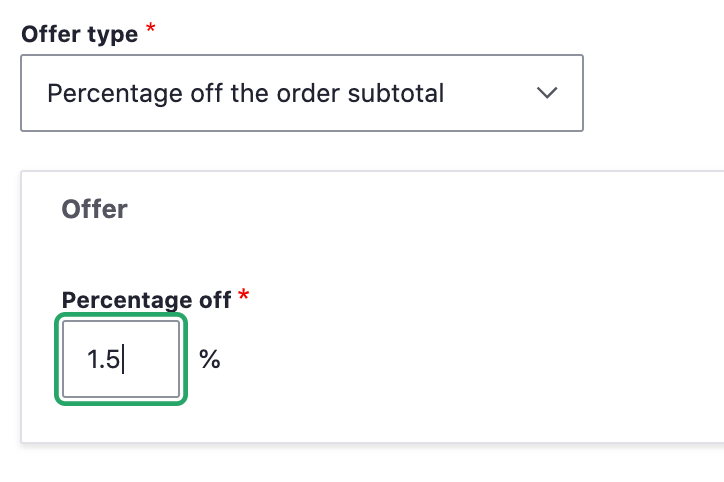

#### Fixed amount or Percentage off each matching product

These offer types are similar to the Fixed amount and Percentage off the order subtotal offer types but offer additional options for how the discounts are displayed and applied to individual order items.

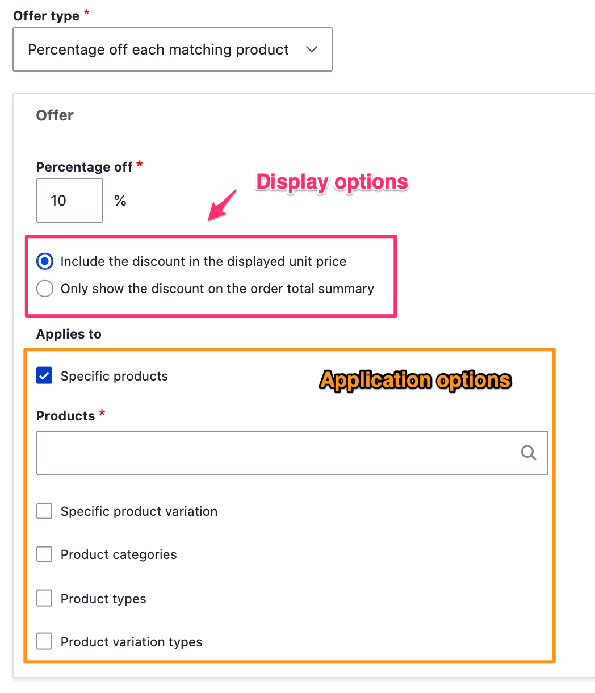

##### Display options

* Use the Display options to control whether displayed unit prices for individual order items remain unchanged or adjusted by discount amounts.

##### Application options

Use the Application options to limit the application of the discount to only order items that match your criteria.

- **Specific products**: Enter the titles for one or more products, separated by commas.
- **Specific product variation**: Enter either titles or SKUs for one or more product variations, separated by commas.
- **Product categories**: For any product types with custom fields that reference taxonomy terms, enter one or more term names, separated by commas. The discount will be applied to products that reference those terms. For example, suppose you have a "Product catalog" taxonomy with terms like "Clothing", "Electronics", "Toys", etc. You could use this offer type to create discounts that only apply to products classified as "Toys".
- **Product types and product variation types**: if only a few options exist, you will see checkbox options for the product/variation types; otherwise, enter the names of the product/variation types, separated by commas.

#### Buy X Get Y

The Buy X Get Y offer type provides discounts for 1 or more items in the customer's cart based on the existence of other items in the cart. The first part of the configuration form is the, "Customer buys" section. Use this section to specify *what must exist in the cart* in order for the discount to apply:

The "Quantity" value can be any non-negative integer or decimal amount. The "Matching" criteria are the same as the [Application options](#application-options) described in the previous section.

The next section of the form, labeled, "Customer gets", specifies additional items that:
1. Must be in the cart for the discount to apply, and
2. If present, will be discounted.

Again, there is a "Quantity" value and "Matching" criteria for these items.

Finally, the third section of the form, labeled, "At a discounted value", specifies whether the items that are discounted should be discounted based on a Percentage or Fixed amount. See the explanation above for [Fixed amount or Percentage off the order subtotal](#fixed-amount-or-percentage-off-the-order-subtotal) offer types for more information.

!!! example "Example: Buy 3 get 1 free for Product X"
    Suppose you create a promotion with a "Buy X Get Y" offer type configured as follows:

      * Customer buys quantity: **3**
      * Matching specific products: **Product X**
      * Customer gets quantity: **1**
      * Matching specific products: **Product X**
      * At a discounted value percentage off: **100**

      Then the following logic will be applied:

      * If the customer has less than 4 units of Product X in his cart, no discount will be applied.
      * If the customer has 4-7 units of Product X in his cart, 1 of those items will be free (100% discount).
      * If the customer has 8-11 units of Product X in his cart, 2 of those items will be free, and so on.

#### Fixed amount or Percentage off the shipment amount

The Commerce Shipping module, if insalled, provides these two offer types which work just like the [Fixed amount or Percentage off the order subtotal](#fixed-amount-or-percentage-off-the-order-subtotal) offer types. However, instead of applying the discount to the subtotal, the discount is applied to the Shipping amount. By entering "100" as the percentage amount, a "Free shipping" discount can be created.

Other custom or contributed modules can also define additional offer types or selection criteria.

### Conditions

Add conditions to a promotion to create limitations for its discount offer. Conditions are grouped into three categories: Customer, Order and Products. Like Offer Types, selecting a Condition triggers the display of a configuration form specific to that condition. Promotions can have any number of conditions. 

For example, here we've selected two Customer conditions. The Customer role has been set to "Authenticated user", so the customer must be logged in for the discount to apply. And the Billing address has been limited to the country of Sweden, so the discount will only apply to orders with Swedish billing addresses. "Customer email" is another Customer condition, but it has not been enabled for this example promotion.

Order conditions allow you to limit the promotion by the total price of the order, currency, or selected payment gateway.

Product conditions allow you to limit the promotion based on the items that have been added to the cart
or by the quantity of products the customer purchases. You can use the autocomplete to enter a comma separated list of products to apply the promotion to.

#### All conditions vs. Only one condition must pass

If multiple conditions have been added to the order, use this option to control whether all or only one of the conditions must be TRUE for the promotion to apply.

If more complex logic is required for your promotions, custom or contributed modules can be installed to provide specialized conditions or order processors.

### Start and End dates

The [Create a promotion](#adding-a-new-promotion) documentation page provides an example of setting the Start and End date for a promotion. The Start date is required but can be set to the current date and time if you want the promotion to be immediately available.

Date and time constraints are applied based on the timezone of the Store, not the customer's timezone.

### Usage limitations

A promotion can also be limited based on total usage or on a per user basis. For example, here we've limited a promotion so that it's available to only the "first 1000 customers", and each customer can only use the discount once. 

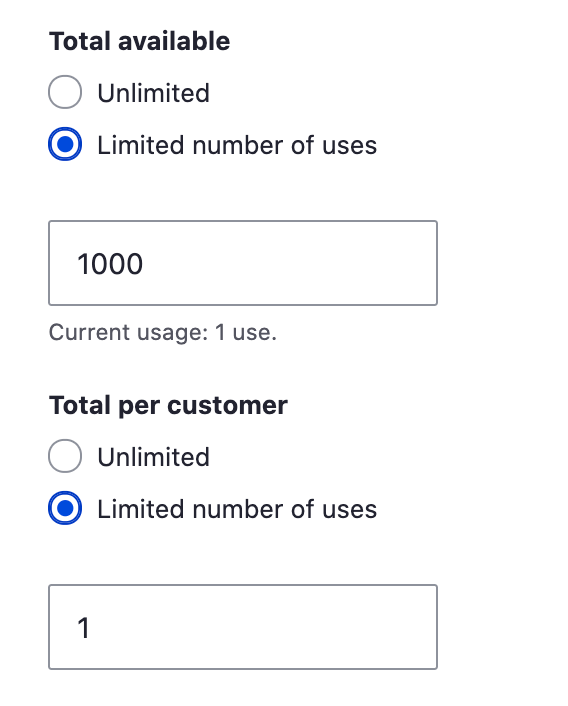

Customer usage is tracked based on email address. If the customer is shopping as a guest and his email address is not yet known, customer usage will not be factored into the logic for determining whether the promotion applies. Once a guest customer enters an email address or logs in, a previously applied discount will be removed if its application would violate the customer usage limit.

### Compatibility options

Compatibility options allow you to specify whether the promotion can be combined with other promotions.

* Once a promotion that is *not* compatible with other promotions is added to an order, no other promotions will be added.
* If a promotion that is compatible with any promotion is added to an order, then any subsequent promotions with limited compatibility will *not* be added to the order.

See the [Promotions table](#ordering-promotions) documentation for information on how to manage the order in which promotions are added to an order.

### Coupons

If your promotion requires coupons, you can create and manage its coupons by clicking the "Coupons" link at the top of the promotion's Edit page:

See [Using coupons](#using-coupons) for coupon-specific documentation.

## Delete a promotion

Promotions can be deleted from the [Promotions table](#managing-promotions) or using the Promotion edit form.

Whenever you elect to delete a promotion through the administrative UI, you will need to confirm the deletion. Deleting a promotion is an irreversible operation.

Whenever a promotion is deleted, all of its coupons and associated customer usage records will also be deleted. However, deleting promotions does *not* affect discounts that have already been applied to placed orders. Also, orders continue to store references to promotions, even after they are deleted.

## Using coupons

Let's now imagine that you're running a new email campaign that sends customers a coupon that they can use to get 10% off each order over $50. 

Setting up a coupon-based promotion is the same as creating a new promotion but with a extra step. You set up the promotion the [same way as before](#adding-a-new-promotion), but this time let's add a Coupon to the promotion.

Click on the Coupon tab at the top of the page. Click on "Add Coupon", and add the following:

* Enter a specific coupon code.
* Mark it as enabled (active).
* Set the number of times this coupon can be used as the "Total available" amount.
* To limit the number of times this coupon can be used by a single customer, set the "Total per customer" amount.
  
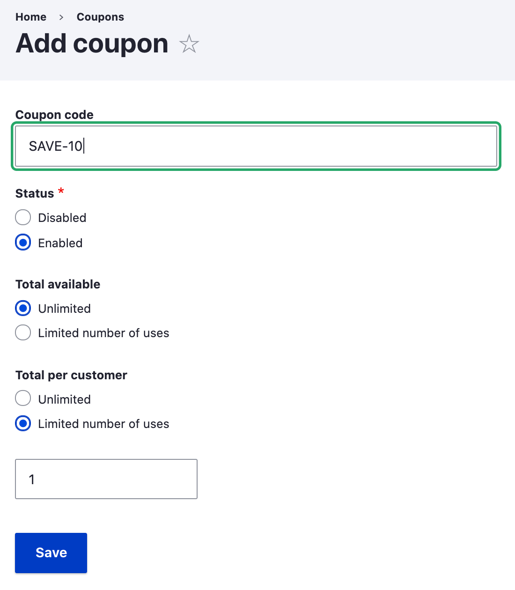

Finally, "Save" the coupon.

Let's test this out by adding a products to a cart so that the order totals over $50. Notice that the discount is not automatically applied. It will only be applied if the coupon code is entered. During Checkout, you can see a "Coupon code" textfield in the "Order summary". Enter the coupon code for the promotion, and click the "Apply coupon" button.

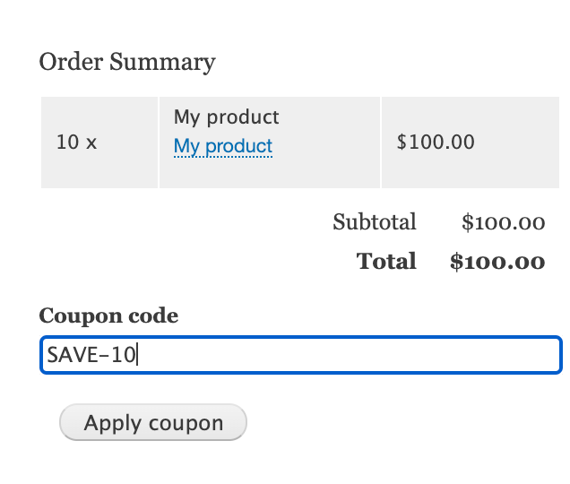

You can now see that the 10% discount has been applied to the entire order.

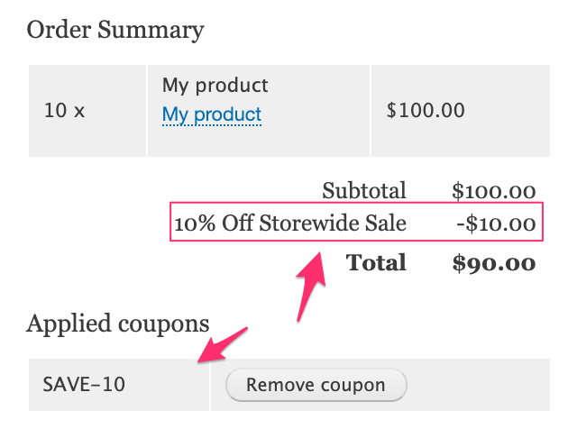

### Bulk coupon generation

Now let's suppose that you want to create a large number of unique coupons for a promotion. You can use the Bulk coupon generator by clicking "Generate coupons" instead of "Add coupon" on a promotion's Coupons page:

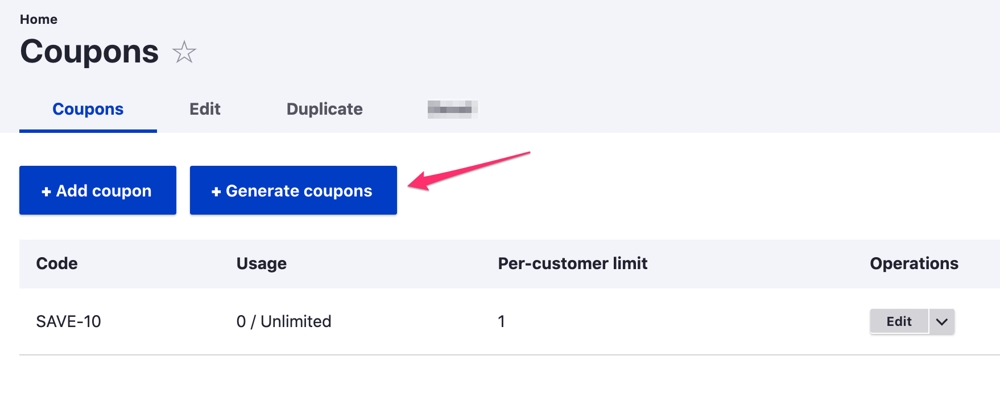

For each batch of coupons you'd like to generate, you need to specify three things:

1. The number of coupons to be generated.
2. The coupon code pattern.
3. Usage limitations, if any. By default, generated coupons are limited to a single use by a single customer. (See the description of [Usage limitations](#usage-limitations) for promotions for more information.)

#### Coupon code pattern

Coupon code patterns are based on four attributes: format, prefix, suffix, and length.

**Format** options are alphanumeric, alphabetic, and numeric and define the type of characters that will form the unique portion of the coupon code. For alphanumeric patterns, the characters 'I', 'O', 'i', 'l', '0', '1' are not used, to avoid recognition issues. Similarly, for alphabetic patterns, the characters 'I', 'i', 'l' are not used. All digits 0-9 are used for numeric patterns.

**Length** is a positive integer that defines the number of characters that form the unique portion of the coupon code. Here are some examples of format/length values and the types of unique codes they produce:

| Format | Length | Example code |
| ------ | ------ | ------------ |
| Alphanumeric | 8 | Xj7kcWn2 |
| Alphabetic | 5 | HPAsu |
| Numeric | 10 | 8974406511 |

**Prefix** and **Suffix** are optional strings that can be added before and after the unique portion of the coupon code.

In this example, we will generate coupon codes that look like "SAVE-10-HPAsu-2020", with "SAVE-10" as the prefix, "-2020" as the suffix, and a unique 5 character alphabetic code.

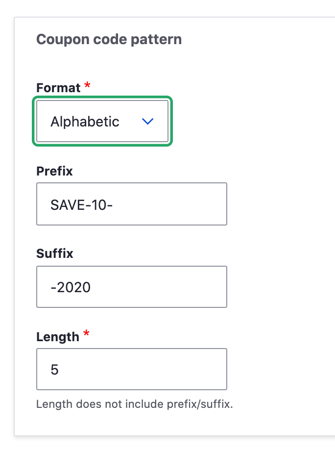

Let's generate 100 coupons for this pattern. Coupons are generated in batches, with progress displayed:

We now have 100 unique coupons for our promotion:

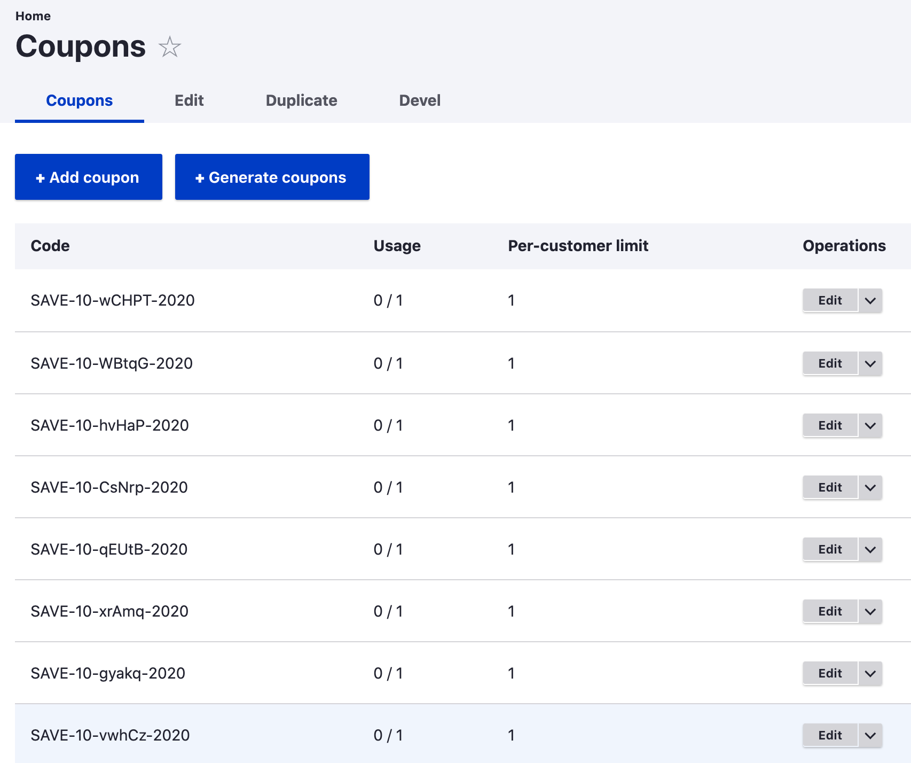

## Managing promotions

To manage promotions, select "Promotions" from the "Commerce" administrative menu.

The Promotions table lists all promotions, including both enabled and disabled promotions. In the first column, the name of the promotion is displayed along with a "Disabled" label for any disabled promotions. The "Usage" column displays both the current total usage and the usage limit (or "Unlimited" when there is no usage limit). The "Per-customer limit" displays the per-customer usage limit or "Unlimited". All promotions have a start date and time that is displayed in the "Start date" column. If a promotion has an end date and time, that value is displayed in the "End date" column. 

Standard operations links for editing/deleting/etc. promotions are provided in the last column, labeled, "Operations".

If your site has more than 50 promotions, they will be grouped into pages with up to 50 promotions per page.

### Ordering promotions

If any of your promotions have limited compatibility, then the order in which promotions are listed in the Promotions table can affect whether any particular promotion is applied to an order. [Compatibility options](#compatibility-options) can be set when editing a promotion:

Whenever a cart or draft order is updated, all "available" promotions are checked, in order, for applicability to the order. A promotion is considered **available** if all of the following are true:

* The promotion is enabled.
* The promotion does not have coupons. (Coupons are handled separately.)
* The promotion applies to the order's *type*.
* The promotion applies to the order's *store*.
* The current date/time is between the order's start and end dates.
* If the promotion has any general or customer-specific usage limits, they have not yet been met.

The available promotions are sorted first by *weight*, from lowest to highest, and then by name, in the case of equally weighted promotions.

To view the **weight** of promotions, click the "Show row weights" link at the top of the Promotions table, on the right:

When weights are displayed, a new "Weight" column appears with editable weight values. When weights are hidden, the grab-and-drop tool in the leftmost column can be used to reorder promotions and adjust their weights. Once the weights have been updated, click the "Save" button at the bottom of the page to save the new weight values.

