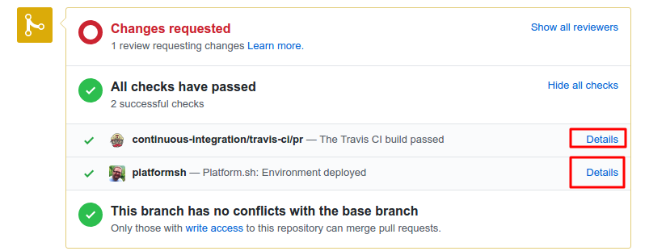

# Contribute to documentation

We love contributors! Please help us improve or fix the documentation by
editing a document and making a pull request in Github.

The beauty of an open source project is that anyone can contribute. To contribute 
to an open source project you need not to be a programmer, there are other ways to 
contribute to an open source project than through code. The easiest way for non-programmers 
is to contribute through documentation.

If you have trouble understanding any part of the documentation, please notify those of 
us who work on this section by [creating an issue] and clearly explain what you don’t 
understand and why - we’re happy to hear from you, your contribution helps everyone!

You can also contribute directly on our [documentation repository] by editing the files 
through the [GitHub] interface directly in your browser. Alternatively, you can clone 
the repository and edit the book in your favorite text editor.

## Choosing an issue

The documentation site uses GitHub for documentation and for tracking issues. To choose an 
issue,  go through [the open issues], pick one you like and **assign it to you** or if you 
don't have permission to assign, then simply inform by commenting.

If you need help choosing an issue or working on one, join the Commerce 2.x office hours.
They are held every wednesday at 5PM GMT+1 on the *#commerce* [Drupal Slack channel].

## Formatting help

The Drupal Commerce documentation site is built using [gravCMS]. Grav is an open source file based
CMS. It's built with PHP and content written in Markdown. If you are familiar with Markdown, then you
can easily contribute to the documentation!

`*emphasis*` renders as *emphasis*

`**strong emphasis**` renders as **strong emphasis**.

`[Drupal Commerce](https://drupalcommerce.org)` renders as [Drupal Commerce](https://drupalcommerce.org)

```markdown

```

Will render as -


```markdown
| Name           | Status        |
|--------------------------------|
| Test 1         | pass          |
| Test 2         | pass          |
| Test 3         | fail          |
| Test 4         | pass          |
```

Will render as -

| Name           | Status        |
|--------------------------------|
| Test 1         | pass          |
| Test 2         | pass          |
| Test 3         | fail          |
| Test 4         | pass          |

### Creating a pull request

Pull requests let you tell others about changes you've pushed to a repository on GitHub. Once a pull request is opened, you can discuss and review the potential changes with collaborators and add follow-up commits before the changes are merged into the repository.

Start by creating a branch for your work.
The branch name should contain a brief summary of its ID and the issue, e.g **106-create-product-type**:

```bash
cd commerce-docs/v2
git checkout -b 106-create-product-type
```

Once you’re done with documenting, push your commits to your fork:

```bash
git commit -am "Issue 106: Created documentation for product type."
git push fork 106-create-product-type
```

You can now go to your fork’s GitHub page and [create a pull request].

Once you create a pull request on GitHub, it runs checks on your pull request. If your changes pass checks then it can be reviewed by repository maintainers. You can get details about checks by clicking on **Show all checks** link as shown in below image.


To get the details about platform-based build for your pull request, click on the **details** link.



**Note:** Only first 10 open PRs gets the full build.

**Getting feedback**

To get the feedback on your pull request you need to ask somebody to review it, and [Drupal Slack] members are ready to review the pull requests for you. But first you will need an invite, you can get invite by submitting your email id here.

In the above image, a pull request was reviewed by reviewer and some changes are suggested. So we will make the suggested changes and push the changes.

```bash
# Change the desired files.
git commit -am "Addressed feedback."
git push fork 106-create-product-type
```

Updating the branch will automatically update the related pull request.


## Keeping up to date

Your forked repository and the original one (called *origin*) will eventually get out of sync. Periodically update your fork by doing:

```bash
# Update your local branch.
git checkout master
git pull origin/master
# Push the update to your GitHub fork.
git push fork master
```

Your pull request might also need rebasing, to re-apply your changes on top of the latest code. Once you’ve updated the master branch, rebase your branch:

```bash
git checkout 106-create-product-type
git rebase master
git push -f fork 106-create-product-type
```

That’s it! Happy contributing!

[gravCMS]: https://getgrav.org/
[the open issues]: https://github.com/drupalcommerce/commerce-docs/issues
[Drupal Slack channel]: https://www.drupal.org/slack
[create a pull request]: https://help.github.com/articles/using-pull-requests#initiating-the-pull-request
[Drupal Commerce]: https://drupalcommerce.org
[slack-invite]: http://drupalslack.herokuapp.com
[Drupal Slack]: http://drupal.slack.com
[documentation repository]: https://github.com/drupalcommerce/commerce-docs
[creating an issue]: https://github.com/drupalcommerce/commerce-docs/issues
[GitHub]: https://github.com/