
First, what are payment gateways? Payment gateways are a pluggable system that allows you to interface with a payment provider to handle the secure payment transactions for whatever you are selling. Paypal or Authorize.net are good examples of payment providers. The systems that sends your orders off to your payment provider and brings them back to your site are called payment gateways. These gateways are all unique because they have very different features and requirements.

There are two kinds of payment methods that payment providers use: On-Site and Off-Site. Each of those are described below:

<ul>
    <li><strong>On-Site</strong>: You can think of on-site payment as having the credit card field on your website. The software is specifically designed to not let you store that information, only to send it to a payment provider.</li>
    <li><strong>Off-Site</strong>: This is the common form of payment where you send your user, with order details, off to another site that will process the transaction and then send them back (hopefully) to your site.</li>
</ul>

## On-site Payment Methods

<strong>Example Payment Method</strong> - Drupal Commerce ships with an example payment method that is simply there for testing purposes to demonstrate how basic payment appears on the checkout form. It also shows how to integrate a submit form callback for the payment method that collects additional data related to the payment method during checkout.

<strong>Credit Card</strong> - The core Payment module includes a file of helper forms and functions for creating credit card payment method modules. Nothing in it allows for the storage of credit card data after the initial form submission. Instead, credit card payment method modules are responsible for immediately acting on the payment details input by the customer.

If the site needs delayed payment or recurring payment, the module should leverage some facility of the payment gateway to either retain authorization IDs for later capture or store credit card data securely at the gateway. For example implementations see the Commerce Authorize.Net and CyberSource integration modules.

<h3>Showing Authorize.net Configuration for On-Site Payments</h3>

**Enable Module**

Enable the Authorize.net module for example On-Site Payment configuration.

<ul class="screenshot_breadcrumbs">
    <li class="first">Administration</li>
    <li class="last">Modules</li>
</ul>

**Enable Payment Methods**

Once you've enabled the modules, they will appear in the Payment Methods section of the Store Configuration. A lot of people will go here first before enabling the modules.

<ul class="screenshot_breadcrumbs">
    <li class="first">Administration</li>
    <li>Store</li>
    <li class="last">Store Configuration</li>
</ul>

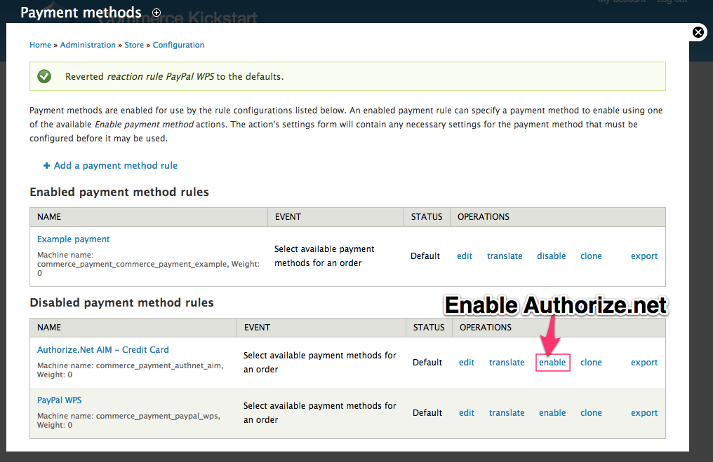

**Enable Method Rule**

Before you can configure, let's go ahead and enable the on-site payment method example Authorize.net

<ul class="screenshot_breadcrumbs">
    <li class="first">Administration</li>
    <li>Store</li>
    <li>Store Configuration</li>
    <li class="last">Payment Methods</li>
</ul>

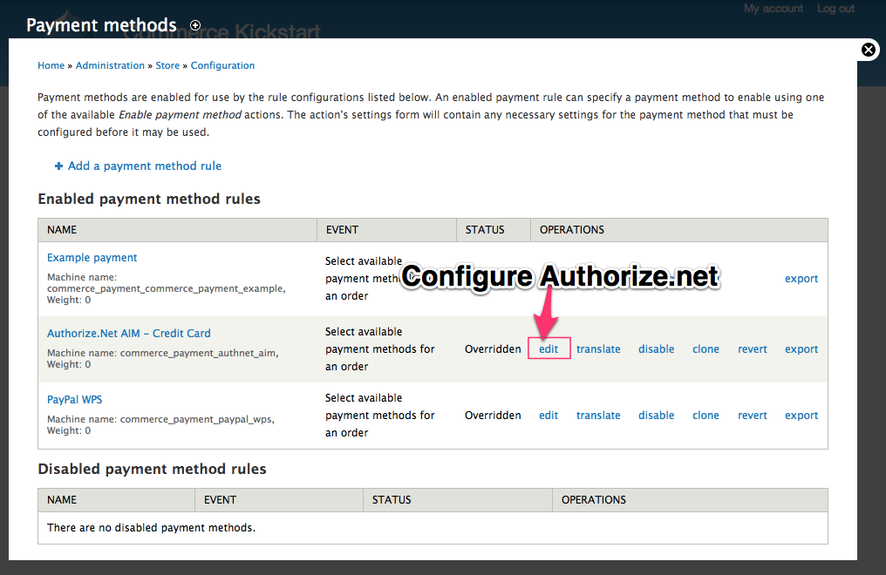

**Configure Payment Method**

After you have enabled the rule, you can now click "edit" to configure your payment method.

<ul class="screenshot_breadcrumbs">
    <li class="first">Administration</li>
    <li>Store</li>
    <li>Store Configuration</li>
    <li>Payment Methods</li>
    <li class="last">Configure Payment Method</li>
</ul>

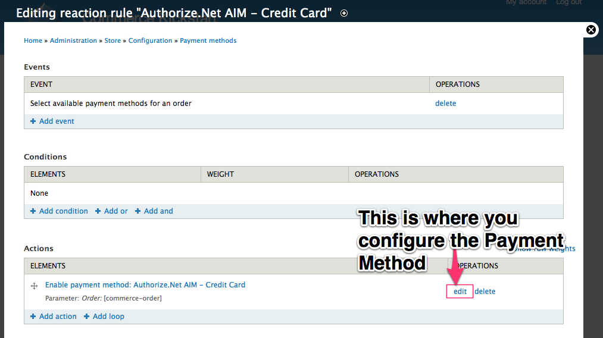

**Configure Payment Method**

Once you click "Edit" you are presented with the rule configuration screen. To edit your credentials/etc you need to click "edit" on the actions. You could also add conditions to when this payment method should be used (only on orders over $50, perhaps?).

<ul class="screenshot_breadcrumbs">
    <li class="first">Administration</li>
    <li>Store</li>
    <li>Store Configuration</li>
    <li>Payment Methods</li>
    <li class="last">Configure Payment Method</li>
</ul>

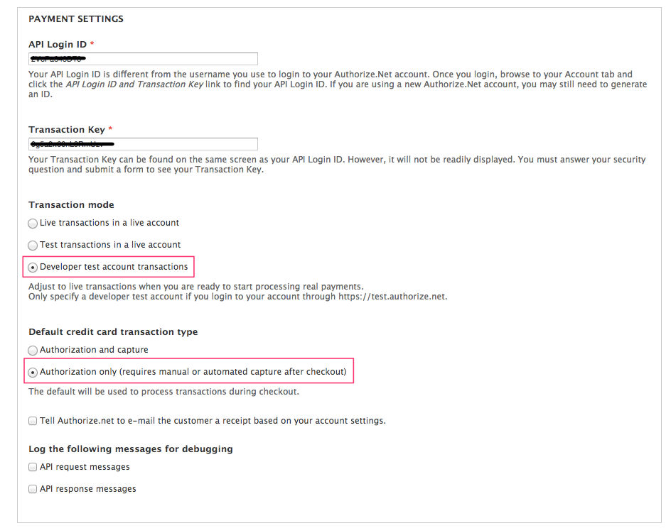

**Example Config Screen**

Highlighted here on a functional Authorize.net configuration screen are the two recommended options just for testing purposes.

<ul class="screenshot_breadcrumbs">
    <li class="first">Administration</li>
    <li>Store</li>
    <li>Store Configuration</li>
    <li>Payment Methods</li>
    <li class="last">Configure Payment Method</li>
</ul>

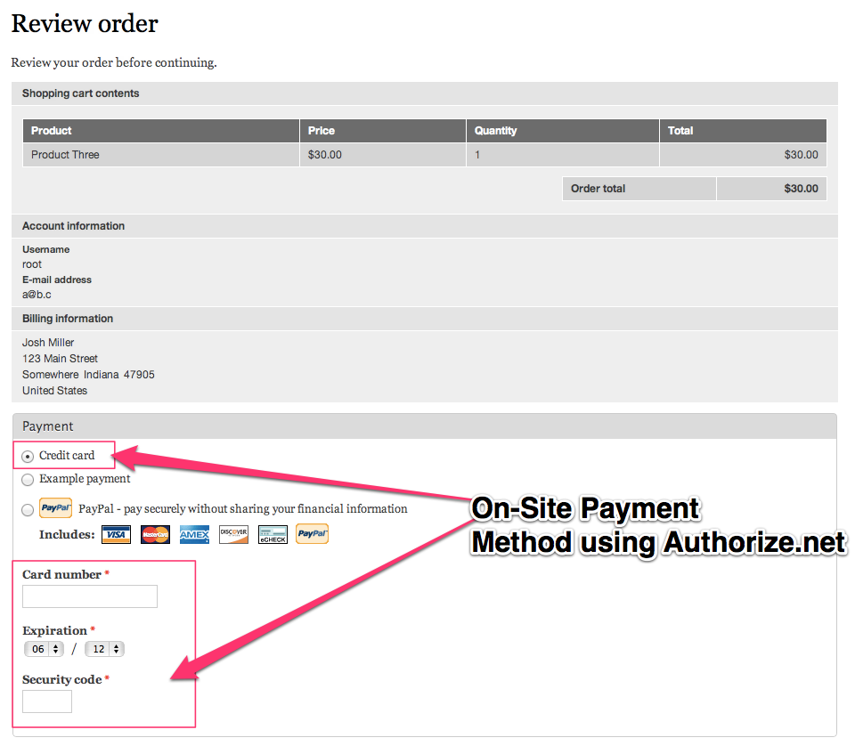

**On-Site Payment**

On-Site Payment Method is now functional for Authorize.net.

## Off-site Payment Methods

<h3>Redirected Payment Workflow</h3>

Drupal Commerce does its best to handle the redirected payment workflow in a like manner to on-site payment methods in the checkout process. Customers will leave from and return to the same place in checkout, so both your on-site and off-site customers should see all the same pages and have their orders processed identically with the sole exception of the optional payment redirect page that only appears when necessary.

Most redirected payment methods send some sort of asynchronous message to your site to provide an authoritative payment notification. Often, this can arrive at your site before the customer actually returns from the payment gateway. In this case, your payment notification listener should update the order as necessary on receipt of the successful payment notification and use the API to move the order forward to the next checkout page.

<h3>Off-site Payment Method Examples</h3>

For an example implementation, see the PayPal WPS module of the Commerce PayPal integration. The base PayPal module in that project defines a pluggable IPN listener that demonstrates how to listen for and handle asynchronous payment notifications from the payment gateway, though your implementation doesn’t necessarily need to be pluggable.

<h3>Showing PayPal Configuration for Off-Site Payments</h3>

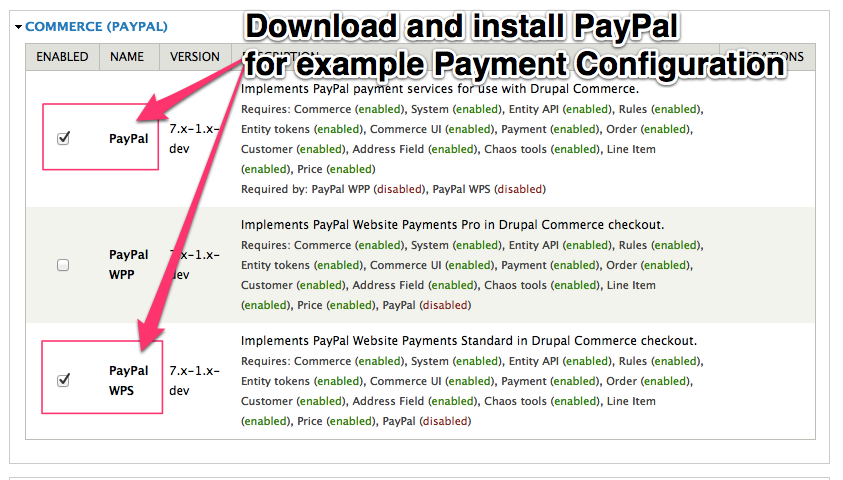

**Enable Module**

Enable the PayPal module for example Off-Site Payment configuration.

<ul class="screenshot_breadcrumbs">
    <li class="first">Administration</li>
    <li class="last">Modules</li>
</ul>

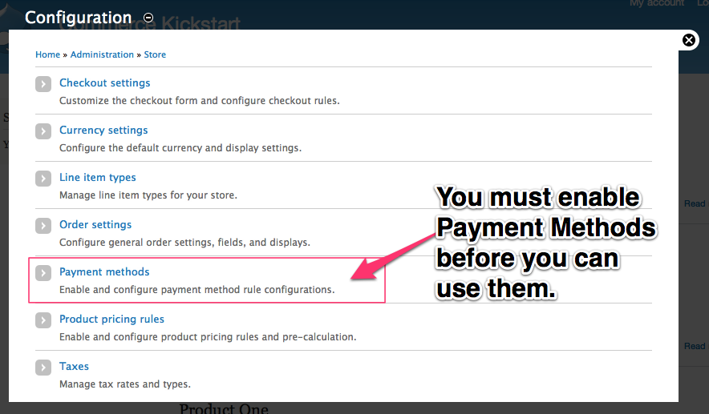

**Enable Payment Methods**

Once you've enabled the modules, they will appear in the Payment Methods section of the Store Configuration. A lot of people will go here first before enabling the modules.

<ul class="screenshot_breadcrumbs">
    <li class="first">Administration</li>
    <li>Store</li>
    <li class="last">Store Configuration</li>
</ul>

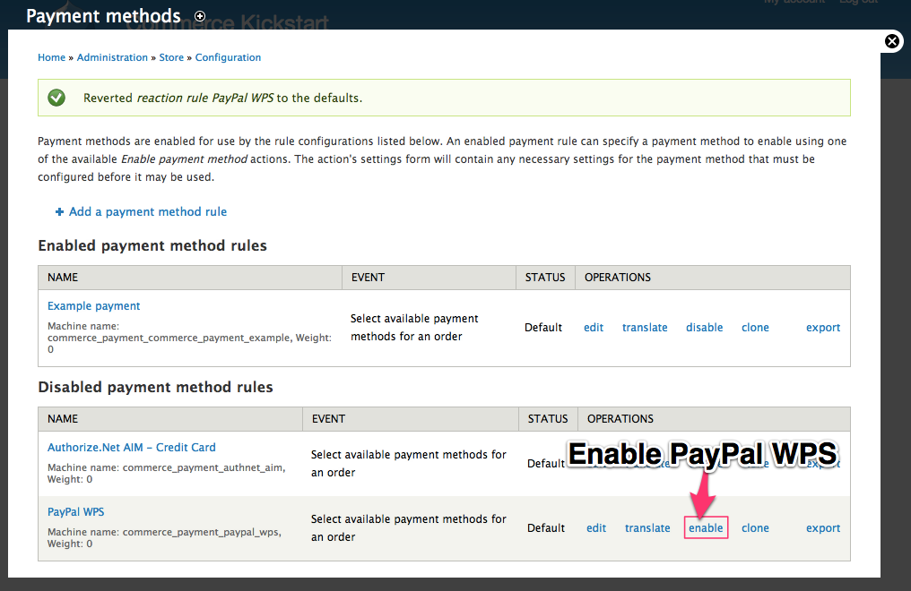

**Enable Method Rule**

Before you can configure, let's go ahead and enable the off-site payment method example PayPal

<ul class="screenshot_breadcrumbs">
    <li class="first">Administration</li>
    <li>Store</li>
    <li>Store Configuration</li>
    <li class="last">Payment Methods</li>
</ul>

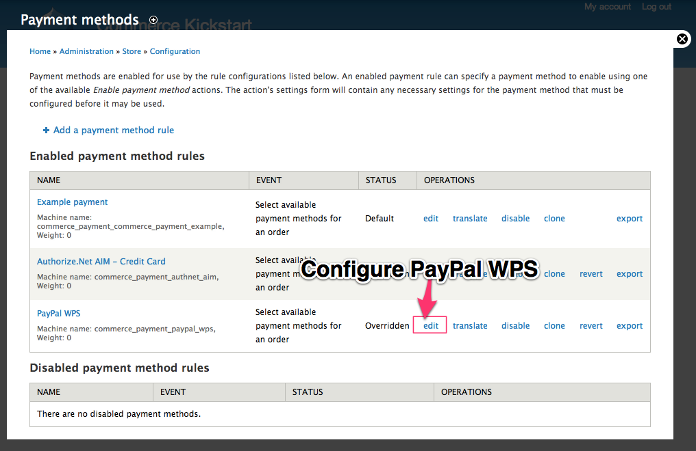

**Configure Payment Method**

After you have enabled the rule, you can now click "edit" to configure your payment method.

<ul class="screenshot_breadcrumbs">
    <li class="first">Administration</li>
    <li>Store</li>
    <li>Store Configuration</li>
    <li>Payment Methods</li>
    <li class="last">Configure Payment Method</li>
</ul>

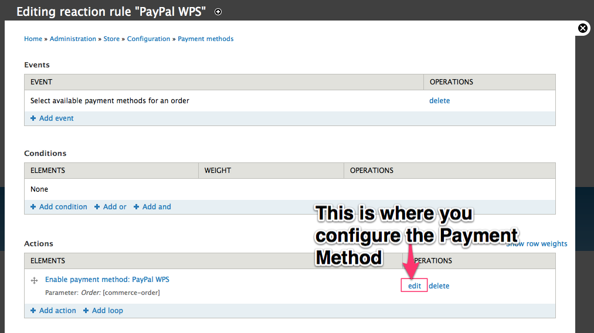

**Configure Payment Method**

Once you click "Edit" you are presented with the rule configuration screen. To edit your credentials/etc you need to click "edit" on the actions. You could also add conditions to when this payment method should be used (only on orders over $50, perhaps?).

<ul class="screenshot_breadcrumbs">
    <li class="first">Administration</li>
    <li>Store</li>
    <li>Store Configuration</li>
    <li>Payment Methods</li>
    <li class="last">Configure Payment Method</li>
</ul>

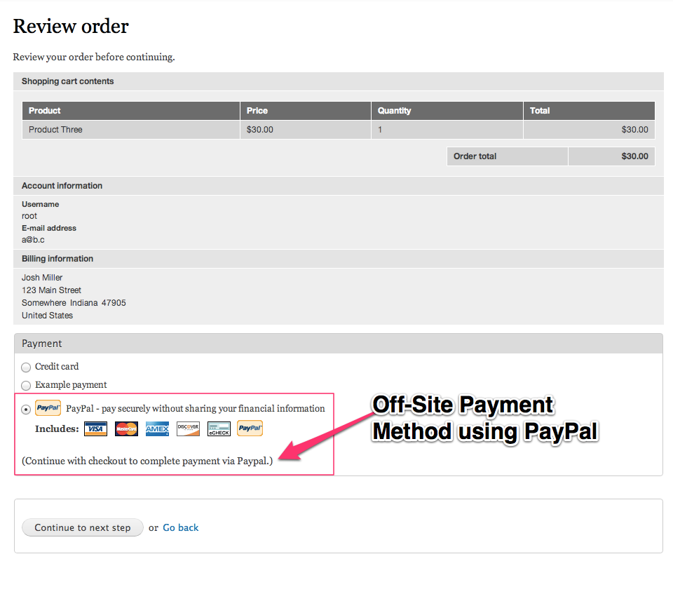

**Off-Site Payment**

Off-Site Payment Method is now functional for PayPal.

## Direct Payment Methods (Invoices, Deferred Payments)

There are various kinds of direct payment methods in an ever-expanding universe of payment gateways.

## PayPal Standard

This guide walk you through setting up PayPal Website Payments Standard (WPS) for use with your Drupal Commerce site. It has been adapted from instructions at http://drupal.org/node/1126786. This guide is almost complete, but if you need to do this, please test it and leave feedback on whether it needs changing (or better, just change it yourself).

<h3>Developer account creation</h3>

<ul>
<li>Head to http://developer.paypal.com and create a developer account to use with the sandbox.</li>
<li><strong>Important:</strong> this is your <em>master</em> sandbox account. <em>Within</em> this account you are going to create further accounts. Think of it like the movie <a href="http://www.imdb.com/title/tt1375666/">Inception</a>, only the PayPal version: horribly badly laid out, and barely functional.
<li>Check your email for the confirmation link and click it to verify your developer account.</li>
<li>Log into the sandbox using the credentials you have created.</li>
</ul>

<h3>Buyer account creation</h3>

<ul>
<li>Under "Test Accounts", choose "create a pre-configured account".</li>
<li>Choose to create a buyer account.</li>
<li><strong><em>Take note</em></strong> of the password here or choose something you will remember as I do not see a way of retrieving it or editing it later.</li>
<li>"Add bank account" should be "yes".</li>
<li>Set the other options as you wish.</li>
<li>When asked for a balance, choose something high enough that you won't run out. For example, if most of your site's sale items are around $10, a balance of $9999 should be fine.</li>
<li>You should now see the "test accounts" page in the sandbox master account, with your account present.</li>
<li>Check the radio button next to your account, if it is not already checked, and choose "Enter Sandbox Test Site" at the bottom.</li>
<li>A popup window will appear. (What is this, 1995?) The username will already be filled in, and you will need to enter the password that you set up on the <em>buyer</em> account. This is <em>not</em> your master developer account password.</li>
<li>Make sure the login works properly. If it does, you can now close this window and return to the master developer account window.</li>
</ul>

<h3>Seller account creation</h3>

<ul>
<li>Under "Test Accounts", choose "create a pre-configured account".</li>
<li>Choose to create a seller account this time.</li>
<li><strong><em>Take note</em></strong> of the password here or choose something you will remember as I do not see a way of retrieving it or editing it later.</li>
<li>"Add bank account" should be "yes".</li>
<li>Set the other options as you wish.</li>
<li>When asked for a balance, choose anything you like.</li>
<li>On the "test accounts" page in the sandbox master account, you should now have two accounts.</li>
<li>Check the radio button next to your new seller account, if it is not already checked, and choose "Enter Sandbox Test Site" at the bottom.</li>
<li>That popup appears again. The username will already be filled in, and you will need to enter the password that you set up on the <em>seller</em> account. This is <em>not</em> your master developer account password.</li>
<li>Make sure the login works properly. If it does, you can now close this window and return to the master developer account window.</li>
</ul>

<h3>Drupal Commerce setup</h3>

<ul>
<li>This assumes you have already set up Drupal Commerce with a shop and everything else you need it for, and just need to link it to a payment processor, which is why you're reading this, so it won't walk you through Drupal Commerce setup itself.</li>
<li>Make sure you have the <a href="http://drupal.org/project/commerce_paypal">commerce_paypal</a> module downloaded and placed inside one of the appropriate module directories.</li>
<li>Enable the PayPal and PayPal WPS modules.</li>
<li>On your site, visit <em>admin/commerce/config/payment-methods</em> and you should see the "PayPal WPS" method. (if you don't try clearing your cache: http://drupal.org/node/1365728 )</li>
<li>Click "enable" on the right side.</li>
<li>Click "edit" on the right side.</li>
<li>You are now editing a rule. There are 2 parts to the rule: an event, which is "Select available payment methods for an order", and is filled for you, and an action, "Enable payment method: PayPal WPS". There are no conditions to this rule.</li>
<li>Next to the action, "Enable payment method: PayPal WPS", click "edit".</li>
<li>There are a number of PayPal-specific options here. For "PayPal email address", make <strong><em>sure</em></strong> you enter the <em>seller</em> account's email address. This is <em>not</em> the email address you used when signing up for a master developer account, nor is it the email address you created when you set up a buyer account. It is likely to have a bunch of random numbers in it. If in doubt, go to the "Test Accounts" page in your master developer account in the PayPal sandbox, and check what email addresses you have. It will be the one associated with the "Business" account.</li>
<li>Set up your currency and language as desired.</li>
<li>Use the "sandbox" server, the "sale" method, and I recommend using the "log notifications with the full IPN" option, as this is good for debugging.</li>
<li>Save this</li>
</ul>

<h3>Make a test order</h3>

<ul>
<li>Go through your checkout process. On the order review page, you should see that the "payment method" appears as "PayPal WPS". Once you proceed past the order review page, you should have the option to be redirected to the PayPal site.</li>
<li>If this does <em>not</em> happen, check that you have sane checkout settings on your site at <em>admin/commerce/config/checkout</em>, otherwise this might affect Drupal Commerce's ability to redirect you to PayPal as part of the checkout process.</li>
<li>When you arrive at PayPal, <em>check</em> that the URL has "sandbox" in it. If it does not, you are using the live gateway, so go back to the PayPal WPS settings above, and ensure you've chosen to use the sandbox.</li>
<li>Enter the login credentials for the <em>buyer</em> account you set up earlier. This is <strong><em>not</em></strong> the master developer account, and not the seller account either. If you can't remember the email for this, you can return to your PayPal developer master account, go to "Test Accounts", and check the email address next to the "Personal" account.</li>
<li>You should be able to proceed though the payment process now, including being redirected back to your website once the payment is complete.</li>
</ul>

<h3>Orders are still pending</h3>

Orders will remain in the "pending" state unless the funds have been accepted by the seller using PayPal. In the sandbox, this means you would have to log into the developer master account, select the seller account, log into the sandbox, and from there, choose to accept the payments.

<h3>Converting to a live process</h3>

<ul>
<li>In order to make the switch to live, first, breathe a sigh of relief that you never have to deal with PayPal's sandbox again (unless something goes wrong).</li>
<li>On your site, at <em>admin/commerce/config/payment-methods</em>, edit your PayPal WPS settings.</li>
<li>Enter the email address of your real PayPal seller account.</li>
<li>Switch over from "sandbox" to "live", and I would also recommend switching off the debugging mode at this stage.</li>
<li>It is always best to test the live account is working properly by sending through a low-value order using your own credit card. You can then refund the order later if it works.</li>
</ul>

## Paypal WPP

The primary advantage of WPP over WPS is that your customer stays on your website throughout the payment process. It offers a more professional user experience than being diverted to a Paypal page. From the customer's point of view, it is as if you have a full merchant account. 

This page builds on the previous page that enabled WPS. While WPS is not a requirement for WPP, you might find it easier to work through that first.

<ul>
<li>Install and enable cURL with php support, if you don't already have it. For example (assumes PHP5 and FPM): 
<code>sudo apt-get install php5-curl
service php5-fpm restart</code>
Using shared hosting? Many hosts already enable cURL. Check whether cURL is installed properly by viewing your phpinfo page. (<a href="http://www.phpinfofile.com/">Make a phpinfo page</a>.) If not, you'll have to convince your host to install it.</li>

<li>Log into your Paypal developer account and make a new sandbox test account. Choose the preconfigured "Website Payments Pro" account type. It's not, as you might expect, the same as your previous seller accounts. To add to the confusion, after you create it, it'll be listed on the sandbox accounts page as another "business" account, same as your "standard" seller. To help distinguish, you might want to set either the country or initial balance to something different. That way, at least you'll be able to expand the "View Details" section to get a hint of which account to select. Make a note of your password or set your own.</li>

<li>Back on the developer page, choose API credentials. You will see a set of API credentials for each seller account you've created. On <em>this</em> page, perhaps the easiest way to distinguish the one you want is probably by the creation date.</li>

<li>In your Drupal tab, go to <em>Store » Configuration » Payment methods</em>. Enable "PayPal WPP - Credit Card" (assuming you previously enabled it on your site's modules page, and perhaps cleared cache.) Click Edit. On the next page scroll down to Actions and click Edit. Under Payment Settings, paste your info from your Paypal API credentials page, choose other settings as you like; make sure transaction type is "Authorization and capture". Save and exit.</li>

<li>Test it by using the credit card details from the View Details link on your Paypal sandbox account page. (Don't log in into the sandbox account, they're cleverly hidden there.) Use any name and address, and any 3-digit security code.</li>

<li>From the sandbox test account home page, select the account you just created, and log in.</li>
</ul>