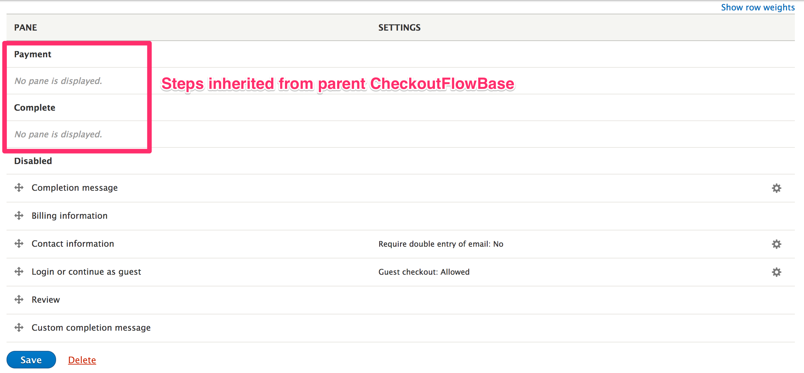
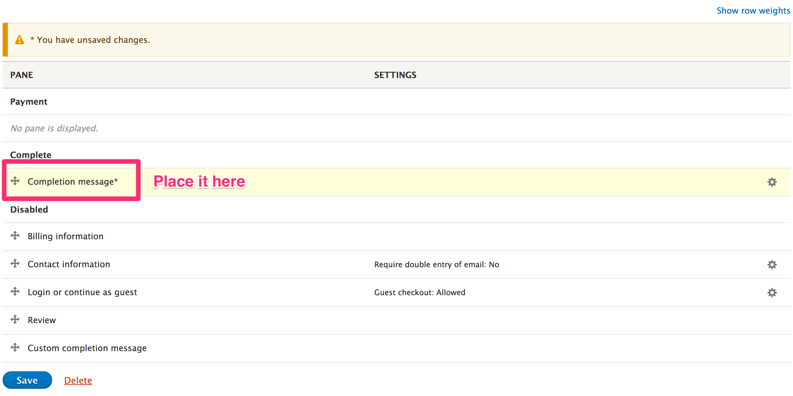
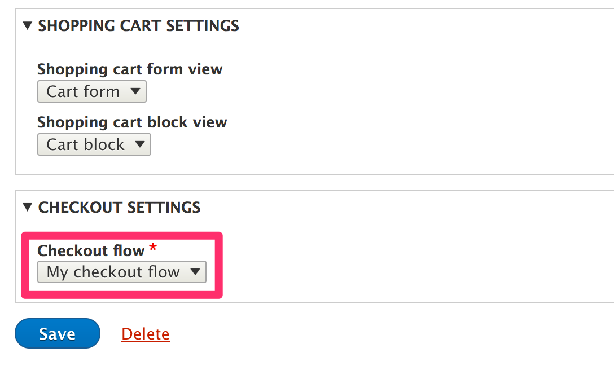
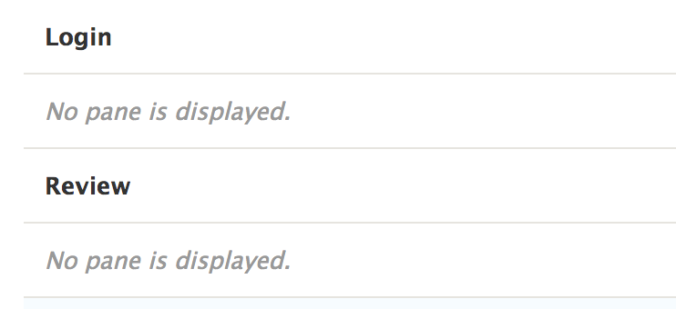
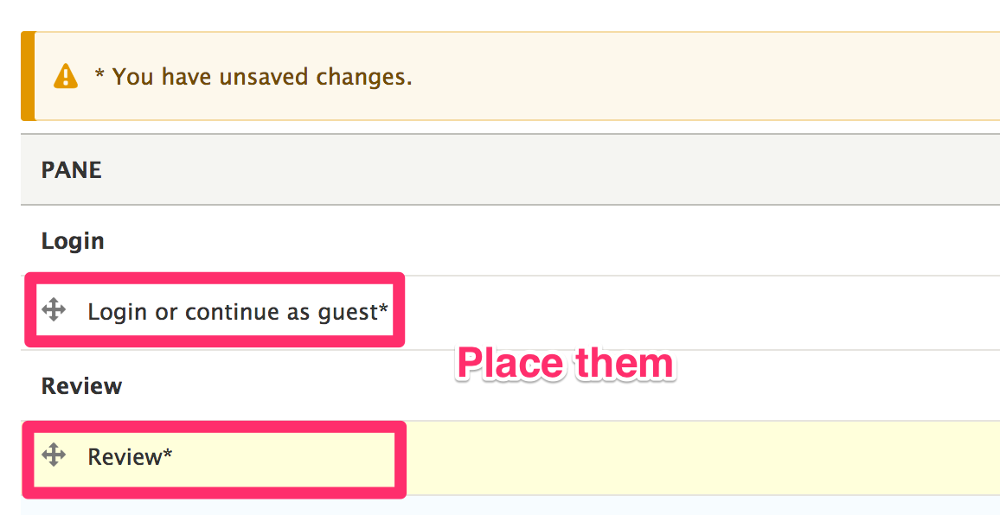
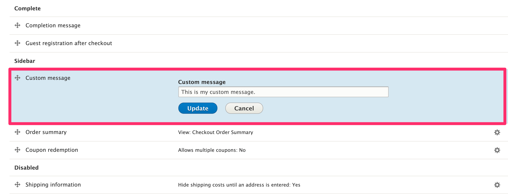
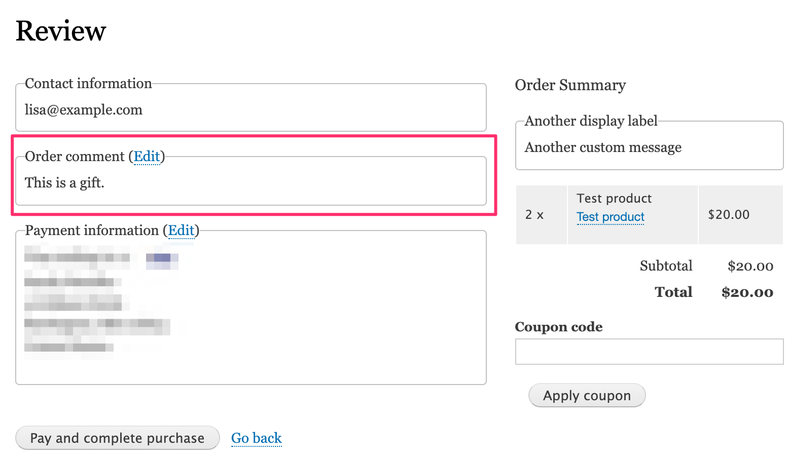
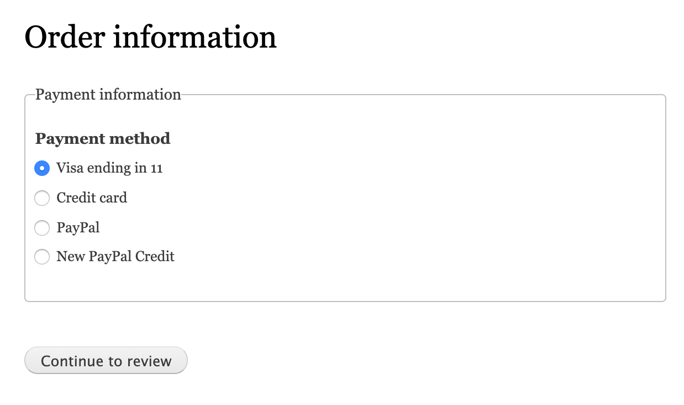
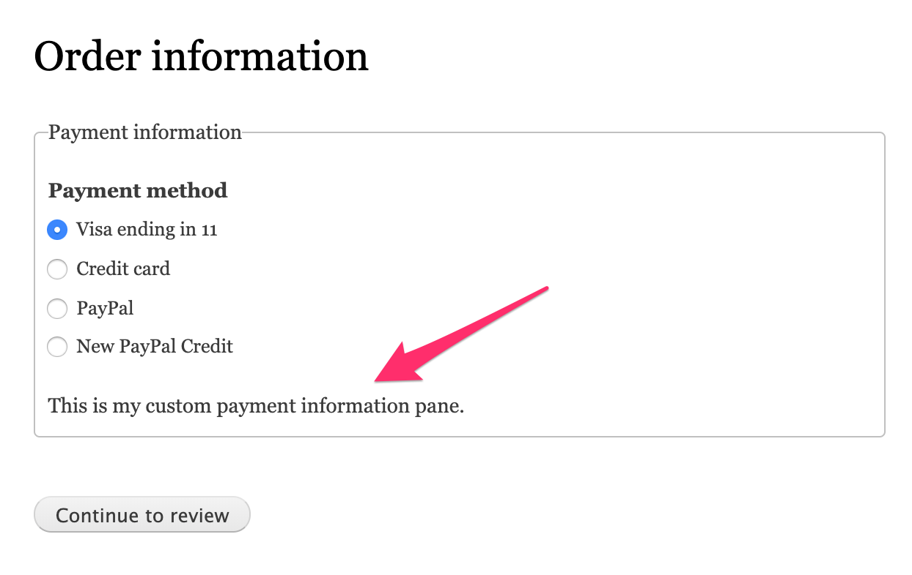
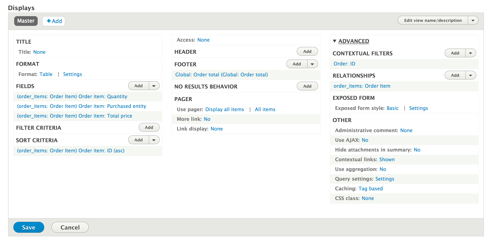

!!! note "We need help filling out this section! Feel free to follow the *edit this page* link and contribute."

## Code Recipes

### Create custom checkout flow

We will learn how to create a custom checkout flow.

Lets create a custom flow and we are going to use it for new orders.

Lets create a module that will do this.

!!! example
    If you are using [Drupal Console](https://drupalconsole.com/), then you can
    execute this command from docroot:

    ```bash
    drupal generate:module \
    --module="My checkout flow" \
    --machine-name="my_checkout_flow" \
    --module-path="/modules/custom" \
    --description="My checkout flow" \
    --core="8.x" \
    --package="Custom" \
    --composer \
    --dependencies="commerce:commerce_checkout"
    ```

    Create the plugin using this command.

    ```bash
    drupal generate:plugin:skeleton \
    --module="my_checkout_flow" \
    --plugin-id="commerce_checkout_flow" \
    --class="CustomCheckoutFlow"
    ```

    A new file ``CustomCheckoutFlow.php`` will be created inside ``src/Plugin/Commerce/CheckoutFlow``.

    Make sure that file looks like this:

    ```php
    <?php

    namespace Drupal\my_checkout_flow\Plugin\Commerce\CheckoutFlow;

    use Drupal\commerce_checkout\Plugin\Commerce\CheckoutFlow\CheckoutFlowWithPanesBase;
    use Drupal\Core\Form\FormStateInterface;

    /**
     * @CommerceCheckoutFlow(
     *  id = "custom_checkout_flow",
     *  label = @Translation("Custom checkout flow"),
     * )
     */
    class CustomCheckoutFlow extends CheckoutFlowWithPanesBase {

    /**
     * {@inheritdoc}
     */
    public function getSteps() {
        return parent::getSteps();
    }

    }
    ```


    Here we are not adding any custom step. We are just **inheriting** the steps
    from the ``parent``.

    The ``parent`` provides these steps.

    ```php
        return [
        'payment' => [
            'label' => $this->t('Payment'),
            'next_label' => $this->t('Pay and complete purchase'),
            'has_sidebar' => FALSE,
        ],
        'complete' => [
            'label' => $this->t('Complete'),
            'next_label' => $this->t('Pay and complete purchase'),
            'has_sidebar' => FALSE,
        ],
        ];
    ```

    You can see these steps here ``/path/to/drupal/modules/commerce/modules/checkout/src/Plugin/Commerce/CheckoutFlow/CheckoutFlowBase.php`` inside ``getSteps()``.

    Enable the module ``my_checkout_flow``.

    ```bash
    drupal module:install my_checkout_flow
    ```

    We are going to create a new checkout flow.

    Go to ``/admin/commerce/config/checkout-flows/add``

    

    Click **Save**.

    

    Now, it can be as simple as displaying only the completion message.

    

    Click **Save**.

    We are going to use this checkout flow for future orders. To do that, go to
    ``admin/commerce/config/order-types/default/edit``.

    At the bottom you will see **Checkout settings** section. Select the checkout
    flow that you just created.

    

    Click **Save**.

    When the customers now place an order, they will just see the completion
    message, and they don't have to pay a dime. Funny isn't it?

    Lets make it more sophisticated. We will add login and review steps.

    Alter ``CustomCheckoutFlow.php`` so that it looks like this:

    ```php
        <?php

        namespace Drupal\my_checkout_flow\Plugin\Commerce\CheckoutFlow;

        use Drupal\commerce_checkout\Plugin\Commerce\CheckoutFlow\CheckoutFlowWithPanesBase;
        use Drupal\Core\Form\FormStateInterface;

        /**
         * @CommerceCheckoutFlow(
         *  id = "custom_checkout_flow",
         *  label = @Translation("Custom checkout flow"),
         * )
         */
        class CustomCheckoutFlow extends CheckoutFlowWithPanesBase {

        /**
         * {@inheritdoc}
         */
        public function getSteps() {
            return [
            'login' => [
                'label' => $this->t('Login'),
                'previous_label' => $this->t('Return to login'),
                'has_sidebar' => FALSE,
            ],
            'review' => [
                'label' => $this->t('Review'),
                'has_sidebar' => TRUE,
            ],
            ] + parent::getSteps();
        }

        }
    ```

    Go back to ``/admin/commerce/config/checkout-flows`` and *edit* the checkout flow
    that you just created.

    You will see the new steps.

    

    

    Click **Save**.

    The customers will now have to *login*, and they will be able to *review* the
    order while placing them.


### Create custom checkout pane

 Custom checkout panes can be used to display information during checkout or collect additional data from the customer. To create a custom checkout pane you will need to write your own code, in a custom module. This page provides several examples of custom checkout panes.

!!! note "Setup: Create a basic custom module"
    If you don't already have a custom module you can use for your new plugin, you can create a basic one with a few simple steps:

    1. Create a new folder for your module within your project in the `/modules/custom` folder.  We'll name ours `my_checkout_pane` for these examples.

    2. Within the `my_checkout_pane` folder, create a new file named `my_checkout_pane.info.yml` with the following text:

    ```yaml
    name: My Checkout Pane
    type: module
    description: Defines custom checkout panes.
    core: 8.x
    package: Custom

    ```

    3. Don't forget to enable your custom module either through the admin UI, drush, or drupal console:

    ```bash
    drush en my_checkout_pane
    ```
!!! example "Example 1: Create a custom message checkout pane."

    In this example, we create a simple checkout pane plugin that displays a custom message. We'll name our plugin `CustomMessagePane` and implement it in a file named `CustomMessagePane.php`, located in `/modules/custom/my_checkout_pane/src/Plugin/Commerce/CheckoutPane`. 

    Commerce checkout panes are [annotation-based plugins], so we start by placing a `@CommerceCheckoutPane` annotation right before our class definition. Also, the `buildPaneForm()` method is required, so we'll add that in as well.


    ```php
    <?php

    namespace Drupal\my_checkout_pane\Plugin\Commerce\CheckoutPane;

    use Drupal\commerce_checkout\Plugin\Commerce\CheckoutPane\CheckoutPaneBase;
    use Drupal\Core\Form\FormStateInterface;

    /**
     * Provides a custom message pane.
     *
     * @CommerceCheckoutPane(
     *   id = "my_checkout_pane_custom_message",
     *   label = @Translation("Custom message"),
     * )
     */
    class CustomMessagePane extends CheckoutPaneBase {

    /**
     * {@inheritdoc}
     */
    public function buildPaneForm(array $pane_form, FormStateInterface $form_state, array &$complete_form) {
    }

    }

    ```

    The `id` and `label` keys are required. The `id` can be any unique, valid machine name, but it's considered a good practice to prefix it with the name of your module. The `label` identifies the pane on the Checkout flow edit page. If we rebuild the plugin cache, our new pane will appear in the "Disabled" section. To enable it, drag it into a checkout step like you would any other checkout pane.

    

    If you go to "Checkout" now, you will find that our custom checkout pane is *not* rendered, even if it's moved out of the "Disabled" section. This is because it does not have any visible markup. Let's add some markup to our pane form so that we can see it in Checkout.

    ```php
    public function buildPaneForm(array $pane_form, FormStateInterface $form_state, array &$complete_form) {
    $pane_form['message'] = [
        '#markup' => $this->t('This is my custom message.'),
    ];
    return $pane_form;
    }
    ```

    Here, the custom checkout pane has been added to the "Sidebar" step:

    

    **Checkout pane annotation**

    In addition to `id` and `label`, several other keys are defined for the `CommerceCheckoutPane` annotation.

    | Key | Definition |
    | ---------------- |
    | display_label | The checkout pane display label, defaults to the main label. |
    | default_step | The ID of the default step. If missing, defaults to disabled. The steps available for the default checkout flow are `login`, `order_information`, `review`, `_sidebar` and `_disabled` |
    | wrapper_element | The wrapper element to use when rendering the pane, defaults to "container". |

    Let's add in these additional elements to our CustomMessagePane annotation, like this:

    ```php
    /**
     * Provides a custom message pane.
     *
     * @CommerceCheckoutPane(
     *   id = "my_checkout_pane_custom_message",
     *   label = @Translation("Custom message"),
     *   display_label = @Translation("Another display label"),
     *   default_step = "_sidebar",
     *   wrapper_element = "fieldset",
     * )
     */
    ```

    Now if we rebuild caches and reload the Checkout page, our custom pane is rendered in a fieldset with its display label:

    

!!! example "Example 2: Create a *configurable* custom message pane"
    You can make your checkout pane plugin configurable by implementing its  `defaultConfiguration()`, `buildConfigurationSummary()`,`buildConfigurationForm()`, and `submitConfigurationForm()` methods. Here's an example implementation that makes our custom message configurable through the admin UI:


    ```php
    public function defaultConfiguration() {
    return [
        'custom_message' => 'This is my custom message.',
    ] + parent::defaultConfiguration();
    }

    public function buildConfigurationSummary() {
    return $this->t('Custom message: @custom_message', ['@custom_message' => $this->configuration['custom_message']]);
    }

    public function buildConfigurationForm(array $form, FormStateInterface $form_state) {
    $form = parent::buildConfigurationForm($form, $form_state);
    $form['custom_message'] = [
        '#type' => 'textfield',
        '#title' => $this->t('Custom message'),
        '#default_value' => $this->configuration['custom_message'],
    ];

    return $form;
    }

    public function submitConfigurationForm(array &$form, FormStateInterface $form_state) {
    parent::submitConfigurationForm($form, $form_state);

    if (!$form_state->getErrors()) {
        $values = $form_state->getValue($form['#parents']);
        $this->configuration['custom_message'] = $values['custom_message'];
    }
    }
    ```

    Note that you can use the `validateConfigurationForm()` method if your configuration form requires validation.

    Now we can configure our custom message through the admin UI:

    

    To display the custom message, we need to modify the `buildPaneForm()` method to use the text saved in configuration:

    ```php
    public function buildPaneForm(array $pane_form, FormStateInterface $form_state, array &$complete_form) {
    $pane_form['message'] = [
        '#markup' => $this->t('@custom_message', ['@custom_message' => $this->configuration['custom_message']]),
    ];
    return $pane_form;
    }
    ```

!!! example "Example 3: Control visibility of a custom checkout pane"
    There are many situations in which you may want to display a checkout pane for some orders but not others. For example, suppose some of the products you sell require a special disclaimer message. You could add a custom boolean field to your product variation type and then check for its existence on any of the products in the customer's cart, during checkout. The key to making this functionality work is the `isVisible()` method. Let's assume the ID for our disclaimer boolean field is `field_needs_disclaimer`. Here is an implementation of `isVisible()` we can add to our custom checkout pane:

    ```php
    public function isVisible() {
    // Check whether the order has an item that requires the disclaimer message.
    foreach ($this->order->getItems() as $order_item) {
        $purchased_entity = $order_item->getPurchasedEntity();
        if ($purchased_entity->get('field_needs_disclaimer')->value == 1) {
        return TRUE;
        }
    }

    return FALSE;
    }
    ```

    Notice that we used `$this->order` in the method. You can access the order and all its items like this in any of the custom checkout pane methods. The `CheckoutPaneBase` class additionally defines `entityTypeManager` and `checkoutFlow` (the parent checkout flow) as protected class properties.

!!! example "Example 4: Allow customer to add a comment to the order."
    In this example, we'll build an actual form in `buildPaneForm()` instead of just displaying information. See the Drupal.org documentation on [Form and render elements] for more information on building custom forms. Our simple pane form has a single textfield element:

    ```php
    public function buildPaneForm(array $pane_form, FormStateInterface $form_state, array &$complete_form) {
    $pane_form['comment'] = [
        '#type' => 'textfield',
        '#title' => $this->t('Optional order comment'),
        '#size' => 60,
    ];
    return $pane_form;
    }
    ```

    If we add our new custom checkout pane to the "Order information" step of our checkout flow, customers will be able to add comments to their orders:

    

    To save the comment entered by the customer, we can use the Commerce Order entity's `setData()` method. For a more complex example, we could implement `validatePaneForm()`, but all we need here is `submitPaneForm()`:

    ```php
    public function submitPaneForm(array &$pane_form, FormStateInterface $form_state, array &$complete_form) {
        $values = $form_state->getValue($pane_form['#parents']);
        $this->order->setData('order_comment', $values['comment']);
    }
    ```

    After saving the comment to the order, you can access the comment value using the Commerce order `getData()` method with the *key* value we used in `submitPaneForm()`, "order_comment":

    ```php
    $comment = $order->getData('order_comment');
    ```

    We can use the `getData()` method to improve our implementation in two ways:
    1. Set the default value for the comment in `buildPaneForm()` so that customers won't have to re-enter their comment if they go back to this checkout step after submitting the form.

    2. Implement the checkout pane method `buildPaneSummary()` so that the comment text appears on the Review page.

    Here is that updated code:
    ```php
    public function buildPaneForm(array $pane_form, FormStateInterface $form_state, array &$complete_form) {
        $comment = $this->order->getData('order_comment');
        $pane_form['comment'] = [
            '#type' => 'textfield',
            '#title' => $this->t('Optional order comment'),
            '#default_value' => $comment ? $comment : '',
            '#size' => 60,
        ];
        return $pane_form;
    }

    public function buildPaneSummary() {
        if ($order_comment = $this->order->getData('order_comment')) {
            return [
            '#plain_text' => $order_comment,
            ];
        }
        return [];
    }
    ```

    And here's how our "Order comment" appears in the "Review" step now:

    

!!! example "Example 5: Use the `EntityFormDisplay` class for pane form build/validate/submit methods"
    As an alternative to using the `data` field to store order information, you can add custom fields to your order type and create a custom [form display mode]. Configure your custom form display mode so that only your new custom fields are enabled. For example, suppose our custom form display mode is named, "Checkout" (with id `checkout`), and we've added a custom field for a "Contact phone #":

    

    We can use the methods provided by the [EntityFormDisplay] class to provide the functionality for our custom checkout pane, like this:

    ```php
    public function buildPaneForm(array $pane_form, FormStateInterface $form_state, array &$complete_form) {
        $form_display = EntityFormDisplay::collectRenderDisplay($this->order, 'checkout');
        $form_display->buildForm($this->order, $pane_form, $form_state);
        return $pane_form;
    }

    public function validatePaneForm(array &$pane_form, FormStateInterface $form_state, array &$complete_form) {
        $form_display = EntityFormDisplay::collectRenderDisplay($this->order, 'checkout');
        $form_display->extractFormValues($this->order, $pane_form, $form_state);
        $form_display->validateFormValues($this->order, $pane_form, $form_state);
    }

    public function submitPaneForm(array &$pane_form, FormStateInterface $form_state, array &$complete_form) {
        $form_display = EntityFormDisplay::collectRenderDisplay($this->order, 'checkout');
        $form_display->extractFormValues($this->order, $pane_form, $form_state);
    }
    ```

    Don't forget the `use` statement: `use Drupal\Core\Entity\Entity\EntityFormDisplay;`

### Replace Existing Checkout pane

The drag-and-drop UI for checkout flows makes it seem easy to simply disable existing checkout panes provided by core and replace them with your own custom panes. However, disabling certain checkout panes can cause problems. Specifically, because the "Payment process" pane is dependent on the "Payment information" pane, if you disable the "Payment information" pane, the "Payment process" pane is automatically disabled. Which is probably not what you want. This documentation page describes how you can safely replace the "Payment information" pane (or any other existing pane) with your own.

The process for creating the replacement checkout pane is essentially the same as for any other [custom checkout pane](#create-custom-checkout-pane). The one big exception is that you should ***not*** include a `@CommerceCheckoutPane` annotation for your new plugin. If other Commerce Core code is dependent on the pane you're replacing, it will reference the pane using the `id` set in the annotation. So if you create a new pane with a new id, references to the existing pane will still point to that existing pane.

For example, let's suppose that we want to replace the Commerce Core "Payment information" pane with one of our own. We'll extend the existing pane class to avoid duplicating code unnecessarily, but if your custom pane is significantly different from the pane it's replacing, you could instead extend `Drupal\commerce_checkout\Plugin\Commerce\CheckoutPane\CheckoutPaneBase`. Here's our custom `PaymentInformation` pane:

```php
<?php

namespace Drupal\my_checkout_pane\Plugin\Commerce\CheckoutPane;

use Drupal\commerce_payment\Plugin\Commerce\CheckoutPane\PaymentInformation as BasePaymentInformation;
use Drupal\Core\Form\FormStateInterface;

/**
 * Provides a custom payment information pane.
 */
class PaymentInformation extends BasePaymentInformation {

  /**
   * {@inheritdoc}
   */
  public function buildPaneForm(array $pane_form, FormStateInterface $form_state, array &$complete_form) {
    $pane_form = parent::buildPaneForm($pane_form, $form_state, $complete_form);
    // Do something custom with the pane form here.
    $pane_form['message'] = [
	    '#markup' => $this->t('This is my custom payment information pane.'),
	  ];
    return $pane_form;
  }

}
```

Note that this custom checkout pane won't show up on the Checkout Flow admin UI page since it doesn't have an annotation. And at this point, the "Payment information" pane is still generated by the Commerce Core code rather than your custom code.

Standard Payment information pane, in the Order information step:



To "fix" references to the existing pane so that they point to your custom checkout pane, you can use `hook_commerce_checkout_pane_info_alter`. For our "Payment information" checkout pane replacement example, that code looks like this:

```php
/**
 * Implements hook_commerce_checkout_pane_info_alter().
 */
function my_checkout_pane_commerce_checkout_pane_info_alter(&$definitions) {
  if (isset($definitions['payment_information'])) {
    $definitions['payment_information']['class'] = \Drupal\my_checkout_pane\Plugin\Commerce\CheckoutPane\PaymentInformation::class;
    $definitions['payment_information']['provider'] = 'my_checkout_pane';
  }
}
```

Add that code to your custom modules's `.module` file, rebuild caches, and reload your checkout page. It now looks like this:




### Changing the order summary

Checkouts, by default, display an order summary on specific steps. This summary is powered by a view which can be modified. This is the *Checkout Order Summary* (`commerce_checkout_order_summary`) view. Changing this view will change how the order is displayed in summary during checkout.

!!! note This is outdated, somewhat. As we now provide a Twig template by default.



**Changing the view**

There is no user interface for changing the view provided. The view is added by the `CheckoutFlowBase` class when building the checkout flow form:

```php
    if ($this->hasSidebar($step_id)) {
      $form['sidebar']['order_summary'] = [
        '#type' => 'view',
        '#name' => 'commerce_checkout_order_summary',
        '#display_id' => 'default',
        '#arguments' => [$this->order->id()],
        '#embed' => TRUE,
      ];
    }
```

To use a completely different view, you will need to use `hook_form_alter` to change the view name, or a provide a custom checkout flow plugin. 


[annotation-based plugins]: https://www.drupal.org/docs/8/api/plugin-api/annotations-based-plugins
[form display mode]: https://www.drupal.org/node/2511722
[EntityFormDisplay]: https://api.drupal.org/api/drupal/core%21lib%21Drupal%21Core%21Entity%21Entity%21EntityFormDisplay.php/class/EntityFormDisplay/8.8.x
[Form and render elements]: https://api.drupal.org/api/drupal/elements/8.8.x
