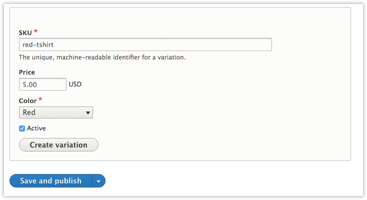
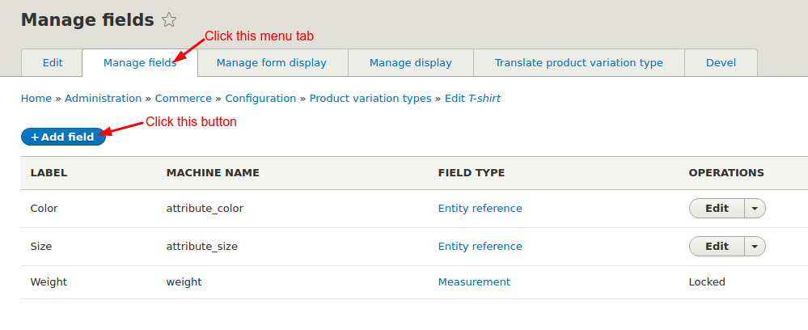
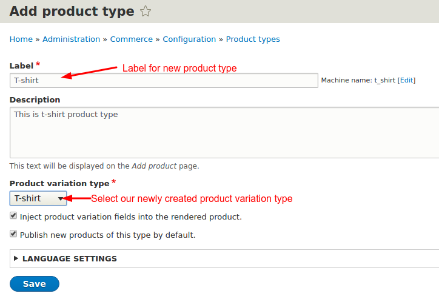
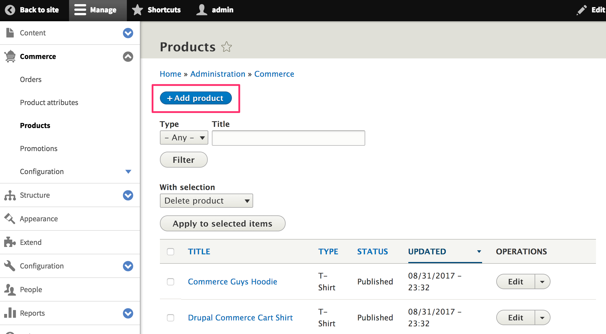
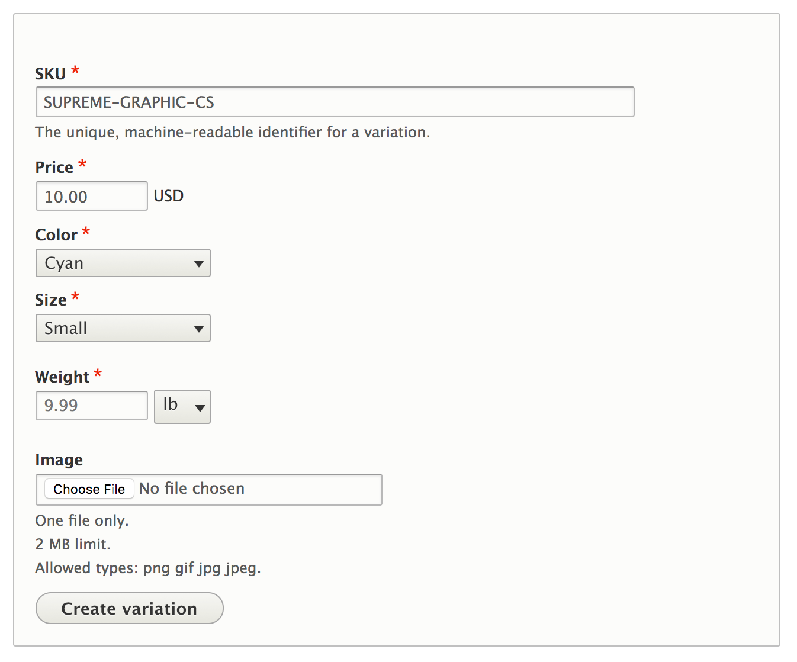

Products in Drupal Commerce are designed to meet your needs. Whether you are selling clothing which has different sizes or colors, bed sheets with various thread counts, or products with various billing terms, Drupal Commerce can support your product model.

## Before you begin

The following is an introduction to terminology used in Drupal Commerce before you begin. 

| Term      | What does it mean?                          |
| ----------- | ------------------------------------ |
| Attribute       | Something about the product which creates a unique choice. For clothing this would be the color and size. A subscription may have monthly or annual billing options.  |
| Variation       | A product variation represents an option of specific attributes for a product. For example, the Large Blue sweatshirt versus the Medium Red sweatshirt |
| Product    | The actual product, a sweatshirt, which contains all of its variations |

### Product example

Before you begin adding products to your Drupal Commerce store, it is important to understand the product structure. Let us go through an example.

Let us say that your store sells t-shirts. Your t-shirts come in various sizes; such as small, medium, large, and extra large. Each shirt has a graphic but can come in different colors. Each graphic t-shirt is its own product but has its variations of colors available.

How does that translate into Drupal Commerce?

* There is a **t-shirt** product type
* There is a **size** product attribute
* There is a **color** product attribute
* Each graphic _t-shirt_ will be its own product, with variations of color and size.

The following table is an example of variations that could be for a Drupal Commerce Cart graphic t-shirt.

| Product      | Size                         | Color |
| ----------- | ------------------------------------ |-------|
| Cart graphic | Small  | Grey  |
| Cart graphic | Small | White |
| Cart graphic | Small | Black |
| Cart graphic | Medium | Grey  |
| Cart graphic | Medium | White |
| Cart graphic | Medium | Black |
| Cart graphic | Large | Grey  |
| Cart graphic | Large | White |
| Cart graphic | Large | Black |
| Cart graphic | Extra Large | Grey  |
| Cart graphic | Extra Large | White |
| Cart graphic | Extra Large | Black |

We have now defined the product attributes which need to be created. [Read here to learn about how to create, edit, and making some attributes optional](#configure-product-attributes)

We will need a product variation type and product type for our t-shirt, [which we discuss in Manage product structure](#manage-product-structure).

Finally, you can create products! [Follow the directions in this section on the most common use cases.](#create-a-product)

## Configure product attributes

! We need updated screenshots. Feel free to follow the *edit this page* link and contribute.

Imagine you need to sell a DrupalCon t-shirt. This t-shirt comes in
different sizes and colors. Each combination of size and color has its
own SKU, so you know which color and size the customer has purchased and you can track exactly how many of each combination you have in stock.

Color and size are product attributes. Blue and small are product
attribute values, belonging to the mentioned attributes. The combination of attribute values (with a SKU and a price) is called a product variation. These variations are grouped inside a product.

### Creating Attributes and their Values

For our t-shirt we need two attributes: color and size. Let's start by
creating the color attribute. Go to the Drupal Commerce administration page and visit the **Product Attributes** link.

Click on the **Add product attribute** link to create an attribute.

After you have created the color attribute, we need to define at least
one value. Normally we would simply say the color is "blue" or "red" but
sometimes you might need to further define the attribute using fields.
Adding fields is covered in detail later on in the documentation.

The product attribute values user interface allows creating and
re-ordering multiple values at the same time and a very powerful
translation capability:

Next, you will need to add the attribute to the product variation type.
You can find these at ``/admin/commerce/config/product-variation-types``
and you just need to add/edit a product variation type that requires
your new attribute.

After you have added "Color" and the various colors your t-shirts are
available in, the next step is to add that "color" attribute to our
product. Store administrators can do this on the product variation type
form, the checkbox in the last step automatically created entity
referenced fields as needed:

### Adding fields to Attributes

Product attributes are so much more than a word. Often times they
represent a differentiation between products that is useful to call out
visually for customers. The fieldable attribute value lets the
information architect decide what best describes this attribute. Like
any other fieldable entity, you can locate the list of attribute bundles
and click edit fields:

``/admin/commerce/product-attributes``

Add a field as you would expect. Most fields are supported and will
automatically show up when you go to add attribute values:

### Editing Attributes

Editing the attribute values is pretty easy. Simply locate the attribute
type that has the values you want to edit:
``/admin/commerce/product-attributes`` And click "edit" and you will be
taken to a screen to edit all the attributes of that type.

### Optional Attributes

After creating attributes, the product variation type needs to know that
it uses the attribute. The product variations are at
``/admin/commerce/config/product-variation-types`` and once you've
clicked on the attribute you want...

Fields are added to the variation type that can then be modified. By
default, all attribute fields are required. If your attribute is
optional (perhaps some of the drupalcon t-shirts only come in blue),
then you can locate the manage fields of your particular product
variation type and make the ``color`` attribute optional by following
these steps:

1. Go to ``/admin/commerce/config/product-variation-types``
2. Click the drop down next to the variation type you want and click
   "manage fields" 
   
   
3. Un-select the "required" checkbox to make the attribute optional.

## Manage product structure

This guide assumes you have created your product attributes, or understand how they are used after reading how to [configure product attributes](#configure-product-attributes)

### Create a product variation type

Following the example of having a t-shirt, the first step is to create a new product variation type for our t-shirt. Go to ``admin/commerce/config/product-variation-types``

Click **Add product variation type**

This will open a form.

Now we will add image field to our product variation.

Click on **Manage fields** and then click on **Add field**

Now select field type Image under *Reference*.

Then click on **Save and continue**. Then save the settings for image field.

In these steps we added an image field to the variation. This allows us to upload a picture of the t-shirt based on its color. As the customer chooses a color to purchase, it will show that image.

### Create a product type

Next, we need to create our product type for our t-shirts. Go to `admin/commerce/config/product-types`.

Click on **Add product type**

This will open a form.

Save settings and this will create our T-shirt product type.
## Create a product

To create a product go to the **Products** management page from the **Commerce** item in the administrative menu. Click on "Add Product." If you have multiple product types, you will need to select the type of product that you are creating.

The form will provide various sections for providing information about the product. First we will provide a **Title**, the product's name, and then a description about the product in the **Body** field. 

On the right side of the form we can control additional information about the product. 

* The stores the product is available to be purchased in. If there is only one store, you will not see the store visibility setting. 
* The path alias (URL) to use for accessing the product. 

By setting the URL alias to `/supreme-graphic-t` the product can be visited at `www.example.com/supreme-graphic-t` rather than `www.example.com/product/1234`

Next we create our variations for the product. The variations are the options available for purchase. Provide a **SKU**, **Price**, and other required fields. When done, click on **Create variation**

Click **Add new variation** to add a new variation. Follow the previous process and repeat until satisified that all purchasable options are displayed.

Finally, click **Save** to create the product.

## Edit a product 

Products can be edited by going to the products overview page and selecting to edit an existing product. When the products are in the table there will be operation links which allow you to edit the product.

The form will allow you to modify the existing information for the product.

To manage variations, you just need to click **Edit** for its entry.

## Delete a product

Sometimes you may wish to delete a product or one of its variations. Before deleting a product or 
variation, consider unpublishing the product or disabling the variation.

### Disabling a product variation

This will prevent the product variation from being displayed or purchased, but will leave it in the system 
should you want to re-enable it at a later point.
 
A product's variation is disabled while editing the product. Click on the variation's **Edit** button. 
Locate the **Active** checkbox on the Variation form and uncheck it. Click **Update Variation** to 
complete the process. The product variation will no longer be available to purchase on your site.

### Deep linking to a product variation

Enhance your customer experience by utilizing deep links to a specific product variation on a PDP. By
appending a `v=###` query parameter to a product page's URL, you ensure the desired variation is
selected upon arrival to the page.

For example, observe the differences between these two URLs in the Drupal Commerce demo store:

Standard Product Page: https://commerce.demo.centarro.io/products/tale-two-cities-charles-dickens
Deep Linked Variation: https://commerce.demo.centarro.io/products/tale-two-cities-charles-dickens?v=35

You can either extract the variation ID from its edit form URL or select a desired variation on the front end.
The query parameter will automatically be appended to the URL as you select values on the Add to Cart form.

By deep linking to specific product variations, you can satisfy the requirements for submitting products to
Google Merchant Center and direct customers to share variations products on social media channels, in email,
or on their own websites.

### Deleting a product variation

A product's variation is deleted while editing the product. Click on the variation's **Remove** button. 
A confirmation form will display. Click **Remove** once more to confirm.

### Deleting entire product

A product can be deleted by editing it. At the bottom of the form there is a **Delete** link, which 
will display a confirmation form. Click **Delete** once more to confirm deletion. All variations will 
also be deleted.

