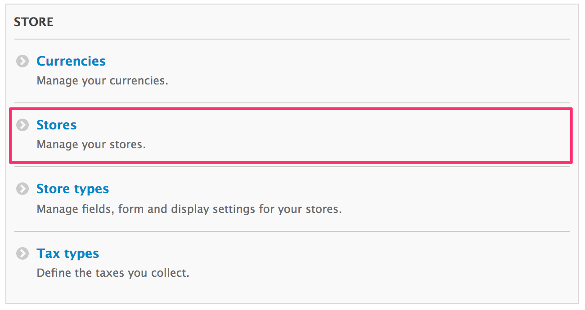
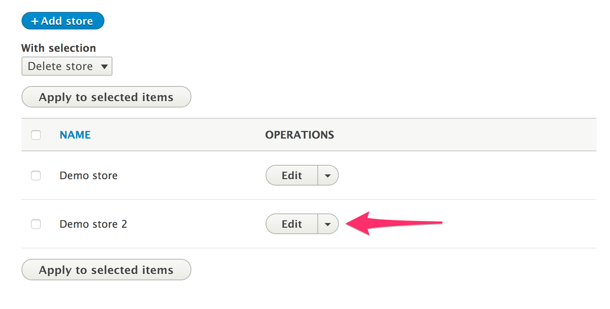

A key component in Drupal Commerce is the store. [Products](./products.md) and [orders](./orders.md) belong to stores. The store controls what billing and shipping countries are available when the customers go to complete checkout.

Each store has a currency. To create a store which uses a new currency, you must [import the currency](./currencies.md#adding-a-new-currency).

With support for multiple stores, Drupal Commerce allows [specifying a default store](#changing-the-default-store). The default store is used when a store cannot be determined (a non-product or order page.)

Stores are also used for invoicing, [tax types](./taxes.md), and any other settings necessary for understanding orders. This has many applications, and it's important to understand what use cases are supported out of the box and how that impacts checkout and other [order workflows](./orders.md).

## Before we begin

To create a store you will need to have at least one currency imported,
and then you can create a store. When Drupal Commerce is first installed, the Drupal site's default country's currency is imported. If your site was configured as United States the USD currency will be imported, if the default country was Germany then EUR would have been imported.

See [Adding a currency](./currencies.md#adding-a-new-currency) to add a new currency, if needed.

## Create a store

Next, we need to create a store. Every product requires one store.
Additional details will be shared about the power of
having stores baked into the core of Commerce, but for now, all you need
to do is define your store’s name, address, and select a few things
about taxes and billing.

Once you’ve got all those details filled out, click save and move on to
creating products! Woohoo!

## Changing the default store

The default store can be thought of as your primary store. When Drupal Commerce determines the current store for a product or order, this will be used if it cannot be determined.

Go to the Stores management page from the Configuration page

Click on **Edit** for the store you would like to make default.

At the bottom of the form, check the **Default** checkout, and then press **Save** to update the store and make it default.

## Use Cases

**! This section should be moved to a subsection, possibly. Detailing how to use multiple stores, or setup a marketplace model.**

We optimize for the two use cases:

1. One business that has one or more locations **or** 2. The marketplace model (where you have sellers)

For these use cases and possibly others, it is up to the developer to
fill in the gaps that are present in the order workflow. This is
different from Commerce 1.x in that we will support stores by default,
allowing for community contributions to extend the functionality instead
of trying to build store functionality from scratch.

#### One or more locations

This is the most common eCommerce situation where we have a single
person, company, or organization that is taking payments online.

#### Marketplace model

The marketplace model is where you have many sellers who are taking
payment for unique products.
